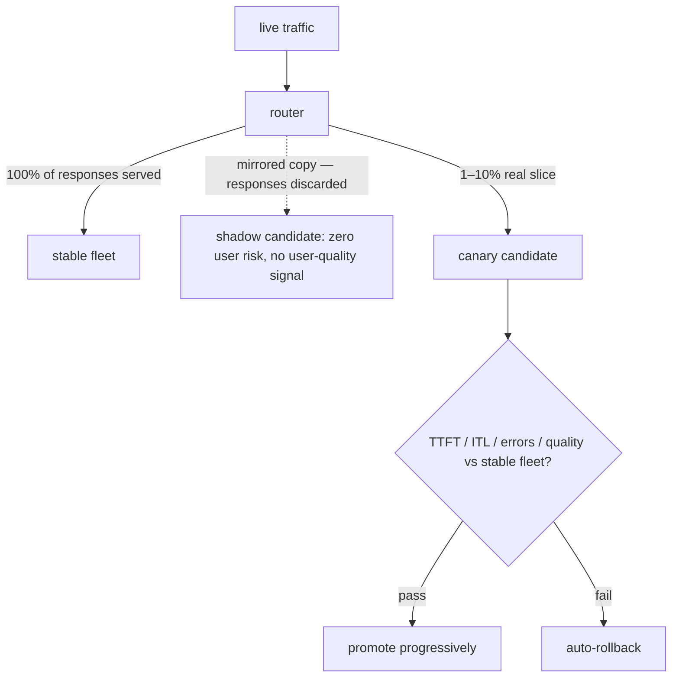
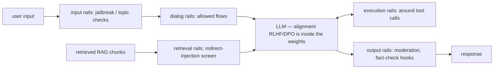

# Week 8 · Day 2 — Monitoring & reliability + safety, ethics, compliance

[← Master Plan](../../../MASTER-PLAN.md) · [Week 8 overview](plan.md) · [← previous day](day-1.md) · [next day →](day-3.md)

## Study block (2 h)

Two domains today, deliberately compressed so Wednesday is free for the mock: **Production Monitoring & Reliability (7%)** and **Safety, Ethics & Compliance (5%)**. Both are definition-heavy — the highest points-per-minute material on the blueprint. Learn the vocabulary cold; the questions are rarely deep, but they punish fuzzy definitions.

### LLM serving metrics — definitions cold (Monitoring, ~35 min)

- **TTFT** (time to first token): request arrival → first output token. Covers queueing + **prefill**. The "feels responsive" metric for streaming UIs.
- **ITL / TPOT** (inter-token latency / time per output token): gap between subsequent tokens — pure **decode** speed. The "reads smoothly" metric.
- **E2E latency** ≈ TTFT + ITL × output_tokens.
- **Throughput**: tokens/s or requests/s across the system — the cost-efficiency metric; it *trades off* against per-request latency via batch size.
- **Goodput**: throughput counting only requests that **met their SLO**. A server pushing 10k tok/s with half the requests blowing their TTFT target has high throughput and poor goodput — the exam likes this distinction.

**One streaming request dissected — TTFT covers everything before the first token; ITL is everything after:**

```
arrive    queue        prefill         tok1   tok2   tok3  …   tokN
  │◄──────────────────────────────────►│◄────►│◄────►│
  │               TTFT                 │ ITL    ITL   (a.k.a. TPOT)
  │    (queueing + prompt processing)  │  (pure decode speed)
  │◄──────────────────────────────────────────────────────────────►│
                       E2E ≈ TTFT + ITL × output_tokens
```

**Percentiles, never means**: report P50/P95/P99. Tail latency is what users actually feel and what SLOs bind; a mean hides ten horrible seconds behind a thousand fast requests. P99 = "1% of requests are worse than this." Capacity intuition, **Little's law**: concurrency = arrival rate × latency — at 10 req/s and 4 s average latency you hold ~40 requests in flight; if that exceeds your batch capacity, queues (and TTFT) explode nonlinearly.

### GPU and engine telemetry (~30 min)

- **DCGM** (Data Center GPU Manager) + **dcgm-exporter** → Prometheus/Grafana is the standard K8s GPU-metrics pipeline. Metrics: utilization, memory used, SM clocks & **throttle reasons** (thermal/power), temperature, power draw, NVLink/ECC errors.
- **"GPU utilization" lies**: `nvidia-smi`-style utilization = fraction of time *any* kernel was resident — a memory-bound GEMV shows 100% "utilization" while SMs idle on HBM stalls. For real saturation look at SM occupancy/activity (DCGM profiling metrics) and achieved tok/s vs roofline expectations.
- **XID errors**: GPU fault codes in kernel logs (e.g. 48 = double-bit ECC, 79 = fell off the bus). Ops response: alert → drain/cordon the node → remediate. "XID" appearing in a question = node-health/hardware-fault context.
- **Engine metrics** (vLLM & friends export these): queue depth / waiting requests, **KV-cache utilization %**, preemption/eviction counts, request timeouts. Rising KV utilization + preemptions = the saturation signature *before* latency explodes — the leading indicator to alert on.

### Reliability patterns (~25 min)

- **Health vs readiness probes**: a model server's container being up ≠ model loaded ≠ serving within SLO. Readiness should verify the model answers (e.g. tiny generation), or K8s routes traffic into a black hole during the minutes-long model load.
- **Canary deployment**: route a small slice (1–10%) of live traffic to the new model/config; compare TTFT/ITL/error rate/quality metrics against the stable fleet; promote or **auto-rollback**. **Shadow traffic**: mirror requests to the candidate, discard its responses — zero user risk, no user-facing quality signal. **A/B test**: split traffic to measure *product* outcomes, not just system health.
**The two low-risk rollout patterns side by side — shadow sees real traffic but users never see it; canary risks a small slice with an escape hatch:**



- **Drift**: input/prompt distribution drift (topics shift, prompt-injection attempts rise) and output-quality drift (model or upstream data changed). LLM twist: you usually can't retrain your way out — detect via **embedding-distribution monitoring** on inputs and **periodic golden-set evals** (fixed prompt suite, scored in CI/CD) on outputs. Plus token-cost monitoring: cost-per-request drifts with output-length creep.

### Safety: threats, then layered defenses (~30 min)

Threats: **direct prompt injection** (jailbreaks — the user attacks), **indirect prompt injection** (malicious instructions hidden in *retrieved* content — the RAG attack: the document attacks), data exfiltration via outputs (PII, system-prompt leakage), harmful-content generation, and hallucination presented as fact. Defense in depth, weakest to strongest: system-prompt hardening < input/output filtering < **programmable guardrails**.

**NeMo Guardrails**: an open-source framework wrapping *any* LLM with programmable rails defined in **Colang**: **input rails** (jailbreak/topic checks before the model), **dialog rails** (keep conversations on allowed flows), **retrieval rails** (screen RAG chunks — the indirect-injection defense), **execution rails** (around tool calls), **output rails** (moderation, fact-check hooks). Integrates content-safety classifier models (Llama Guard–class, NemoGuard models). The key exam distinction: **alignment (RLHF/DPO) is *in* the model; guardrails are *around* the model** — complementary, not alternatives; you cannot patch a jailbreak with more RLHF by Friday, but you can add a rail.

**A guarded request end to end — alignment lives IN the LLM box; every rail is a checkpoint AROUND it:**



### Compliance: PII, licensing, regulation (~30 min)

- **PII across the lifecycle**: *curation-time* redaction/anonymization in training data (**NeMo Curator** has PII detection/redaction); *inference-time* detection/masking of PII in prompts and outputs (rails again); *logging policy* — prompts/completions in logs are personal data too: retention limits, access control. GDPR wrinkle: data rights (erasure) vs trained weights is legally unsettled — deletion from training *sets* and filtering at inference are the practical answers.
- **Licensing**: **open-weights ≠ open-source**. Llama's community license carries use restrictions and an acceptable-use policy (plus scale-based clauses); Apache-2.0/MIT models (many Qwen, Mistral releases) are genuinely permissive. Check *dataset* provenance and output-usage terms as well as model terms; "can we use its outputs to train our own model?" is a license question, not a technical one.
- **Transparency & governance**: **model cards** (intended use, limits, eval results), bias/fairness evaluation across demographic slices, **EU AI Act** risk tiers (unacceptable/high/limited/minimal — GPAI models carry transparency & documentation duties).

### Read next

- NeMo Guardrails docs — "Getting started" + the five rail types: <https://docs.nvidia.com/nemo/guardrails/>
- vLLM production metrics reference (skim metric names — you'll expose similar ones from ferrum-serve's `/stats`): <https://docs.vllm.ai/en/latest/>
- DCGM-exporter README — what a GPU Prometheus pipeline exports: <https://github.com/NVIDIA/dcgm-exporter>
- OWASP Top 10 for LLM Applications — threat vocabulary the exam borrows: <https://owasp.org/www-project-top-10-for-large-language-model-applications/>

### Quick check

1. Users complain the app "hangs before answering" but dashboards show healthy average latency. Which two metric practices were missing?
<details><summary>Answer</summary>TTFT tracked separately from e2e latency (the hang-before-first-token is prefill/queueing, invisible inside an e2e average), and percentiles instead of means (P95/P99 TTFT would expose the tail the average hides).</details>

2. GPU utilization shows 100% but tokens/s is far below expectations. Why can both be true, and what do you check?
<details><summary>Answer</summary>Utilization only measures "a kernel was resident" — a bandwidth-bound decode saturates the metric while SMs stall on HBM. Check SM activity/occupancy via DCGM profiling metrics, batch size/queue depth, and whether clocks are throttling (thermal/power).</details>

3. Design a rollout for a new AWQ variant of your production model with near-zero user risk, in three steps.
<details><summary>Answer</summary>(1) Shadow traffic: mirror real requests, discard responses, compare latency + golden-set quality offline. (2) Canary 5%: real traffic slice, gate on TTFT/ITL P99, error rate, and quality-eval scores vs the stable fleet, with auto-rollback. (3) Progressive promotion to 100%, keeping the old version warm for instant rollback.</details>

4. A RAG chatbot starts obeying instructions embedded in a retrieved webpage. Name the attack and the *specifically targeted* NeMo Guardrails defense.
<details><summary>Answer</summary>Indirect prompt injection. Retrieval rails — screening retrieved chunks before they enter the context (plus output rails as backstop). System-prompt hardening alone can't fix it: the poison arrives through the retrieval channel.</details>

## Build block (4 h)

**ferrum-serve day 2: block manager + scheduler — the hard logic, all green on CPU.** [Project brief](../../../gpu-engineering-lab/02-llm-engineering/week-08-mini-inference-server/README.md)

- Implement `blocks.rs` until `cargo test --test blocks_test` is green — including the **fork/ref-count** tests (that's the prefix-caching primitive you studied).
- Implement `scheduler.rs` until `cargo test --test scheduler_test` is green: FIFO admission under three budgets, **decode-first slot reservation**, finish/cancel freeing blocks immediately.
- Both files are pure logic — no async, no GPU, no lifetimes beyond `&self`/`&mut self`. The Scheduler *owns* the BlockManager: single mutator, no locks.
- **Definition of done:** both suites green; clippy clean. All green = the week's hard thinking is done before any GPU code.
- Hint: when the borrow checker rejects mutating the block manager while iterating scheduler state, that fight *is* the curriculum — collect the sequence IDs into a `Vec` first (iterate the clone, mutate freely), or split the struct's fields so the borrows don't overlap.

## Close the day (15 min)

- Anki: TTFT/ITL/goodput definitions, P99 rationale, Little's law, XID, KV-utilization-as-leading-indicator, canary vs shadow vs A/B, direct vs indirect injection, alignment-vs-guardrails, open-weights ≠ open-source, PII at curation vs inference.
- One line in [notes.md](notes.md): hardest definition to keep straight.
- Blockers — then stop early if you can. Tomorrow is the 120-minute mock: sleep is prep.
