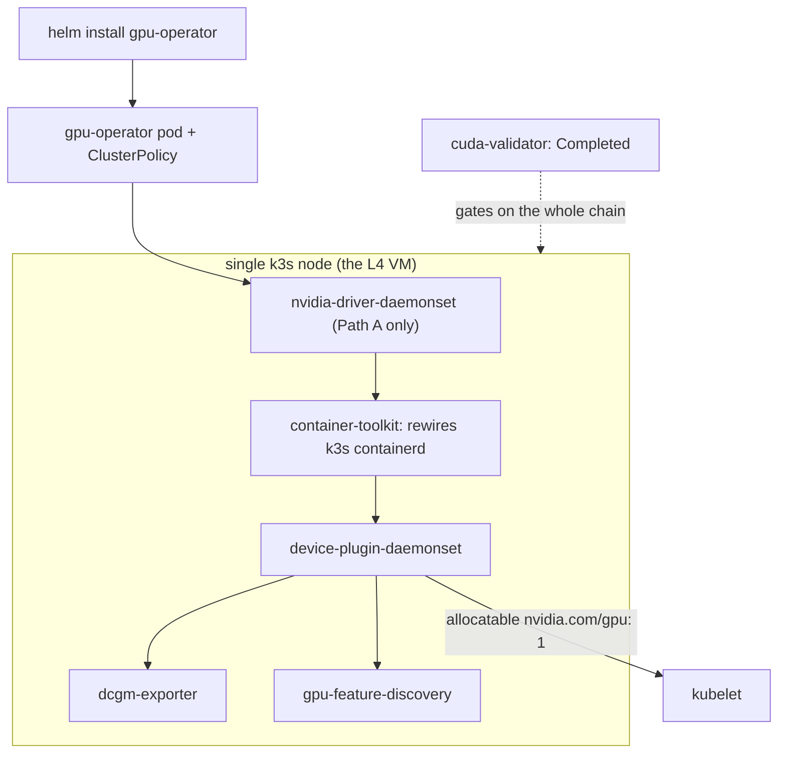

# Lab: GPU Operator on a 1-node cloud Kubernetes cluster

**Exam domains:** Installation & Deployment (31%), Troubleshooting (23%)
**Estimated cost/time:** 1× L4 VM (e.g. GCP `g2-standard-8` ≈ $0.85/hr, or Lambda/other clouds
similar) × ~2h ≈ **$2**. Time: 60–90 min first run; drill target **≤ 25 min**.
**Goal:** From a bare GPU VM to a working K8s node with the full GPU Operator stack, a running
CUDA pod, and DCGM metrics — the single most exam-relevant lab in this folder.

## Prerequisites

- Ubuntu 22.04/24.04 VM with 1× NVIDIA L4 (or T4/A10 — any datacenter GPU), 8 vCPU/32 GB,
  100 GB disk, ports open for SSH only.
- **Choose the driver path** (both are exam-relevant — do the lab once each way if time allows):
  - Path A (operator-managed driver): start from a clean image with NO NVIDIA driver.
  - Path B (host-managed driver): image with driver pre-installed (most cloud "GPU images") →
    you'll set `driver.enabled=false`.
- No local kubectl needed; everything on the VM.

## Steps

### 1. Install k3s (lightweight single-node K8s)

```bash
curl -sfL https://get.k3s.io | sh -s - --write-kubeconfig-mode 644
export KUBECONFIG=/etc/rancher/k3s/k3s.yaml
kubectl get nodes
```

Expected: one node `Ready` within ~1 min. (k3s bundles containerd; the GPU Operator's toolkit
container will configure that containerd for us.)

### 2. Install Helm

```bash
curl -fsSL https://raw.githubusercontent.com/helm/helm/main/scripts/get-helm-3 | bash
```

### 3. Install GPU Operator

```bash
helm repo add nvidia https://helm.ngc.nvidia.com/nvidia
helm repo update
```

Path A (no host driver — operator installs it):

```bash
helm install gpu-operator nvidia/gpu-operator \
  -n gpu-operator --create-namespace \
  --set toolkit.env[0].name=CONTAINERD_CONFIG \
  --set toolkit.env[0].value=/var/lib/rancher/k3s/agent/etc/containerd/config.toml \
  --set toolkit.env[1].name=CONTAINERD_SOCKET \
  --set toolkit.env[1].value=/run/k3s/containerd/containerd.sock
```

Path B (driver already on host):

```bash
helm install gpu-operator nvidia/gpu-operator \
  -n gpu-operator --create-namespace \
  --set driver.enabled=false \
  --set toolkit.env[0].name=CONTAINERD_CONFIG \
  --set toolkit.env[0].value=/var/lib/rancher/k3s/agent/etc/containerd/config.toml \
  --set toolkit.env[1].name=CONTAINERD_SOCKET \
  --set toolkit.env[1].value=/run/k3s/containerd/containerd.sock
```

(The toolkit env overrides are k3s-specific — on kubeadm/containerd defaults you'd omit them.
Knowing WHY they exist is exam-grade understanding: the toolkit container must edit the
*actual* containerd config in use.)

### 4. Watch the stack converge (this is the learning moment)

```bash
kubectl get pods -n gpu-operator -w
```

Expected end state (names abbreviated; Path A includes a `nvidia-driver-daemonset` pod):

```
gpu-operator-...                                       Running
gpu-feature-discovery-...                              Running
nvidia-container-toolkit-daemonset-...                 Running
nvidia-cuda-validator-...                              Completed
nvidia-dcgm-exporter-...                               Running
nvidia-device-plugin-daemonset-...                     Running
nvidia-operator-validator-...                          Running
node-feature-discovery-...                             Running
```

Path A: driver compile/load takes 5–10 min; everything else gates on it (init containers
`driver-validation`). Watch the ordering — it mirrors the dependency chain you must recite:
**driver → toolkit → device plugin → DCGM / GFD**.

**What converges in step 4 — the pod ordering you watch is the dependency chain itself.**



### 5. Verify the node advertises a GPU

```bash
kubectl describe node | grep -A6 'Capacity:' | grep nvidia
kubectl get node -o jsonpath='{.items[0].status.allocatable.nvidia\.com/gpu}'; echo
```

Expected: `nvidia.com/gpu: 1`.

### 6. Check CDI and runtime wiring

```bash
grep -A3 'nvidia' /var/lib/rancher/k3s/agent/etc/containerd/config.toml | head -20
ls /var/run/cdi/ 2>/dev/null || ls /etc/cdi/ 2>/dev/null
kubectl get runtimeclass
```

Expected: a `nvidia` runtime entry in containerd config; `runtimeclass nvidia` present.
CDI spec files appear if `cdi.enabled=true` (try re-installing with
`--set cdi.enabled=true --set cdi.default=true` to compare).

### 7. Run a test CUDA pod

```bash
cat <<'EOF' | kubectl apply -f -
apiVersion: v1
kind: Pod
metadata:
  name: cuda-vectoradd
spec:
  restartPolicy: OnFailure
  runtimeClassName: nvidia
  containers:
  - name: cuda-vectoradd
    image: nvcr.io/nvidia/k8s/cuda-sample:vectoradd-cuda12.5.0
    resources:
      limits:
        nvidia.com/gpu: 1
EOF
kubectl wait --for=jsonpath='{.status.phase}'=Succeeded pod/cuda-vectoradd --timeout=180s
kubectl logs cuda-vectoradd
```

Expected log tail:

```
[Vector addition of 50000 elements]
...
Test PASSED
Done
```

### 8. Query DCGM metrics

```bash
kubectl -n gpu-operator port-forward svc/nvidia-dcgm-exporter 9400:9400 &
sleep 2
curl -s localhost:9400/metrics | grep -E 'DCGM_FI_DEV_(GPU_UTIL|FB_USED|XID_ERRORS)' | grep -v '^#'
kill %1
```

Expected: three metric lines with gpu/UUID labels, e.g.
`DCGM_FI_DEV_GPU_UTIL{gpu="0",...} 0`.

### 9. (Optional, +10 min) Time-slicing preview for the KAI lab

```bash
cat <<'EOF' | kubectl apply -n gpu-operator -f -
apiVersion: v1
kind: ConfigMap
metadata:
  name: time-slicing-config
data:
  any: |-
    version: v1
    sharing:
      timeSlicing:
        resources:
        - name: nvidia.com/gpu
          replicas: 4
EOF
kubectl patch clusterpolicies.nvidia.com/cluster-policy -n gpu-operator --type merge \
  -p '{"spec":{"devicePlugin":{"config":{"name":"time-slicing-config","default":"any"}}}}'
# wait ~1 min for device plugin restart, then:
kubectl get node -o jsonpath='{.items[0].status.allocatable.nvidia\.com/gpu}'; echo   # now 4
```

## Troubleshooting notes (feed these into lab-troubleshoot.md)

- Validator stuck `Init:0/1` on Path A → driver still compiling: `kubectl logs -n gpu-operator
  ds/nvidia-driver-daemonset`.
- `Insufficient nvidia.com/gpu` on the test pod → device plugin not up or node capacity 0;
  re-check step 5.
- Toolkit pod CrashLoop on k3s → the two `toolkit.env` overrides are missing/wrong.

## Cleanup

```bash
kubectl delete pod cuda-vectoradd --ignore-not-found
helm uninstall gpu-operator -n gpu-operator
/usr/local/bin/k3s-uninstall.sh
```

Then **stop/delete the VM** (the cost is the VM-hours, not the software). If reusing the VM for
lab-runai-kai, keep k3s + operator installed and just stop the instance.
