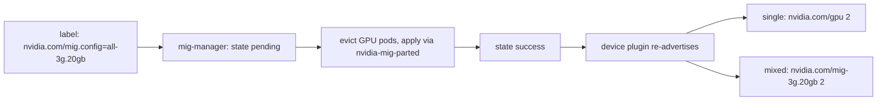

# Lab: MIG configuration (nvidia-smi + MIG Manager)

**Exam domains:** Administration (23%), Installation & Deployment (31%)
**Estimated cost/time:** 1× A100 40GB for ~2h. Cheapest reliable options mid-2026: Lambda
on-demand A100 ≈ $1.29/hr, RunPod/Vast A100 spot ≈ $0.8–1.4/hr, GCP `a2-highgpu-1g` spot ≈
$1.10/hr. Budget **$3–5 total**. Drill target ≤ 25 min (excluding provisioning).

> **L4 WARNING — read first:** Your standing lab VM's **L4 does NOT support MIG** (no Ada
> datacenter GPU does; neither do T4/A10/L40S). MIG needs A30, A100, H100, H200, B200, GB-class.
> If you skip the A100 rental, do the **read-along fallback** at the bottom: hand-write every
> command and expected output, then check. The exam WILL make you type these; renting the A100
> once is the better trade.

## Prerequisites

- 1× A100 (40 or 80 GB) VM, Ubuntu 22.04, NVIDIA driver installed (any recent cloud image).
- Part 2 additionally needs k3s + GPU Operator (repeat lab-gpu-operator steps 1–4 on this VM,
  Path B, ~15 min).
- Profile-name note: A100-40GB profiles are `1g.5gb / 2g.10gb / 3g.20gb / 4g.20gb / 7g.40gb`;
  on an 80GB card mentally double the memory (`3g.40gb` etc.) and adjust commands.

## Part 1 — Manual MIG with nvidia-smi (~30 min)

### 1. Baseline and enable MIG mode

```bash
nvidia-smi --query-gpu=name,mig.mode.current --format=csv
sudo nvidia-smi -i 0 -mig 1
```

Expected: `Enabled MIG Mode for GPU 00000000:00:04.0` — often followed by a warning that a
reset is pending. If so:

```bash
sudo nvidia-smi --gpu-reset -i 0   # or reboot; fails if any process holds the GPU
nvidia-smi --query-gpu=mig.mode.current --format=csv   # -> Enabled
```

(Exam point: enabling MIG requires the GPU idle + reset; on live clusters you drain the node
first.)

### 2. Explore available profiles

```bash
nvidia-smi mig -lgip          # list GPU instance profiles: ID, instances free/total, memory, SMs
nvidia-smi mig -lgipp         # placements
```

Expected: table showing e.g. `MIG 1g.5gb  ID 19  Instances free 7/7`,
`MIG 3g.20gb  ID  9  Instances free 2/2`, `MIG 7g.40gb  ID  0 ...`.

### 3. Create instances: 3g.20gb + 2g.10gb + 1g.5gb

Slice math first (A100-40GB has 7 compute / 8 memory slices): 3g.20gb = 3c/4m,
2g.10gb = 2c/2m, 1g.5gb = 1c/1m → total 6c/7m, fits. Note what does NOT fit:
`2× 3g.20gb` fills all 8 memory slices, so adding any third instance fails with
`Insufficient capacity` — a classic exam trap.

```bash
sudo nvidia-smi mig -cgi 3g.20gb,2g.10gb,1g.5gb -C
nvidia-smi mig -lgi           # GPU instances
nvidia-smi mig -lci           # compute instances (one per GI thanks to -C)
nvidia-smi -L
```

Expected `nvidia-smi -L` tail:

```
GPU 0: NVIDIA A100-SXM4-40GB (UUID: GPU-...)
  MIG 3g.20gb     Device  0: (UUID: MIG-...)
  MIG 2g.10gb     Device  1: (UUID: MIG-...)
  MIG 1g.5gb      Device  2: (UUID: MIG-...)
```

**What you just built — a GI carves memory plus SMs, a CI subdivides SMs; each GI+CI pair surfaces as one MIG device.**

```
GPU 0 (A100, MIG mode enabled)
 |- GI 3g.20gb --- CI (from -C) ---> MIG device 0   (MIG-<uuid>)
 |- GI 2g.10gb --- CI            ---> MIG device 1
 |- GI 1g.5gb  --- CI            ---> MIG device 2

teardown order: CIs first (-dci), then GIs (-dgi), then -mig 0
```

### 4. Run work on one instance

```bash
docker run --rm --gpus '"device=0:0"' nvcr.io/nvidia/cuda:12.4.1-base-ubuntu22.04 nvidia-smi -L
# or without docker:
CUDA_VISIBLE_DEVICES=MIG-<uuid-from-step-3> python3 -c "import ctypes; print('ok')"
nvidia-smi   # while a workload runs: only that MIG device shows the process
```

### 5. Tear down (reverse order: CIs, then GIs)

```bash
sudo nvidia-smi mig -dci      # destroy all compute instances
sudo nvidia-smi mig -dgi      # destroy all GPU instances
sudo nvidia-smi -i 0 -mig 0   # disable MIG mode (reset pending again)
```

## Part 2 — Declarative MIG with GPU Operator's MIG Manager (~30 min)

With k3s + GPU Operator running on this A100 node (driver pre-installed → Path B):

### 1. Inspect the shipped MIG config and strategy

```bash
kubectl get configmap default-mig-parted-config -n gpu-operator -o yaml | grep -B2 -A8 'all-3g.20gb'
kubectl get clusterpolicies.nvidia.com/cluster-policy -o jsonpath='{.spec.mig.strategy}'; echo
```

Expected: named profiles like `all-disabled`, `all-1g.5gb`, `all-3g.20gb`, `all-balanced`;
strategy `single` by default.

### 2. Apply a profile by labeling the node

```bash
NODE=$(kubectl get node -o name | cut -d/ -f2)
kubectl label node $NODE nvidia.com/mig.config=all-3g.20gb --overwrite
kubectl logs -n gpu-operator -l app=nvidia-mig-manager -f   # watch it drive mig-parted
kubectl get node $NODE -o jsonpath='{.metadata.labels.nvidia\.com/mig\.config\.state}'; echo
```

Expected: state transitions `pending` → `rebooting`(sometimes) → `success`; then:

```bash
kubectl get node $NODE -o jsonpath='{.status.allocatable}' | tr ',' '\n' | grep nvidia
```

- strategy **single** → `nvidia.com/gpu: 2` (two uniform 3g.20gb exposed as plain GPUs)
- strategy **mixed** → `nvidia.com/mig-3g.20gb: 2`

**The declarative loop you just watched — one label change drives eviction, mig-parted, and re-advertisement.**



### 3. Schedule a pod onto a MIG instance

```bash
cat <<'EOF' | kubectl apply -f -
apiVersion: v1
kind: Pod
metadata:
  name: mig-test
spec:
  restartPolicy: OnFailure
  runtimeClassName: nvidia
  containers:
  - name: cuda
    image: nvcr.io/nvidia/cuda:12.4.1-base-ubuntu22.04
    command: ["nvidia-smi", "-L"]
    resources:
      limits:
        nvidia.com/gpu: 1        # with mixed strategy use: nvidia.com/mig-3g.20gb: 1
EOF
kubectl logs pod/mig-test
```

Expected: the container sees exactly ONE `MIG 3g.20gb` device — hardware-isolated slice.

### 4. Contrast with time-slicing (paper exercise, 5 min)

Recall lab-gpu-operator step 9: time-slicing set `replicas: 4` and the node advertised 4
"GPUs" that are the SAME silicon time-shared — no memory/fault isolation, first-come memory.
MIG advertised 2 resources that are genuinely partitioned. One sentence you should be able to
say cold: *time-slicing multiplies the resource count, MIG divides the GPU.*

## Cleanup

```bash
kubectl label node $NODE nvidia.com/mig.config=all-disabled --overwrite   # if Part 2 done
# wait for state=success, then
sudo nvidia-smi mig -dci; sudo nvidia-smi mig -dgi; sudo nvidia-smi -i 0 -mig 0
```

**Terminate the A100 instance immediately** — it is your most expensive lab asset.

## Read-along fallback (no A100, $0)

1. Hand-write, from memory, the full command sequence for: enable MIG on GPU 0 → list profiles
   → create 3g.20gb+2g.10gb+1g.5gb with CIs → list GIs → run a container on one instance →
   destroy everything → disable MIG.
2. Check against Part 1 above. Repeat next day until zero diffs.
3. Read the GPU Operator MIG page (https://docs.nvidia.com/datacenter/cloud-native/gpu-operator/latest/gpu-operator-mig.html)
   and write the node-label workflow + single-vs-mixed resource names from memory.
4. On your L4 VM, run `sudo nvidia-smi -i 0 -mig 1` once to SEE the real error a non-MIG GPU
   gives (`Unable to enable MIG Mode... Not Supported`) — recognizing that message is itself
   exam-relevant.
