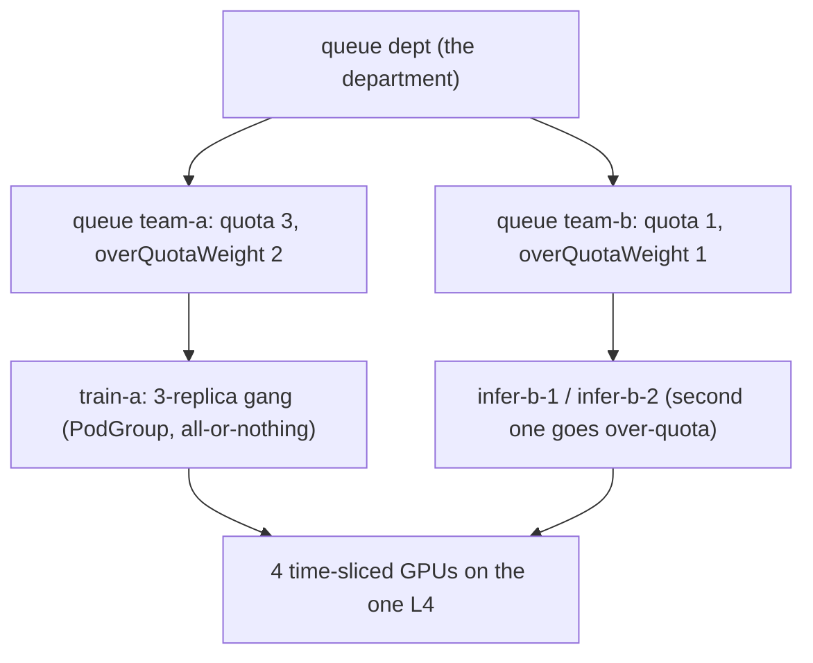

# Lab: KAI Scheduler — Run:ai concepts hands-on

**Exam domains:** Administration (23%, "NVIDIA Run:ai"), Workload Management (23%)
**Estimated cost/time:** reuses the L4 VM + k3s + GPU Operator from lab-gpu-operator ≈
$0.85/hr × ~1.5h ≈ **$1.50**. Drill target ≤ 25 min.
**Why this lab:** Run:ai the product has no free tier, but NVIDIA open-sourced its scheduling
core as **KAI Scheduler** — the same gang scheduling, queue quota, over-quota, and preemption
semantics. You already demo KAI; this lab re-frames each behavior in **Run:ai product
vocabulary**, which is what the exam tests.

| You observe (KAI) | Exam word (Run:ai) |
|---|---|
| Queue with `quota` | Project with GPU quota (projects map to namespaces) |
| Parent/child queues | Department → project hierarchy |
| Workload beyond quota still runs, then evicted | Over-quota + reclaim |
| PodGroup all-or-nothing placement | Gang scheduling of distributed workloads |
| Time-sliced shared GPU | Fractional GPUs (memory-limited software sharing) |

## Prerequisites

- L4 VM with k3s + GPU Operator healthy (lab-gpu-operator through step 5).
- Time-slicing config applied with `replicas: 4` (lab-gpu-operator step 9) so one L4 presents
  4 schedulable GPUs — lets us stage real contention on $1 of hardware.
- Helm installed.

## Steps

### 1. Install KAI Scheduler

```bash
helm upgrade -i kai-scheduler oci://ghcr.io/nvidia/kai-scheduler/kai-scheduler \
  -n kai-scheduler --create-namespace
kubectl get pods -n kai-scheduler   # scheduler, binder, podgrouper etc. Running
```

(Pin `--version vX.Y.Z` from https://github.com/NVIDIA/KAI-Scheduler/releases if you want
reproducibility.)

### 2. Create a queue hierarchy ("department" + two "projects")

```bash
cat <<'EOF' | kubectl apply -f -
apiVersion: scheduling.run.ai/v2
kind: Queue
metadata:
  name: dept
spec:
  resources:
    gpu:      {quota: -1, limit: -1, overQuotaWeight: 1}
    cpu:      {quota: -1, limit: -1, overQuotaWeight: 1}
    memory:   {quota: -1, limit: -1, overQuotaWeight: 1}
---
apiVersion: scheduling.run.ai/v2
kind: Queue
metadata:
  name: team-a
spec:
  parentQueue: dept
  resources:
    gpu:      {quota: 3, limit: -1, overQuotaWeight: 2}
    cpu:      {quota: -1, limit: -1, overQuotaWeight: 1}
    memory:   {quota: -1, limit: -1, overQuotaWeight: 1}
---
apiVersion: scheduling.run.ai/v2
kind: Queue
metadata:
  name: team-b
spec:
  parentQueue: dept
  resources:
    gpu:      {quota: 1, limit: -1, overQuotaWeight: 1}
    cpu:      {quota: -1, limit: -1, overQuotaWeight: 1}
    memory:   {quota: -1, limit: -1, overQuotaWeight: 1}
EOF
kubectl get queues
```

Run:ai translation: department `dept`, project `team-a` (quota 3 GPUs), project `team-b`
(quota 1 GPU). Node has 4 sliced GPUs total.

**The contention stage — two projects sharing four sliced GPUs; steps 3–4 make gang scheduling and reclaim visible on exactly this setup.**



### 3. Gang scheduling — all-or-nothing

Submit a 3-replica "distributed job" for team-a (each replica wants 1 GPU):

```bash
cat <<'EOF' | kubectl apply -f -
apiVersion: apps/v1
kind: Deployment
metadata:
  name: train-a
spec:
  replicas: 3
  selector: {matchLabels: {app: train-a}}
  template:
    metadata:
      labels:
        app: train-a
        kai.scheduler/queue: team-a
    spec:
      schedulerName: kai-scheduler
      containers:
      - name: cuda
        image: nvcr.io/nvidia/cuda:12.4.1-base-ubuntu22.04
        command: ["sh","-c","nvidia-smi -L && sleep infinity"]
        resources:
          limits: {nvidia.com/gpu: 1}
EOF
kubectl get pods -l app=train-a -w   # all 3 -> Running together
kubectl get podgroups -A             # podgrouper created a PodGroup automatically
```

**Gang test:** scale to 5 (only 4 GPUs exist):

```bash
kubectl scale deploy/train-a --replicas=5
kubectl get pods -l app=train-a
```

For a true all-or-nothing demo, delete and resubmit as a fresh 5-replica job — the whole gang
stays `Pending` (check `kubectl describe podgroup` events: insufficient resources for
minMember). No partial placement = no deadlocked half-jobs. Scale back: `--replicas=3`.

### 4. Over-quota, then reclaim/preemption

team-b (quota 1) submits 1 pod → fits. Then team-b tries a 2nd (over quota):

```bash
for i in 1 2; do
cat <<EOF | kubectl apply -f -
apiVersion: v1
kind: Pod
metadata:
  name: infer-b-$i
  labels: {kai.scheduler/queue: team-b}
spec:
  schedulerName: kai-scheduler
  containers:
  - name: cuda
    image: nvcr.io/nvidia/cuda:12.4.1-base-ubuntu22.04
    command: ["sleep","infinity"]
    resources:
      limits: {nvidia.com/gpu: 1}
EOF
done
kubectl get pods
```

With train-a at 3 replicas, all 4 GPUs are taken by quota-respecting work → `infer-b-2`
pends. Now free capacity: `kubectl scale deploy/train-a --replicas=2`. `infer-b-2` schedules —
team-b is now **over quota** (2 used vs quota 1) using idle capacity.

**Reclaim:** scale team-a back to its full quota: `kubectl scale deploy/train-a --replicas=3`.
Watch:

```bash
kubectl get pods -w
```

Expected: one team-b pod is **evicted/preempted** so team-a can reclaim its deserved quota.
Run:ai translation: over-quota workloads are preemptible; in-quota (deserved) workloads win
reclaim. `overQuotaWeight` decides how surplus is split among over-quota queues.

### 5. Fractional GPU via time-slicing (Run:ai "fractions" analogue)

Already live: the 4 `nvidia.com/gpu` on one L4 ARE software-shared slices. Prove sharing:

```bash
kubectl exec deploy/train-a -- nvidia-smi -L   # same physical GPU UUID in every pod
```

Every pod sees the same UUID — same silicon, time-shared, no memory isolation. Run:ai
fractions add managed per-workload memory limits on top of this idea; MIG (lab-mig-config) is
the hardware-isolated alternative. Be ready to rank all three on isolation in one breath.

## Cleanup

```bash
kubectl delete deploy train-a; kubectl delete pod infer-b-1 infer-b-2 --ignore-not-found
kubectl delete queue team-a team-b dept
helm uninstall kai-scheduler -n kai-scheduler
```

Stop the VM. (Keep k3s+operator if lab-troubleshoot is next — it uses the same box.)
