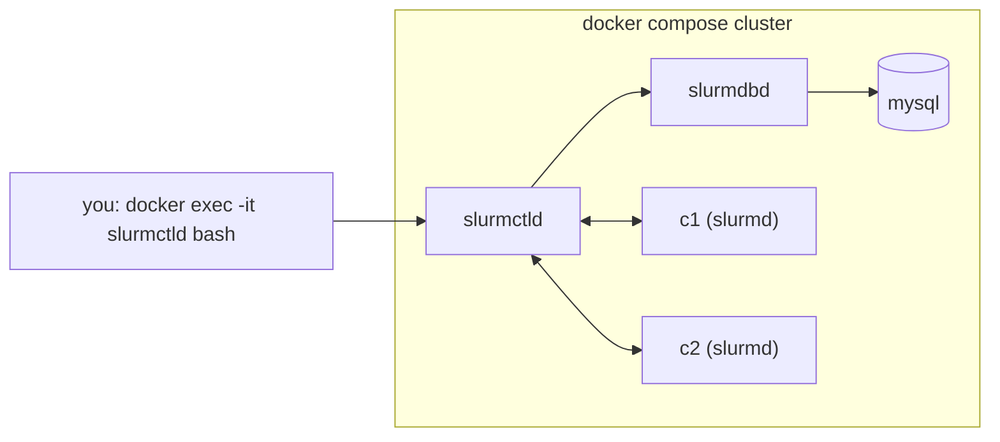

# Lab: Slurm cluster basics (containerized cluster + single-node GPU fallback)

**Exam domains:** Installation & Deployment (31%), Administration (23%), Workload Mgmt (23%)
**Estimated cost/time:** Part A+C run on ANY cheap VM or your laptop/WSL2 with Docker —
**$0–0.10**. Part B (real GPU job) reuses the L4 VM from lab-gpu-operator ≈ $0.85/hr × 1h.
Total time 90 min first pass; drill target ≤ 25 min for A+C.

> **BCM note:** the exam's Slurm content lives inside BCM-deployed clusters
> (`cm-wlm-setup`), but BCM itself has **no free tier** — this lab drills the raw Slurm layer
> (identical daemons, configs, and commands underneath BCM) and you study the BCM wrapper from
> the Administrator Manual (week 9, day 1–2).

## Part A — Multi-node Slurm in containers (~30 min, no GPU)

Uses the community `slurm-docker-cluster` compose project (slurmctld + slurmdbd + MySQL +
2 compute containers c1/c2) — the fastest legal way to get a *multi-node* Slurm.

**The five containers — a real multi-daemon Slurm minus the hardware; accounting flows ctld to dbd to mysql.**



### 1. Bring it up

```bash
git clone https://github.com/giovtorres/slurm-docker-cluster.git
cd slurm-docker-cluster
docker compose build          # first time: ~5-10 min
docker compose up -d
docker compose ps             # mysql, slurmdbd, slurmctld, c1, c2 all Up
./register_cluster.sh         # registers cluster in slurmdbd accounting
```

### 2. First contact

```bash
docker exec -it slurmctld bash
sinfo
```

Expected:

```
PARTITION AVAIL  TIMELIMIT  NODES  STATE NODELIST
normal*      up 5-00:00:00      2   idle c[1-2]
```

### 3. Core command drill (inside slurmctld)

```bash
scontrol show node c1                     # CPUs, RealMemory, State
scontrol show partition normal
sbatch --wrap="hostname; sleep 30"        # -> Submitted batch job N
squeue                                    # see it R on c1 or c2
scontrol show job <N>
scancel <N>
# node lifecycle:
scontrol update nodename=c1 state=drain reason="lab drill"
sinfo                                     # c1 now drain/drng
sbatch -N2 --wrap="hostname"              # pends: only 1 usable node
squeue --state=PD -o "%i %r"              # Reason: e.g. Nodes required... / Resources
scontrol update nodename=c1 state=resume
```

### 4. Look at the configs (this is what you must be able to WRITE)

```bash
grep -Ev '^#|^$' /etc/slurm/slurm.conf | grep -E 'NodeName|PartitionName|SelectType|Accounting'
```

Note the shape: `NodeName=c[1-2] CPUs=1 ...` / `PartitionName=normal Default=yes ...` /
`AccountingStorageType=accounting_storage/slurmdbd`.

## Part B — Single-node GPU Slurm with gres.conf (~30 min, on the L4 VM)

The container cluster has no GPUs; GPU gres is exam-critical, so do this once on the L4 VM.

### 1. Install and configure (Ubuntu 22.04+)

```bash
sudo apt-get update && sudo apt-get install -y slurm-wlm
sudo tee /etc/slurm/slurm.conf >/dev/null <<EOF
ClusterName=lab
SlurmctldHost=$(hostname -s)
ProctrackType=proctrack/linuxproc
SelectType=select/cons_tres
GresTypes=gpu
NodeName=$(hostname -s) CPUs=$(nproc) RealMemory=$(free -m | awk '/Mem:/{print $2-2048}') Gres=gpu:l4:1 State=UNKNOWN
PartitionName=gpu Nodes=$(hostname -s) Default=YES MaxTime=INFINITE State=UP
EOF
sudo tee /etc/slurm/gres.conf >/dev/null <<EOF
NodeName=$(hostname -s) Name=gpu Type=l4 File=/dev/nvidia0
EOF
sudo systemctl restart slurmctld slurmd
sinfo   # 1 node, idle
```

(Alternative first line of gres.conf worth knowing: `AutoDetect=nvml` — requires slurmd built
with NVML; the explicit `File=` form always works and is the safe exam answer.)

### 2. Write and submit a GPU batch job

```bash
cat > gpujob.sh <<'EOF'
#!/bin/bash
#SBATCH --job-name=gputest
#SBATCH --partition=gpu
#SBATCH --gres=gpu:1
#SBATCH --time=00:05:00
#SBATCH --output=gputest-%j.out
echo "CUDA_VISIBLE_DEVICES=$CUDA_VISIBLE_DEVICES"
nvidia-smi --query-gpu=name,uuid --format=csv
EOF
sbatch gpujob.sh
squeue
cat gputest-*.out
```

Expected output file:

```
CUDA_VISIBLE_DEVICES=0
name, uuid
NVIDIA L4, GPU-xxxxxxxx-...
```

The `CUDA_VISIBLE_DEVICES=0` line is the proof Slurm's gres plugin scoped the job to its
allocated GPU. Try `sbatch --gres=gpu:2 gpujob.sh` → stays PD with reason `Resources`
(only 1 GPU exists) — recognize that pending-reason pattern.

## Part C — Accounting, QOS, fairshare (~30 min, back in the container cluster)

Inside `docker exec -it slurmctld bash`:

```bash
sacctmgr -i add account research Description="research" Organization="lab"
sacctmgr -i add user root account=research           # container user is root
sacctmgr -i add qos short MaxWall=00:30:00 MaxTRESPerUser=cpu=1 Priority=100
sacctmgr -i modify account research set qos+=short
sacctmgr show assoc format=cluster,account,user,qos%20
sbatch --account=research --qos=short --wrap="sleep 20"
squeue -o "%i %u %a %q %T"                            # shows account + qos
sacct -j <jobid> --format=JobID,JobName,Account,QOS,Elapsed,State
sacct -a --starttime=today --format=JobID,User,Account,AllocCPUS,State,Elapsed
```

Expected: the job runs under account `research`, QOS `short`, and `sacct` shows the full
accounting trail (that trail flowing through slurmdbd→MySQL is the whole point of Part A's
extra containers).

Try violating the QOS: `sbatch --qos=short --time=01:00:00 --wrap="sleep 5"` →
`sbatch: error: ... QOSMaxWallDurationPerJobLimit` (if enforcement enabled) or job pends with
that reason — read it in `squeue -o "%i %r"`.

## Cleanup

```bash
# Part A/C:
cd slurm-docker-cluster && docker compose down -v
# Part B (on the L4 VM):
sudo systemctl stop slurmd slurmctld && sudo apt-get remove -y slurm-wlm
```

Stop the L4 VM if you're done for the day.
