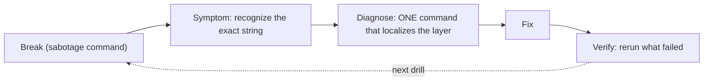

# Lab: Break-and-fix drills on the GPU node

**Exam domain:** Troubleshooting & Optimization (23%) — and the closest simulation of the
exam's hands-on labs in this folder. Run each drill cold in week 12.
**Estimated cost/time:** reuses the L4 VM with k3s + GPU Operator ≈ $0.85/hr × ~2h ≈ **$2**.
Each drill ≤ 20 min. Do (a)+(b) in week 11 day 4, (c)+(d) in week 12 days 1–2.

**Format per drill:** Break → Symptoms (learn to RECOGNIZE these) → Diagnose → Fix → Verify.
Ideal drill mode: run the break commands, walk away 10 min, come back pretending it's a ticket.

**Every drill is the same loop — the exam grades the diagnose-then-verify chain, not the fix.**



## Prerequisites

- L4 VM, k3s + GPU Operator healthy (test CUDA pod passes), Docker also installed on the host
  (`sudo apt-get install -y docker.io nvidia-container-toolkit` — we break Docker, not k3s,
  in drill (a)/(b) so the cluster stays usable).

---

## Drill (a) — Wrong/missing runtime: container can't see the GPU

### Break

```bash
sudo nvidia-ctk runtime configure --runtime=docker   # ensure it works first; test:
sudo docker run --rm --gpus all nvcr.io/nvidia/cuda:12.4.1-base-ubuntu22.04 nvidia-smi   # OK
# now break it: remove the nvidia runtime registration
sudo sed -i.bak 's/"nvidia"/"nvidia-broken"/' /etc/docker/daemon.json
sudo systemctl restart docker
```

### Symptoms

```bash
sudo docker run --rm --gpus all nvcr.io/nvidia/cuda:12.4.1-base-ubuntu22.04 nvidia-smi
```

→ `docker: Error response from daemon: could not select device driver "" with capabilities: [[gpu]]`
(K8s flavor of the same class of failure: pod stuck ContainerCreating or running but
`nvidia-smi: command not found` / no devices, when runtimeClassName/default runtime is wrong.)

### Diagnose

```bash
docker info | grep -i -A3 runtime          # nvidia runtime missing from list
cat /etc/docker/daemon.json                # spot the wrong key
nvidia-ctk --version                       # toolkit itself present?
```

Decision tree to memorize: error mentions "could not select device driver" → Docker doesn't
know a GPU runtime → toolkit not installed OR daemon.json not configured OR docker not
restarted.

### Fix + verify

```bash
sudo nvidia-ctk runtime configure --runtime=docker    # rewrites daemon.json correctly
sudo systemctl restart docker
sudo docker run --rm --gpus all nvcr.io/nvidia/cuda:12.4.1-base-ubuntu22.04 nvidia-smi  # GPU table
```

K8s variant to also drill: remove `runtimeClassName: nvidia` from a test pod on a cluster
where nvidia is NOT the default runtime → pod runs but sees no GPU; fix by adding it back.

---

## Drill (b) — Driver/library version mismatch (simulated)

Real cause: upgrading the driver userspace while the old kernel module stays loaded. Safely
simulated by hiding the userspace library version instead of actually corrupting the box.

### Break (simulation)

```bash
# Point a container at a deliberately incompatible CUDA userspace:
sudo docker run --rm --gpus all nvcr.io/nvidia/cuda:13.0.0-base-ubuntu24.04 nvidia-smi 2>&1 | head -3
```

If your driver predates CUDA 13, you get the authentic error class. Also study the classic
host-level one (do NOT create it for real; just recognize it):

### Symptoms

- Container: `CUDA driver version is insufficient for CUDA runtime version` → container's CUDA
  is newer than the host driver supports. **Fix direction: older image or newer driver.**
- Host: `Failed to initialize NVML: Driver/library version mismatch` → userspace libs ≠ loaded
  kernel module. **Fix direction: reboot (or reload modules).**

### Diagnose

```bash
nvidia-smi --query-gpu=driver_version --format=csv,noheader   # host driver
cat /proc/driver/nvidia/version                               # loaded KERNEL module version
dpkg -l | grep nvidia-driver                                  # installed userspace version
# mismatch between the last two = the NVML error; container CUDA tag vs driver = the first error
```

### Fix + verify

```bash
# container case:
sudo docker run --rm --gpus all nvcr.io/nvidia/cuda:12.4.1-base-ubuntu22.04 nvidia-smi   # works
# host case (know by heart, exam answer = reboot):
#   sudo reboot    OR    sudo rmmod nvidia_uvm nvidia_drm nvidia_modeset nvidia && sudo modprobe nvidia
```

---

## Drill (c) — NCCL misconfiguration and reading NCCL_DEBUG

Single-GPU L4 can still exercise NCCL init, transport selection, and the interface-selection
failure mode (2 ranks on one GPU is legal for drills).

### Setup

```bash
sudo docker run --rm --gpus all -it --shm-size=8g nvcr.io/nvidia/pytorch:25.06-py3 bash
# inside, a 2-process NCCL allreduce on one device:
cat > /tmp/allreduce.py <<'EOF'
import os, torch, torch.distributed as dist
dist.init_process_group("nccl")
r = dist.get_rank()
t = torch.ones(1<<20, device="cuda:0") * (r+1)
dist.all_reduce(t)
print(f"rank {r} sum ok: {t[0].item()}")
EOF
```

### Baseline (healthy)

```bash
NCCL_DEBUG=INFO torchrun --nproc_per_node=2 /tmp/allreduce.py 2>&1 | grep -E 'NCCL INFO (Using|Channel|NET/|Connected)' | head
```

Read the output: look for `Using network Socket` (no IB on this VM) and channel lines `via SHM`
or `via P2P` — this is the transport-selection evidence you must interpret on the exam.

### Break 1: bogus socket interface

```bash
NCCL_DEBUG=INFO NCCL_SOCKET_IFNAME=ib0 torchrun --nproc_per_node=2 /tmp/allreduce.py 2>&1 | tail -5
```

Symptoms: `NCCL WARN Bootstrap : no socket interface found` → init error / hang. Lesson: on
multi-node clusters, a wrong `NCCL_SOCKET_IFNAME` (or one that matches docker0) is a classic
"job hangs at startup on some nodes" cause. Fix: unset it or set to the real interface
(`NCCL_SOCKET_IFNAME=eth0`, or by exclusion: `^docker,lo`).

### Break 2: force the slow path

```bash
NCCL_DEBUG=INFO NCCL_P2P_DISABLE=1 NCCL_SHM_DISABLE=1 torchrun --nproc_per_node=2 /tmp/allreduce.py 2>&1 | grep -E 'via|NET' | head
```

Symptoms: channels now `via NET/Socket` even between co-located ranks — the "why is my
intra-node allreduce 10x slower" scenario. Diagnostic reflex: NCCL_DEBUG=INFO, grep the `via`
lines, compare against what the topology should give (NVLink/P2P intra-node, IB inter-node).

### Verify recovery

Re-run baseline without the sabotage env vars; transports return to SHM/P2P.

---

## Drill (d) — Xid errors and dcgmi diag

### Explore Xid surfaces (no need to injure a rented GPU)

```bash
sudo dmesg -T | grep -i xid                       # usually empty on a healthy VM — good
nvidia-smi -q | grep -A2 -i 'ecc errors' | head   # ECC counters surface
```

Memorize the triage table (week-12 notes): 13/31/43 = app; 48, 63/64, 74, 79, 94/95 =
hardware-path. If dmesg ever shows `NVRM: Xid (PCI:0000:00:04): 31, ...` during your own CUDA
experiments — that's an app-level page fault, not a broken GPU. Recognize the line format.

### DCGM diagnostics ladder

```bash
# DCGM standalone on the host (or use the dcgm container):
sudo apt-get install -y datacenter-gpu-manager-4-core datacenter-gpu-manager-4-cli || \
  sudo docker run --rm --gpus all --cap-add SYS_ADMIN nvcr.io/nvidia/cloud-native/dcgm:4.2.3-1-ubuntu22.04 dcgmi diag -r 1
sudo systemctl start nvidia-dcgm 2>/dev/null || true
dcgmi discovery -l            # GPU inventory as DCGM sees it
dcgmi diag -r 1               # seconds: deployment/software sanity
dcgmi diag -r 2               # ~2-3 min: + PCIe + brief stress
# dcgmi diag -r 3             # 30+ min: full memory/stress — run once overnight, know it exists
dcgmi health --set a && dcgmi health --check
```

Expected `-r 1` output: a table of tests (`Denylist`, `NVML Library`, `CUDA Main Library`,
`Permissions...`) with `Pass`. On `-r 2` note the PCIe and memory bandwidth entries — those are
the numbers that catch a degraded link (drill 14 in week-12 self-check).

### The operational playbook to internalize

1. Alert (Xid metric / job failures) → 2. `dmesg | grep -i xid` → classify app vs HW →
3. HW-suspect: drain node (`kubectl drain` / `scontrol update state=drain`) →
4. `dcgmi diag -r 3` → 5. pass = resume; fail = RMA, stays drained. Say it in your sleep.

## Cleanup

```bash
sudo rm -f /etc/docker/daemon.json.bak
exit   # any containers
```

Restore anything still broken (re-run each drill's Fix), confirm the operator test pod still
passes, then **stop the VM**. After week 12 drills, delete all lab infrastructure.
