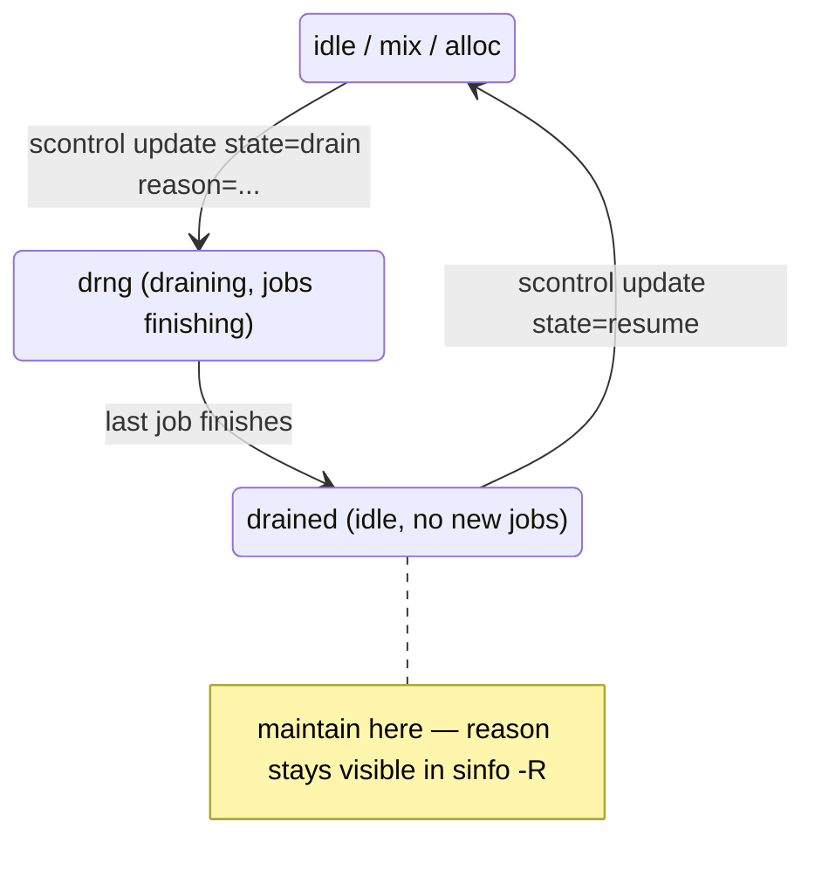
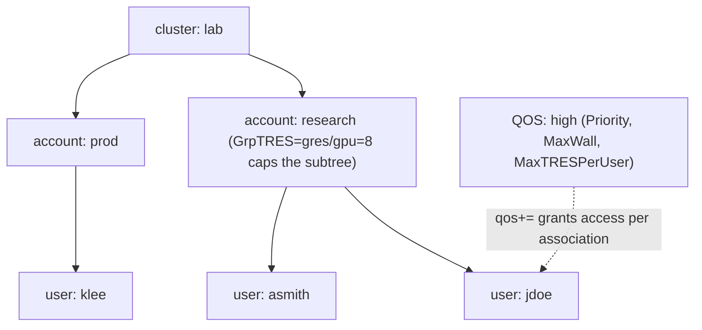

# Week 10 · Day 1 — Slurm administration

[← Master Plan](../../../MASTER-PLAN.md) · [Week 10 overview](plan.md) · [← previous day](../week-9/day-5.md) · [next day →](day-2.md)

New domain: **Administration (23%)**. Last week you *installed* Slurm; this week you *run*
it — node lifecycle, accounting, QOS, fairshare. These are the verbs the exam's hands-on
labs test directly. Also on this week's checklist: **book the exam slot for ~Fri
2026-10-02** (see close-the-day).

## Study block (2 h)

### 1. Node & partition operations (0:00–0:45)

`sinfo` state codes you must read at a glance: **idle** (free), **mix** (partially
allocated), **alloc** (full), **drain**/**drng** (no new jobs; drng = draining, jobs still
finishing), **down** (unreachable/failed) — and the suffix `*` = slurmd not responding.

The admin verb set, all through `scontrol`:

```bash
scontrol show node gpu01                 # full node record incl. Reason
scontrol update nodename=gpu01 state=drain reason="nvml errors, maint"
scontrol update nodename=gpu01 state=resume     # back to service
scontrol show partition gpu
scontrol update partitionname=gpu state=down    # stop new scheduling, jobs keep running
scontrol update partitionname=gpu maxtime=12:00:00
```

Job control: `scontrol hold <jobid>` / `release <jobid>`, `scancel <jobid>` (or
`scancel -u jdoe`, `scancel --state=PENDING -p gpu`). Drain-then-maintain is the canonical
exam workflow: **drain → wait for drng→drained → maintain → resume**. A `reason` string is
mandatory on drain — and shows up in `sinfo -R`, which is where you look first when nodes
"disappear" from a partition.

**The canonical maintenance loop — drain (with a reason), wait for drng to become drained, work, resume.**



### 2. Accounting: the associations tree (0:45–1:15)

Everything policy-shaped in Slurm hangs off slurmdbd's tree: **cluster → account → user**
(an "association" = one path through that tree, optionally per-partition). `sacctmgr` is
the only write-tool:

```bash
sacctmgr add account research Description="ml research"
sacctmgr add user jdoe account=research
sacctmgr modify account research set GrpTRES=gres/gpu=8    # group-wide GPU cap
sacctmgr show assoc tree format=account,user,grptres,qos%20
```

**Everything policy-shaped hangs off this tree — an association is one cluster-to-account-to-user path.**



`sacct` vs `sreport` — a favorite MCQ distinction: **`sacct`** = per-job records (what did
job 1234 use); **`sreport`** = aggregated reports (cluster utilization by account last
month). `sacct -j 1234 --format=JobID,Elapsed,TRESUsageInTot%40` vs
`sreport cluster utilization start=2026-09-01`.

### 3. QOS, preemption, fairshare (1:15–1:35)

A **QOS** is a named bundle of limits + priority that jobs attach to (`sbatch --qos=high`):

```bash
sacctmgr add qos high set Priority=100 MaxWall=04:00:00 MaxTRESPerUser=gres/gpu=2
sacctmgr modify user jdoe set qos+=high        # grant access to it
```

Knobs to know: `Priority`, `MaxWall`, `MaxTRESPerUser`, `GrpTRES`, `MaxJobsPerUser`,
`Preempt`/`PreemptMode`. **Preemption** via QOS: `PreemptType=preempt/qos` in slurm.conf,
then a high QOS lists which QOSes it may preempt; `PreemptMode=REQUEUE|CANCEL|SUSPEND`
decides the victim's fate. (Tomorrow you'll see Run:ai/KAI do the same thing with queues.)

**Fairshare**: `PriorityType=priority/multifactor` computes job priority from weighted
factors — fairshare (past usage vs your share), age, job size, partition, QOS
(`PriorityWeightFairshare=10000` etc. set the mix). Under-served accounts float up;
heavy users sink. Inspect with **`sshare`** (usage vs share) and `sprio` (per-pending-job
factor breakdown).

**What breaks and how you notice:** jobs rejected at submit with an association error →
user not in the account (`AccountingStorageEnforce`); `--qos=high` rejected → QOS exists
but the user's association doesn't include it; priorities look "stuck" → check `sprio` —
usually one weight dominates; slurmdbd down → submissions may still work but accounting
silently gaps, `sacct` goes quiet.

### 4. Do (1:35–2:00) — [lab-slurm-basics.md](../labs/lab-slurm-basics.md) Part C

On the container cluster: create account + user + QOS, submit with `--qos`, verify with
`sacct`; then drain/resume a node and read `sinfo -R`. This is exit-criterion #1 — do it
until it needs no docs.

**Read next:** https://slurm.schedmd.com/qos.html · https://slurm.schedmd.com/accounting.html

### Quick check

1. `sinfo` shows `gpu01  drng`. What exactly is happening, and how is it different from `drain`ed?
2. Which tool answers "how many GPU-hours did account *research* burn in June" — `sacct` or `sreport` — and why?
3. Write from memory the sacctmgr line that creates a QOS with 4 h max walltime and a 2-GPU-per-user cap.
4. What must be true in slurm.conf AND in the QOS definitions for QOS-based preemption to work?

<details><summary>Answers</summary>

1. Node is draining: marked to accept no new jobs but still running existing ones; `drained` = drain requested and now idle. Both keep the admin's `reason` (visible via `sinfo -R`).
2. `sreport` — it aggregates usage across jobs/accounts/time windows (`sreport cluster AccountUtilizationByUser`); `sacct` lists individual job records.
3. `sacctmgr add qos <name> set Priority=<n> MaxWall=04:00:00 MaxTRESPerUser=gres/gpu=2`
4. slurm.conf: `PreemptType=preempt/qos` (+ a `PreemptMode`); the high QOS must list the preemptable QOSes in its `Preempt=` setting.

</details>

## Build block (4 h)

**Local, free — parallelism week begins on CPU/gloo.**
Brief: [week-10-parallelism-internals/README.md](../../../gpu-engineering-lab/03-scale-and-serve/week-10-parallelism-internals/README.md)

Objective: **tensor-parallel linear layers + the f/g conjugate ops** in `src/tp_layers.py`.

- [ ] `_CopyToParallelRegion` (f: identity fwd, all-reduce bwd) and `_ReduceFromParallelRegion` (g: all-reduce fwd, identity bwd) as `autograd.Function`s.
- [ ] `ColumnParallelLinear` (output-dim split, optional `gather_output`) and `RowParallelLinear` (input-dim split, partial-output all-reduce).
- [ ] Weight init: full weight with fixed seed on every rank, then slice your shard — exact match vs single-process baseline.
- [ ] `make test` green (world_size=2, CPU/gloo) before renting anything.

Hint: if TP output is *close but not equal* to baseline, it's the init — you sliced before
seeding identically, or sliced the wrong dim. Whiteboard why f's backward is an all-reduce
(replicated input ⇒ partial grads) before coding; it's tomorrow's building block *and* an
interview staple. No cloud spend today.

## Close the day (15 min)

- Anki: sinfo state codes, drain workflow, sacct-vs-sreport, QOS knobs, fairshare factors.
- `notes.md`: one line — the associations tree in your own words.
- **Book the exam slot** for ~Fri 2026-10-02 (this week's plan says now, not later). Log confirmation in notes.
- Cloud: nothing rented today; pre-pick tomorrow's 2×GPU instance.
