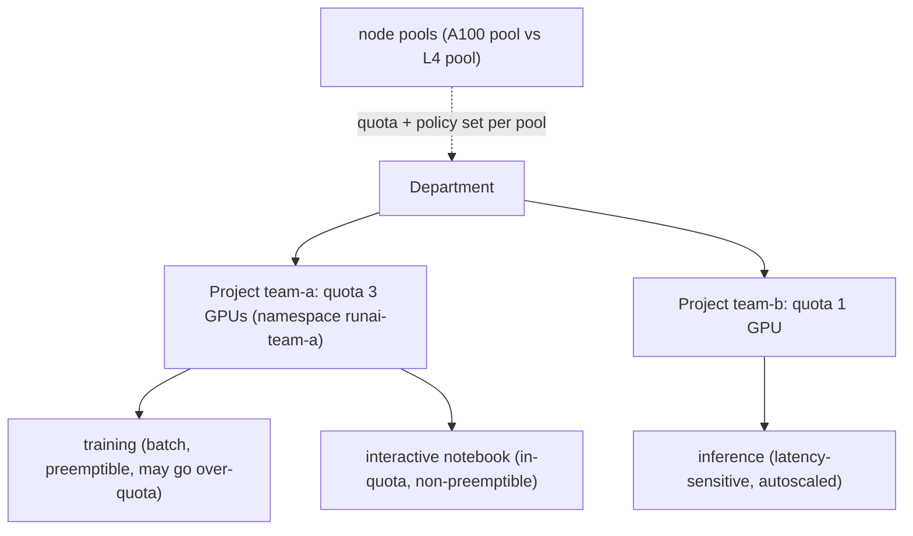
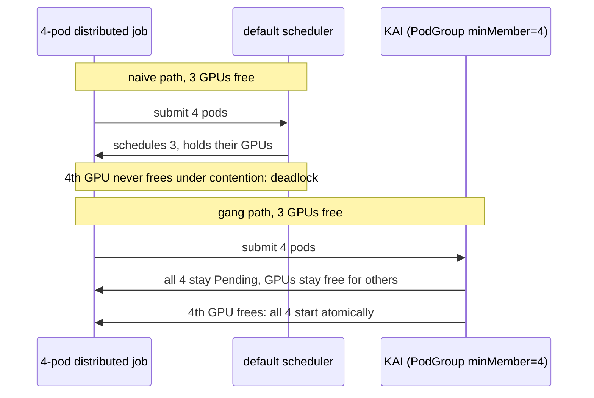

# Week 10 · Day 2 — Run:ai and its KAI scheduler core

[← Master Plan](../../../MASTER-PLAN.md) · [Week 10 overview](plan.md) · [← previous day](day-1.md) · [next day →](day-3.md)

Administration (23%), the part you're secretly ahead on: you already **demo** KAI gang
scheduling in the k8s-ai-stack-demo. Today's job is mapping what you demo onto **Run:ai
product vocabulary** — the exam asks in product terms, not scheduler internals.

## Study block (2 h)

### 1. The Run:ai product model (0:00–0:45)

NVIDIA Run:ai is the enterprise GPU-orchestration layer on Kubernetes. Two halves: a
**control plane** (SaaS or self-hosted — UI, API, policy, analytics) and a **cluster**
component installed on each K8s cluster it manages. The org model, top-down:

- **Departments** → contain → **Projects**. A project maps to a **Kubernetes namespace**
  (created as `runai-<project>`), and carries a **GPU quota** — its *deserved* share.
- **Over-quota**: a project may exceed its quota by borrowing *idle* GPUs — but borrowed
  capacity is **reclaimable**: when the owning project needs its deserved GPUs back, the
  borrower's workloads get preempted. Quota = floor you're guaranteed, not ceiling.
- **Preemptible vs non-preemptible workloads**: within-quota workloads can be marked
  non-preemptible; anything running over-quota is preemptible *by definition*.
- **Workload types** — the exam expects the triple: **interactive** (notebooks; often
  non-preemptible, quota-bounded), **training** (batch, checkpointable, preemptible,
  may go over-quota), **inference** (serving, latency-sensitive, autoscaled).
- **Node pools**: partition the cluster's nodes (e.g. A100 pool vs L4 pool); quotas and
  scheduling policy can be set per pool.

**The Run:ai org model — quota is a guaranteed floor per project; anything borrowed above it is reclaimable.**

### 2. Fractional GPUs (0:45–1:15)

Run:ai lets a workload request **a fraction** (e.g. `0.5` GPU) or an explicit **GPU memory
amount** (e.g. 10 GiB). Multiple pods then share one physical GPU; Run:ai enforces the
memory split in **software** and time-shares the compute. Placement of this in the sharing
taxonomy you already demo (memorize the row-by-row contrast):

| | Isolation | Memory enforcement | Granularity | Hardware needed |
|---|---|---|---|---|
| **MIG** | hardware (SM+mem+L2 slices) | hardware | fixed profiles | A100/H100/A30/B200… |
| **Time-slicing** | none | none (honor system) | arbitrary | any GPU |
| **MPS** | process-level, shared context | opt-in limits | arbitrary | any GPU |
| **Run:ai fractions** | software-managed | software (enforced) | arbitrary fraction / GiB | any GPU |

So: Run:ai fractions ≈ *managed* time-slicing **plus enforced memory limits** — better than
raw time-slicing, weaker than MIG's hardware walls. Exam trap: fractions do **not** give
fault isolation; a crashing neighbor can still take the GPU down. MIG is the only option
with hardware isolation (Day 4).

### 3. Run:ai → KAI mapping (1:15–1:35)

**KAI Scheduler** is Run:ai's open-sourced scheduler core (Apache-2.0, github.com/NVIDIA/KAI-Scheduler)
— the thing your demo installs. The concept map, product term → KAI mechanism:

| Run:ai (product) | KAI (open source) |
|---|---|
| Project + GPU quota | **Queue** with `quota` (deserved share) |
| Department hierarchy | parent/child queues |
| Over-quota borrowing | queue `overQuotaWeight` — idle capacity split by weight |
| Reclaim on demand | queue **reclaim**: preempt borrowers when owner is under quota |
| Distributed workload starts atomically | **gang scheduling** via PodGroup (all-or-nothing) |
| Preemptible workload | lower-priority pod in queue; victim of reclaim/priority preemption |
| Fractional GPU | GPU-sharing reservation pods + memory request annotations |

Pods opt in with `schedulerName: kai-scheduler` and a queue label — exactly what
[`scheduling/deadlock-gang-kai.yaml`](../../../k8s-ai-stack-demo/scheduling/deadlock-gang-kai.yaml)
does in your demo. When the exam says "project quota exceeded, workload preempted," you
should *see* the KAI reclaim you demo in scene form.

**Why gang scheduling exists — partial allocation squats on GPUs and deadlocks; PodGroup admits all pods or none.**

**What breaks and how you notice:** gang job half-scheduled forever under the default
scheduler → that's the deadlock your demo's `deadlock-naive.yaml` shows, fixed by PodGroup
gang semantics; pods Pending with a queue error event → missing/misnamed queue label;
"my job was killed at 2 am" → reclaim of over-quota capacity, visible in events — working
as designed, and you should be able to say why.

### 4. Do (1:35–2:00) — start [lab-runai-kai.md](../labs/lab-runai-kai.md)

Install KAI on the lab cluster, create two queues with different quotas/over-quota weights.
Tomorrow: competing gang jobs + preemption. (Demo-repo API re-verification is tomorrow's
SHOW touchpoint — today just note any obvious drift you see while installing.)

**Read next:** Run:ai docs — https://run-ai-docs.nvidia.com/ (scheduling, fractions,
projects); KAI README — https://github.com/NVIDIA/KAI-Scheduler

### Quick check

1. A project has quota 4, is using 7, and another project now needs its GPUs. What happens and what is this called?
2. Run:ai fractional GPUs vs MIG: name the two enforcement differences that matter.
3. Map to KAI: project quota, over-quota borrowing, "distributed job starts all-or-nothing".
4. Which Run:ai workload type is typically non-preemptible and why?

Answers

1. The 3 over-quota (borrowed) GPUs' workloads are preempted so the owning project gets its deserved quota back — **reclaim** (over-quota capacity is always preemptible).
2. Fractions enforce the memory split in software and time-share compute with no fault isolation; MIG partitions SMs+memory+L2 in hardware — real isolation, but only fixed profiles on MIG-capable GPUs.
3. Quota → KAI Queue `quota` (deserved); over-quota → `overQuotaWeight` share of idle capacity; all-or-nothing start → gang scheduling via PodGroup.
4. Interactive (notebook) workloads — a human is attached; killing/restarting mid-session destroys work, so they run within quota, non-preemptible.

## Build block (4 h)

**Cloud day — rent the 2×GPU node.**
Brief: [week-10-parallelism-internals/README.md](../../../gpu-engineering-lab/03-scale-and-serve/week-10-parallelism-internals/README.md)

Objective: **TP transformer** — yesterday's layers wired into the week-05 GPT
(`src/tp_model.py`).

- [ ] TP MLP block: column → gelu → row (one all-reduce fwd, one bwd — because of f/g).
- [ ] TP attention: Q,K,V column-parallel, heads/2 per rank, output proj row-parallel.
- [ ] Same seed + input: TP=2 logits vs single-GPU ≤ 1e-3 max abs diff; short training run overlays baseline loss.
- [ ] Collective count verified: exactly 2 all-reduces per layer per forward (wrap `dist.all_reduce` and count).

Hint: if you count more than 2 per layer, the usual culprit is `gather_output=True` left on
inside the block — intermediate activations should stay sharded. Cost discipline: tests ran
green locally yesterday, so today is validation + measurement only; push before breaks,
**shut the node down** at session end, log the session cost.

## Close the day (15 min)

- Anki: project/quota/over-quota/reclaim, workload triple, sharing-taxonomy table rows, Run:ai↔KAI map.
- `notes.md`: one line — the sentence you'd use in the exam to define over-quota.
- Blockers: any KAI install friction → feeds tomorrow's SHOW re-verification.
- **Instance terminated?** Console check + cost log line.
