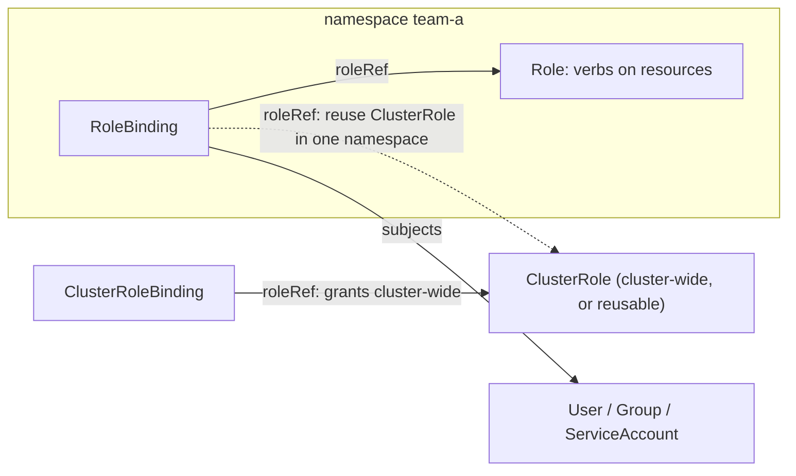

# Week 10 · Day 3 — Kubernetes administration: RBAC, quotas, node ops

[← Master Plan](../../../MASTER-PLAN.md) · [Week 10 overview](plan.md) · [← previous day](day-2.md) · [next day →](day-4.md)

Administration (23%) on the K8s side: who may do what (RBAC), who may *use* what
(quotas/limits), and how you take a node out of service without killing anyone's training
run. Plus this week's **SHOW touchpoint**: re-verifying the demo repo's pinned KAI/DRA APIs.

## Study block (2 h)

### 1. RBAC: four objects, one sentence (0:00–0:45)

*"A **(Cluster)Role** lists verbs on resources; a **(Cluster)RoleBinding** attaches it to a
subject (user, group, or ServiceAccount)."* Scope is the whole game:

- **Role** = namespaced permissions; **ClusterRole** = cluster-wide *or* reusable across
  namespaces (a RoleBinding can reference a ClusterRole to grant it in one namespace).
- Humans are certs/OIDC identities (no User objects — Week 9 Day 5); workloads use
  **ServiceAccounts**.

**Four objects, two scopes — the binding is the glue: roleRef picks the permission set, subjects pick who gets it.**



Write this pair from memory — it's exit-criterion material (< 5 min from scratch):

```yaml
apiVersion: rbac.authorization.k8s.io/v1
kind: Role
metadata: {name: pod-creator, namespace: team-a}
rules:
- apiGroups: [""]                # "" = core API group
  resources: ["pods"]
  verbs: ["create", "get", "list", "watch"]
---
apiVersion: rbac.authorization.k8s.io/v1
kind: RoleBinding
metadata: {name: jdoe-pod-creator, namespace: team-a}
subjects:
- kind: User
  name: jdoe
roleRef: {kind: Role, name: pod-creator, apiGroup: rbac.authorization.k8s.io}
```

Verification verb the exam loves: **`kubectl auth can-i`**, especially impersonation:

```bash
kubectl auth can-i create pods -n team-a --as jdoe                       # yes
kubectl auth can-i delete pods -n team-a --as jdoe                       # no
kubectl auth can-i list nodes --as system:serviceaccount:team-a:default # no (namespaced Role)
```

**What breaks and how you notice:** `Error from server (Forbidden)` names the exact
identity, verb, and resource — read it, don't guess; a binding that "does nothing" usually
points its `roleRef` at the wrong kind (Role vs ClusterRole) or lives in the wrong
namespace; RBAC is **additive only** — there is no deny rule, so "remove access" means
finding and deleting the binding that grants it.

### 2. ResourceQuota & LimitRange — GPUs are just another resource (0:45–1:15)

**ResourceQuota** caps a namespace's total consumption; GPUs count via the extended
resource name:

```yaml
apiVersion: v1
kind: ResourceQuota
metadata: {name: gpu-quota, namespace: team-a}
spec:
  hard:
    requests.nvidia.com/gpu: "4"
    limits.nvidia.com/gpu: "4"
```

A pod pushing the namespace past 4 GPUs is **rejected at admission** — instant `Forbidden:
exceeded quota` on create, not a Pending pod. **LimitRange** is per-pod/per-container
defaults and bounds (default requests, max per container) — quota is the namespace ceiling,
LimitRange is the per-object guardrail. Note the layering with yesterday: ResourceQuota is
a *hard static* cap; Run:ai/KAI quotas are *scheduler-level, borrowable* shares. Different
tools, both called "quota" — a classic exam discrimination.

### 3. Node maintenance + steering GPU pods (1:15–1:35)

```bash
kubectl cordon gpu-node-1      # unschedulable; existing pods untouched
kubectl drain gpu-node-1 --ignore-daemonsets --delete-emptydir-data
kubectl uncordon gpu-node-1    # back in service
```

`drain` = cordon + evict, and it **honors PodDisruptionBudgets** — if a PDB says the
eviction would break availability, drain waits (the classic "stuck drain"). DaemonSets
aren't evicted (hence the flag). This is Slurm's drain/resume with different spelling —
same reflex, from Week 10 Day 1.

Steering pods to GPU nodes — two directions, one MCQ: **taints & tolerations repel**
(taint GPU nodes so *only* GPU workloads land — protects expensive nodes from riff-raff);
**nodeSelector/affinity attract** (pod insists on `nvidia.com/gpu.product=NVIDIA-A100…`
labels from GFD). Production GPU pools use *both*.

### 4. Do (1:35–2:00) — finish [lab-runai-kai.md](../labs/lab-runai-kai.md) + quota proof

Two competing gang jobs, watch KAI preemption/reclaim happen; then apply the GPU
ResourceQuota above and prove a second 2-GPU pod is rejected at admission.

**✦ SHOW touchpoint (wk 10):** re-verify the
[demo repo](../../../k8s-ai-stack-demo/README.md)'s pinned fast-moving APIs against
upstream: the KAI manifests in [`scheduling/`](../../../k8s-ai-stack-demo/scheduling/)
(scheduler version, queue/PodGroup API groups, labels) and the DRA manifests in
[`dra/`](../../../k8s-ai-stack-demo/dra/) (`resource.k8s.io` version, ResourceClaim/
ComputeDomain fields). DRA and KAI move fast; a demo that 404s on apply is a dead demo.
Log any drift + fix the pins.

### Quick check

1. Role vs ClusterRole — and why would a RoleBinding ever reference a ClusterRole?
2. A pod exceeding the namespace GPU ResourceQuota: Pending or rejected? How does that differ from an unsatisfiable KAI queue request?
3. Why does `kubectl drain` hang forever sometimes, and which two flags do you almost always need?
4. Taints vs node affinity for a GPU pool — which one protects the nodes, which one places the pod?

<details><summary>Answers</summary>

1. Role is namespaced, ClusterRole cluster-scoped; a RoleBinding referencing a ClusterRole grants that (reusable) permission set *within one namespace* — define once, bind everywhere.
2. Rejected at admission (`Forbidden: exceeded quota`) — quota is an API-server check. A KAI queue over its deserved quota leaves pods Pending/queued (and possibly schedulable over-quota later) — scheduler-level, dynamic.
3. A PodDisruptionBudget blocks the eviction (or a pod with no controller can't be evicted safely); `--ignore-daemonsets` and `--delete-emptydir-data`.
4. Taints (+ tolerations) protect the nodes by repelling non-GPU pods; nodeSelector/affinity places the pod by attracting it to labeled GPU nodes.

</details>

## Build block (4 h)

**Cloud day — 2×GPU node.**
Brief: [week-10-parallelism-internals/README.md](../../../gpu-engineering-lab/03-scale-and-serve/week-10-parallelism-internals/README.md)

Objective: **GPipe pipeline parallelism** (`src/pipeline.py`) — 2 stages, fill–drain
microbatch schedule, measure the bubble.

- [ ] GPT split: stage0 = embeddings + first half of blocks; stage1 = rest + head; P2P activations fwd, grads bwd.
- [ ] Fill–drain over m microbatches with gradient accumulation; loss on last stage.
- [ ] Bubble fraction measured for m ∈ {1,2,4,8,16}; plotted vs theory (p−1)/(m+p−1), residual explained (comm time, uneven split).
- [ ] Loss parity vs single-GPU baseline at identical global batch.

Hint: deadlocks here are almost always send/recv ordering — both ranks blocking on recv.
Fix the schedule on paper first (who sends what at step t), then code it. Push before
breaks; **shut the node down** at session end; cost log.

## Close the day (15 min)

- Anki: Role/RoleBinding skeleton, `auth can-i --as`, quota-vs-KAI-quota, drain flags, taints-vs-affinity.
- `notes.md`: one line — result of the KAI/DRA pin re-verification (drift found y/n).
- Blockers: unresolved API drift → open a demo-repo TODO now, not week 11.
- **Instance terminated?** Console check + cost log line. Lab VM stopped.
