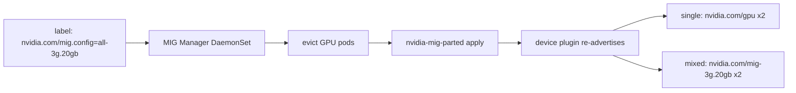

# Week 10 · Day 4 — MIG configuration

[← Master Plan](../../../MASTER-PLAN.md) · [Week 10 overview](plan.md) · [← previous day](day-3.md) · [next day →](day-5.md)

The most command-dense Administration (23%) topic, and a likely hands-on lab candidate:
carving a GPU into hardware-isolated slices, manually and declaratively. You demo MIG
concepts already — today you drill the exact syntax until it's motor memory.

## Study block (2 h)

### 1. Concepts: GI, CI, profiles, isolation (0:00–0:30)

**MIG** (Multi-Instance GPU) partitions one GPU into up to 7 instances with **hardware**
isolation — dedicated SM slices, memory slices, and L2 cache slices. Two-level hierarchy:

- **GPU Instance (GI)**: the memory + SM partition (the "slice of the card").
- **Compute Instance (CI)**: a further split of a GI's SMs (same memory). Default: 1 CI
  spanning the GI (`-C` in the create command does this for you).

Profile naming: `<compute slices>g.<memory>gb`. **A100-40GB table** (memorize — the exam
asks what fits):

| Profile | Count max | SM fraction | Memory |
|---|---|---|---|
| 1g.5gb | 7 | 1/7 | 5 GB |
| 2g.10gb | 3 | 2/7 | 10 GB |
| 3g.20gb | 2 | 3/7 | 20 GB |
| 4g.20gb | 1 | 4/7 | 20 GB |
| 7g.40gb | 1 | whole | 40 GB |

Mixes are allowed if slices fit (e.g. 3g.20gb + 3g.20gb, or 4g.20gb + 2g.10gb + 1g.5gb).

**Why only two 3g.20gb fit on an A100-40GB — slice arithmetic on both axes; a third would need slices that no longer exist.**

```
A100-40GB: 7 compute slices, 8 memory slices (~5 GB each)

compute: | 1 | 2 | 3 | 4 | 5 | 6 | 7 |
         |  3g.20gb  |  3g.20gb  | - |    3 + 3 slices used, 1 left over
memory:  | 1 | 2 | 3 | 4 | 5 | 6 | 7 | 8 |
         |  20 GB (4 sl) |  20 GB (4 sl) |    memory full -> no third instance

hierarchy: GPU -> GI (SM + memory partition) -> CI (SM split within a GI; -C creates 1 per GI)
```

**Hardware support**: A100, A30, H100/H200, B200 — **yes**; L4, L40S, consumer GPUs —
**no** (their sharing options are time-slicing/MPS only). That one fact kills several
distractor answers.

### 2. Manual flow with nvidia-smi (0:30–1:00)

```bash
nvidia-smi -i 0 -mig 1               # enable MIG mode on GPU 0
#   requires the GPU idle; may require GPU reset (nvidia-smi -i 0 -r)
#   pre-Ampere-refresh systems: a reboot; drain the node first in prod

nvidia-smi mig -lgip                 # list GI profiles (IDs + counts available)
nvidia-smi mig -cgi 3g.20gb,3g.20gb -C   # create 2 GIs, -C = also create default CIs
nvidia-smi mig -lgi                  # list created GPU instances
nvidia-smi mig -lci                  # list compute instances
nvidia-smi -L                        # note the MIG device UUIDs (MIG-<uuid>)

# teardown — order matters: CIs first, then GIs
nvidia-smi mig -dci && nvidia-smi mig -dgi
nvidia-smi -i 0 -mig 0               # disable MIG mode
```

**What breaks and how you notice:** `-mig 1` returns "pending" → something still holds the
GPU (processes, DCGM, monitoring agents) — drain/stop them, reset; create fails
`Insufficient capacity` → slice arithmetic doesn't fit the remaining slots (`-lgip` shows
what's left); jobs "can't see the GPU" after enabling MIG → an un-partitioned MIG-mode GPU
exposes **no** usable devices until you create instances; CUDA sees exactly **one** MIG
device per process — no multi-MIG-per-process.

### 3. Declarative flow: MIG Manager on Kubernetes (1:00–1:35)

On a GPU Operator cluster you don't run `nvidia-smi mig` by hand — **MIG Manager** (a
DaemonSet, using **`nvidia-mig-parted`** underneath) reconciles a node label:

```bash
kubectl label nodes gpu-node-1 nvidia.com/mig.config=all-3g.20gb --overwrite
# MIG Manager: evicts GPU pods → applies mig-parted profile → device plugin re-advertises
kubectl get node gpu-node-1 -o json | jq '.status.allocatable'
```

**Declarative MIG — you change a label; MIG Manager drives eviction, mig-parted, and re-advertisement.**



Two **strategies** (`mig.strategy` in ClusterPolicy) — a guaranteed exam distinction:

- **`single`**: all GPUs on the node carved into *one uniform* profile; advertised as plain
  `nvidia.com/gpu` (pods don't need MIG-aware requests).
- **`mixed`**: heterogeneous profiles; advertised as profile-specific resources —
  `nvidia.com/mig-3g.20gb: 1` in the pod's limits.

Config sets live in the MIG Manager's ConfigMap (`all-disabled`, `all-1g.5gb`,
`all-balanced`, custom). Standalone/Slurm clusters use `nvidia-mig-parted apply -f
config.yaml` directly — same tool, no operator. (Slurm exposes MIG devices via
`AutoDetect=nvml` in gres.conf — they appear as distinct gres GPUs.)

### 4. MIG vs time-slicing vs MPS — the discriminator table (1:35–1:45)

| | MIG | Time-slicing | MPS |
|---|---|---|---|
| Isolation | hardware (SM/mem/L2) | none | process-level, shared context |
| Memory protection | yes, enforced | no | opt-in limit |
| Fault isolation | yes | no (one crash can hit all) | no |
| QoS/predictability | strong | none | medium |
| Hardware | Ampere+ datacenter | any | any |
| Use case | multi-tenant prod | dev/bursty low-value | many small kernels, one user |

Yesterday's Run:ai fractions sit between time-slicing and MPS: software memory enforcement,
no hardware isolation.

### 5. Do (1:45–2:00 + spillover) — [lab-mig-config.md](../labs/lab-mig-config.md)

Rent **1×A100 spot for ~2 h** (the L4 lab VM cannot do MIG — see the support list). If the
budget says no: the lab's read-along path, hand-writing **every** command. Exit criterion:
2× `3g.20gb` from memory, both manual and via the node label.

**Read next:** GPU Operator MIG page + `nvidia-mig-parted` README; MIG user guide —
https://docs.nvidia.com/datacenter/tesla/mig-user-guide/

### Quick check

1. Why can't you create 3× `3g.20gb` on an A100-40GB? Show the arithmetic.
2. `single` vs `mixed` strategy: what resource name does a pod request under each?
3. Write the teardown sequence from a fully-partitioned GPU back to non-MIG mode.
4. A team wants guaranteed memory + fault isolation for 7 small tenants on one A100. MIG, time-slicing, or MPS — and which profile?

<details><summary>Answers</summary>

1. Each 3g.20gb takes 3 of 7 compute slices and 20 of 40 GB (4 of 8 memory slices); three would need 9 compute slices and 60 GB — only 2 fit.
2. `single`: plain `nvidia.com/gpu` (uniform slices masquerade as GPUs). `mixed`: profile-named extended resources like `nvidia.com/mig-3g.20gb`.
3. `nvidia-smi mig -dci` → `nvidia-smi mig -dgi` → `nvidia-smi -i 0 -mig 0` (CIs before GIs; GPU must be idle; reset/reboot if pending).
4. MIG with `1g.5gb` ×7 — the only option with hardware memory + fault isolation; time-slicing/MPS give neither.

</details>

## Build block (4 h)

**Cloud day — the punchline experiment.**
Brief: [week-10-parallelism-internals/README.md](../../../gpu-engineering-lab/03-scale-and-serve/week-10-parallelism-internals/README.md)

Objective: prove **parallelism as necessity** — a GPT that OOMs on one L4 (24 GB) but
trains on two, under both TP=2 and PP=2.

- [ ] Size d_model/layers so params+optimizer+activations > 22 GB; capture the 1-GPU **OOM log** (it's a deliverable).
- [ ] Run TP=2 and PP=2 (m=8): record peak mem/GPU (`torch.cuda.max_memory_allocated`), tokens/sec, step time.
- [ ] README results table filled; expected PCIe shape confirmed or refuted: TP hurts throughput (all-reduce every layer), PP pays bubbles but communicates only at the boundary.

Hint: size the model with arithmetic *before* renting — params×(4+4+8) bytes for
fp32+grads+Adam states gets you within 10%; don't discover sizes by trial-and-OOM at
$1.20/h. Push before breaks. **Two instances possibly live today** (A100 spot for the cert
lab + the 2×L4 build node) — the A100 spot especially must die at the 2 h mark. Log both costs.

## Close the day (15 min)

- Anki: profile table, `-cgi/-dci/-dgi` sequence, mig.config label, single-vs-mixed, discriminator table.
- `notes.md`: one line — TP vs PP throughput result and the one-sentence why.
- Blockers: any MIG command you still can't write cold → first thing tomorrow.
- **Instances terminated?** A100 spot AND build node — console check both. Cost logs updated.
