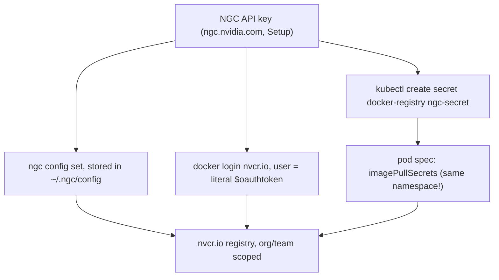

# Week 11 · Day 1 — NGC: the catalog, the CLI, and three ways to authenticate

[← Master Plan](../../../MASTER-PLAN.md) · [Week 11 overview](plan.md) · [← previous day](../week-10/day-5.md) · [next day →](day-2.md)

---

## Study block (2 h)

**Domain: Workload Management (23% of the exam).** Everything an admin deploys this week starts
life in NGC. The exam tests the *operator's* motions: authenticate, pull, verify — not the
marketing tour of the catalog.

### 1. NGC catalog anatomy (0:00–0:30)

Four artifact types, each with its own CLI verb:

| Artifact | Example | Pulled with |
|---|---|---|
| Containers | `nvcr.io/nvidia/pytorch:25.06-py3` | `docker pull` / `ngc registry image pull` |
| Models | `nvidia/nemo/llama-3_1-8b-instruct-nemo` | `ngc registry model download-version` |
| Resources | scripts, notebooks, configs | `ngc registry resource download-version` |
| Helm charts | `gpu-operator`, `network-operator` | `helm fetch https://helm.ngc.nvidia.com/...` |

Container naming decodes as `nvcr.io/<org>/<team-optional>/<image>:<tag>`. Public NVIDIA images
sit under org `nvidia` (or `nim` for NIM microservices); **your private registry is
`nvcr.io/<your-org>/<your-team>/...`** — same registry host, org-scoped namespace, invisible
without auth.

What's inside a deep-learning framework container (e.g. `pytorch:25.06-py3`): CUDA toolkit,
cuDNN, NCCL, and the framework — a **pinned, QA'd, mutually compatible set**, refreshed monthly
(tag = `YY.MM`). The only external dependency is the *host driver*, which must be new enough for
the container's CUDA major version. That is the whole point: NGC containers delete the
CUDA/cuDNN/framework version-matrix problem; the driver is the one thing left to get right.

### 2. NGC CLI and the three authentication paths (0:30–1:15)

Install and configure the CLI (Linux):

```bash
wget https://api.ngc.nvidia.com/v2/resources/nvidia/ngc-apps/ngc_cli/versions/latest/files/ngccli_linux.zip
unzip -o ngccli_linux.zip && chmod u+x ngc-cli/ngc && export PATH="$PATH:$PWD/ngc-cli"
ngc config set        # prompts: API key, CLI output format, org, team, ace
ngc registry image list "nvidia/pytorch*"       # browse
ngc registry model download-version "nvidia/..."  # pull a model artifact
```

The API key comes from ngc.nvidia.com → Setup → Generate API Key. Memorize the **three auth
paths** (exam loves these):

1. **NGC CLI**: `ngc config set` stores the key in `~/.ngc/config`.
2. **Docker**: username is the *literal string* `$oauthtoken` (single-quote it!), password is the key:
   ```bash
   echo "$NGC_API_KEY" | docker login nvcr.io --username '$oauthtoken' --password-stdin
   ```
3. **Kubernetes**: a docker-registry secret referenced by `imagePullSecrets`:
   ```bash
   kubectl create secret docker-registry ngc-secret \
     --docker-server=nvcr.io --docker-username='$oauthtoken' \
     --docker-password="$NGC_API_KEY"
   ```
   then in the pod spec: `spec.imagePullSecrets: [{name: ngc-secret}]`.

**One key, three doors — CLI config, docker login, and the namespace-scoped K8s pull secret all carry the same credential.**



### 3. Symptom → diagnosis → fix (1:15–1:35)

| Symptom | Diagnosis | Fix |
|---|---|---|
| `docker pull` → `unauthorized: authentication required` | not logged in to nvcr.io, or key lacks org access | `docker login nvcr.io` with `$oauthtoken`/key; check org in NGC UI |
| Pod stuck `ErrImagePull` / `ImagePullBackOff` on `nvcr.io/<org>/...` | no `imagePullSecrets`, or secret in wrong namespace | `kubectl describe pod` → events; create secret **in the pod's namespace**; add `imagePullSecrets` |
| Container starts, app dies: `CUDA driver version is insufficient for CUDA runtime version` | container's CUDA newer than host driver supports | older container tag, or upgrade the host driver — this is a *deploy-time compatibility check you skipped* |
| `ngc: command not found` after install | PATH not exported / wrong arch zip | re-export PATH; `ngc --version` |

Diagnostic reflex for any pull failure: `kubectl describe pod <p>` (events tell you 401 vs 404
vs network), then `kubectl get secret ngc-secret -o yaml` (right namespace? right server?), then
test the same pull with `docker`/`ctr` directly on the node.

### 4. Verify the compatibility rule yourself (1:35–2:00)

On today's lab node (build block below rents it), run and record in `notes.md`:

```bash
nvidia-smi --query-gpu=driver_version --format=csv,noheader   # host driver
docker run --rm --gpus all nvcr.io/nvidia/pytorch:25.06-py3 nvcc --version
docker run --rm --gpus all nvcr.io/nvidia/pytorch:25.06-py3 nvidia-smi
```

Note that `nvidia-smi` *inside* the container reports the **host driver** version — the driver
is never in the image. Write the forward-compat rule in your own words: *driver ≥ what the
container's CUDA runtime needs; minor-version compat covers same-major differences.*

**Read next:** NGC user guide sections "NGC CLI" and "Accessing NGC Registry"; skim the private
registry docs for org/team structure.

### Quick check

**1. Exact username and password for `docker login nvcr.io`?**
<details><summary>Answer</summary>The literal string <code>$oauthtoken</code> (quoted, or the shell eats it) as username; your NGC API key as password. Identical credentials in the K8s docker-registry secret.</details>

**2. A pod pulling `nvcr.io/myorg/myteam/trainer:1.0` sits in `ImagePullBackOff`, but `docker pull` of the same image works on the node. Most likely cause?**
<details><summary>Answer</summary>Kubernetes isn't using your docker login — the pod is missing <code>imagePullSecrets</code>, or the <code>ngc-secret</code> exists in a different namespace than the pod. Secrets are namespace-scoped.</details>

**3. What does an NGC framework container guarantee that `pip install torch` doesn't, and what's the one host-side requirement?**
<details><summary>Answer</summary>A pinned, mutually tested CUDA + cuDNN + NCCL + framework stack (monthly <code>YY.MM</code> tags). Host requirement: an NVIDIA driver new enough for the container's CUDA major version.</details>

**4. Where does a private NGC registry live and how is it namespaced?**
<details><summary>Answer</summary>Same host, <code>nvcr.io</code>, namespaced as <code>nvcr.io/&lt;org&gt;/&lt;team&gt;/&lt;image&gt;</code>. Access is governed by the org/team membership tied to the API key.</details>

---

## Build block (4 h) — cluster + GPU Operator

Objective (Day 1 of the [week-11 build brief](../../../gpu-engineering-lab/03-scale-and-serve/week-11-k8s-gpu-serving/README.md)):
bare Ubuntu L4 node → k3s → GPU Operator → proven GPU pod.

- Rent the L4 node — plain Ubuntu 22.04/24.04, **no pre-installed driver** (the Operator installing it *is* the lesson).
- Run `scripts/00-k3s-install.sh` then `scripts/01-gpu-operator.sh` — read both first; you must be able to explain every flag.
- **DoD:** all `gpu-operator` namespace pods Running/Completed; CUDA vectorAdd test pod passes; `kubectl describe node | grep nvidia.com/gpu` shows capacity 1.
- **DoD:** written in the repo: what `runtimeClassName: nvidia` does, how the toolkit rewires containerd, what CDI changes vs the legacy hook.
- Hint: on k3s the Operator must point at k3s's own containerd socket (`/run/k3s/containerd/containerd.sock`) — the install script does it; *find the line*.

---

## Close the day (15 min)

- [ ] Anki: add today's cards (3 auth paths, container naming, forward-compat rule, pull-failure triage) to the NCP-AIO deck; clear due reviews.
- [ ] One line in [notes.md](notes.md): driver version vs container CUDA version observed today.
- [ ] Blockers → tomorrow's top of mind (write them down, don't carry them in your head).
- [ ] **Cloud day: confirm the instance is stopped/terminated** and log today's spend.
