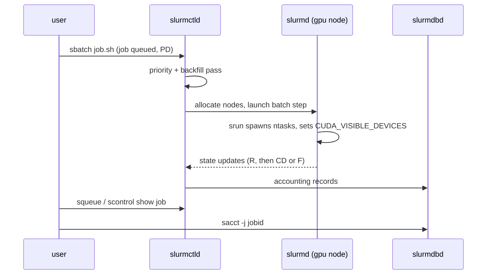

# Week 11 · Day 2 — Deploying training: Slurm sbatch, K8s Jobs, Kubeflow TrainJob

[← Master Plan](../../../MASTER-PLAN.md) · [Week 11 overview](plan.md) · [← previous day](day-1.md) · [next day →](day-3.md)

---

## Study block (2 h)

**Domain: Workload Management (23%).** Same task — "run this training job on N GPUs" — expressed
in the two dialects the exam speaks: Slurm and Kubernetes. Fluency means writing both from
memory in under five minutes each (that's a week-11 exit criterion).

### 1. Slurm dialect (0:00–0:45)

The canonical GPU sbatch script:

```bash
#!/bin/bash
#SBATCH --job-name=llm-ft
#SBATCH --partition=gpu
#SBATCH --nodes=2
#SBATCH --ntasks-per-node=4
#SBATCH --gres=gpu:4            # 4 GPUs PER NODE (gres is per-node)
#SBATCH --time=02:00:00
#SBATCH --output=%x-%j.out      # jobname-jobid
srun python train.py            # srun launches ntasks; one task per GPU here
```

**The sbatch lifecycle — submit to slurmctld, launch via slurmd, audit through slurmdbd.**



The traps the exam sets:

- `--gres=gpu:4` = **4 per node**; `--gpus=8` = **8 total for the job**, which Slurm may spread.
  On one node they coincide; multi-node they don't.
- Slurm sets `CUDA_VISIBLE_DEVICES` per *step* to the allocated indices; with cgroup enforcement
  (`ConstrainDevices=yes`) other GPUs' device files are actually blocked — a rogue process
  can't grab an unallocated GPU.
- Interactive work: `salloc --gres=gpu:1` then `srun --pty bash`, or one-shot
  `srun --gres=gpu:1 --pty bash`.
- Watch and audit: `squeue -u $USER` (state: PD reason column is gold — `Resources`,
  `Priority`, `QOSMaxGRESPerUser`), `scontrol show job <id>`, `sacct -j <id>
  --format=JobID,Elapsed,AllocTRES%40,State,ExitCode`.

Containers under Slurm — the NGC-blessed path is **enroot + pyxis** (rootless runtime + SPANK
plugin), *not* Docker:

```bash
srun --container-image=nvcr.io#nvidia/pytorch:25.06-py3 \
     --container-mounts=/data:/data python train.py
```

Note the `#` replacing the first `/` in the image reference — pyxis syntax, worth a flashcard.

### 2. Kubernetes dialect (0:45–1:30)

Plain K8s Job — the minimum honest GPU training manifest:

```yaml
apiVersion: batch/v1
kind: Job
metadata: {name: ft-job}
spec:
  backoffLimit: 2
  template:
    spec:
      restartPolicy: Never              # Jobs: Never or OnFailure — Always is invalid
      runtimeClassName: nvidia          # unless nvidia is containerd's default runtime
      containers:
      - name: train
        image: nvcr.io/nvidia/pytorch:25.06-py3
        command: ["torchrun", "--nproc_per_node=1", "train.py"]
        resources:
          limits: {nvidia.com/gpu: 1}   # GPUs go in limits; requests auto-set equal
      imagePullSecrets: [{name: ngc-secret}]
```

Multi-node is where plain Jobs run out of road: you'd hand-plumb `MASTER_ADDR`, `MASTER_PORT`,
`WORLD_SIZE`, `RANK` into each pod and pray they all schedule. **Kubeflow TrainJob v2** (your
demo repo!) is the answer the exam wants: a `TrainJob` references a `TrainingRuntime`
(e.g. `torch-distributed`) that templates the torchrun rendezvous env across pods, and under
KAI/Run:ai the pods are **gang-scheduled** — all-or-nothing, so a 4-pod job never deadlocks
holding 3 GPUs. Symptom→concept: *"job's pods all Pending though 3 of 4 GPUs are free"* →
that's gang scheduling working as designed, not a bug.

**Same "train on N GPUs" task, three dialects — plain Jobs run out of road at multi-node; TrainJob adds rendezvous plus gang semantics.**

```mermaid
flowchart TB
    subgraph SL["Slurm"]
        S1["sbatch --gres=gpu:4"] --> S2["slurmctld schedules"]
        S2 --> S3["srun tasks on slurmd nodes"]
    end
    subgraph KJ["Plain K8s Job"]
        K1["Job manifest, nvidia.com/gpu limit"] --> K2["default scheduler, pod by pod"]
        K2 --> K3["multi-node: hand-plumbed rendezvous env"]
    end
    subgraph TJ["Kubeflow TrainJob v2"]
        T1["TrainJob references TrainingRuntime"] --> T2["torchrun env templated across pods"]
        T2 --> T3["gang-scheduled under KAI: all-or-nothing"]
    end
```



### 3. Symptom → diagnosis → fix (1:30–1:40)

| Symptom | Diagnosis | Fix |
|---|---|---|
| sbatch job PD, reason `Resources` | no free GPUs matching gres request | wait, or right-size `--gres`; check `sinfo -o "%P %G %D %t"` |
| PD, reason `QOSMaxGRESPerUser` | QOS GPU cap hit | `sacctmgr show qos format=name,maxtrespu%30`; request under the cap |
| K8s pod `Pending`, event `Insufficient nvidia.com/gpu` | no node advertises enough GPUs | `kubectl describe node`: capacity vs allocated; device plugin healthy? |
| torchrun multi-node hangs at rendezvous | MASTER_ADDR wrong / pods can't reach port | headless Service for rank-0; verify env in each pod; NCCL debugging is week 12 |

### 4. Do (1:40–2:00)

[lab-slurm-basics](../labs/lab-slurm-basics.md) Part B if unfinished — sbatch a real GPU job,
watch `squeue`, read `sacct -j`. Otherwise: re-run your demo repo's TrainJob and narrate it
aloud in NCP-AIO vocabulary (runtime, gang, gres-equivalent, accounting).

**Read next:** Slurm `sbatch` man page GRES section; Kubeflow Trainer TrainJob/TrainingRuntime docs.

### Quick check

**1. `--gres=gpu:2` on `--nodes=3` gives how many GPUs? And `--gpus=2` on `--nodes=1`?**
<details><summary>Answer</summary>6 (gres is per node: 2×3). <code>--gpus=2</code> is job-total, so 2 — identical to gres only in the single-node case.</details>

**2. How does a Slurm step end up seeing only its allocated GPUs — two mechanisms?**
<details><summary>Answer</summary>Slurm sets <code>CUDA_VISIBLE_DEVICES</code> to the allocated indices per step, and with cgroup <code>ConstrainDevices=yes</code> it blocks the other GPUs' device files at kernel level.</details>

**3. What do enroot and pyxis each do, and what's the srun flag?**
<details><summary>Answer</summary>enroot = rootless container runtime converting Docker/NGC images to unprivileged sandboxes; pyxis = the Slurm SPANK plugin exposing it as <code>srun --container-image=nvcr.io#nvidia/pytorch:25.06-py3</code>.</details>

**4. Why does TrainJob + KAI leave all 4 pods Pending when only 3 GPUs are free, and why is that correct?**
<details><summary>Answer</summary>Gang scheduling (PodGroup minMember=4) admits all pods or none. Partial allocation would hold 3 GPUs doing nothing while waiting for a 4th — a deadlock under contention. All-or-nothing prevents it.</details>

---

## Build block (4 h) — containerize + deploy your server

Objective (Day 2 of the [week-11 build brief](../../../gpu-engineering-lab/03-scale-and-serve/week-11-k8s-gpu-serving/README.md)):
ferrum-serve running as a self-healing Deployment on yesterday's cluster.

- Finish the `Dockerfile` — the layer-ordering/caching decisions are the TODOs and the learning.
- Fill `k8s/deployment.yaml` TODOs: GPU limits, `runtimeClassName`, liveness/readiness probes, requests.
- **DoD:** `make deploy-app` → port-forward → `/generate` returns tokens.
- **DoD:** readiness gates on *model-loaded*, not TCP-open — prove it by watching READY flip late.
- **DoD:** `kubectl delete pod` mid-traffic → replacement pod self-heals to Ready without your help.
- Hint: everything you wrote in today's study block K8s manifest appears verbatim in this deployment — write it from memory first, then check.

---

## Close the day (15 min)

- [ ] Anki: gres vs gpus, pyxis syntax, PD reason codes, Job restartPolicy, gang-scheduling why.
- [ ] One line in [notes.md](notes.md): the Dockerfile caching decision you made and why.
- [ ] Blockers noted for tomorrow.
- [ ] **Cloud day: instance stopped/terminated?** Log spend.
