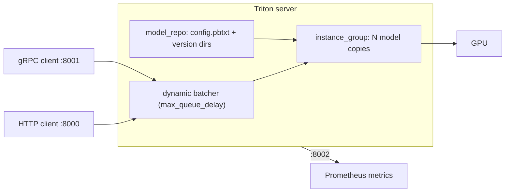
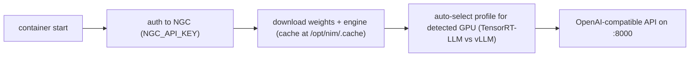

# Week 11 · Day 3 — Inference deployment (Triton, NIM) + resource allocation strategies

[← Master Plan](../../../MASTER-PLAN.md) · [Week 11 overview](plan.md) · [← previous day](day-2.md) · [next day →](day-4.md)

---

## Study block (2 h)

**Domain: Workload Management (23%).** Today closes the deploy story (inference) and builds THE
table of the exam — allocation strategies. If you can only memorize one artifact this week,
it's that table.

### 1. Triton Inference Server — the ops view (0:00–0:45)

Triton serves *any* backend (ONNX, TensorRT, PyTorch, Python, vLLM) from a **model repository**
with a fixed layout the exam will ask you to sketch:

```
model_repo/
  resnet/                # model name
    config.pbtxt         # backend, max_batch_size, inputs/outputs, instance_group
    1/                   # version directory (integer)
      model.onnx
```

```bash
docker run --rm --gpus all -p8000:8000 -p8001:8001 -p8002:8002 \
  -v $PWD/model_repo:/models nvcr.io/nvidia/tritonserver:25.06-py3 \
  tritonserver --model-repository=/models
curl -sf localhost:8000/v2/health/ready && echo READY      # readiness endpoint
curl -s localhost:8000/v2/models/resnet | jq .              # model metadata
```

Memorize the port triple: **8000 HTTP · 8001 gRPC · 8002 Prometheus metrics**. Two throughput
knobs an admin tunes in `config.pbtxt`:

- `dynamic_batching { max_queue_delay_microseconds: 100 }` — server-side request coalescing;
  trades a little latency for a lot of throughput.
- `instance_group [{ count: 2, kind: KIND_GPU }]` — concurrent copies of the model on one GPU;
  overlaps compute with I/O.

**Triton's ops anatomy — three ports in, and the two throughput knobs sit between request and GPU.**



Symptom→fix: model shows `UNAVAILABLE` at `/v2/models/<m>` → `docker logs` will name the exact
config.pbtxt/version-dir problem (wrong dims, missing version folder — the layout above is the
first thing to check).

### 2. NIM — the ops view (0:45–1:20)

NIM = a model packaged *with* its optimized inference stack behind an OpenAI-compatible API.
The admin's whole job:

```bash
docker login nvcr.io                     # $oauthtoken / NGC key — day 1
docker run --rm --gpus all -e NGC_API_KEY \
  -p 8000:8000 nvcr.io/nim/meta/llama-3.1-8b-instruct:latest
curl -s localhost:8000/v1/models | jq .
curl -s localhost:8000/v1/chat/completions -H 'Content-Type: application/json' \
  -d '{"model":"meta/llama-3.1-8b-instruct","messages":[{"role":"user","content":"hi"}]}'
```

Key exam facts: `NGC_API_KEY` env var required at *runtime* (the container downloads the engine);
on startup NIM **auto-selects a model profile** (TensorRT-LLM vs vLLM engine, precision) for the
detected GPU; on K8s you deploy via Helm or the **NIM Operator**. Cache the downloaded engines
(`-v nim-cache:/opt/nim/.cache`) or every restart re-downloads gigabytes.

**What a NIM does at startup that Triton doesn't — authenticate, download, self-profile, then serve.**



When an admin picks what: **raw vLLM** = max control/OSS, you own tuning; **Triton** =
multi-model, multi-backend consolidation on shared infra, mature metrics; **NIM** = fastest
supported path to an optimized endpoint, licensed with NVIDIA AI Enterprise.

### 3. THE allocation-strategy table (1:20–1:50)

Build this in [notes.md](notes.md) from memory, then correct it:

| Strategy | Isolation | Granularity | Use when |
|---|---|---|---|
| Whole GPU | full device | 1 GPU | default; latency-critical prod |
| MIG | **hardware** (memory, SM, faults) | up to 7 slices (A100/H100: 1g.5gb…) | multi-tenant, guaranteed QoS, noisy neighbors forbidden |
| Time-slicing | **none** — full context swap, shared memory | K replicas of `nvidia.com/gpu` | bursty dev/test, oversubscription accepted |
| MPS | none for faults; concurrent kernels, shared memory | per-process % via env | many small kernels, one trust domain, max throughput |
| Fractions (Run:ai/KAI) | scheduler-enforced memory quota | arbitrary fraction | platform-managed sharing with quotas/fairness |
| DRA ResourceClaims | n/a — *selection* mechanism | attribute-level (CEL: "≥40GB", MIG profile) | K8s ≥1.34 structured parameters; successor to opaque `nvidia.com/gpu` counts |

Your demo repo covers MIG/time-slicing/MPS and DRA in depth — today you only need instant recall
of the isolation column and one use-case each. Tomorrow's build block makes the time-slicing
"no isolation" row *measurable* (interference numbers).

### 4. Do (1:50–2:00)

On the lab node: `curl` your ferrum-serve readiness endpoint, then sketch (paper) how you'd
swap it for Triton and for NIM — which YAML lines change? That mapping is an exam lab in disguise.

**Read next:** Triton model-configuration docs (config.pbtxt reference); NIM getting-started
(profiles + K8s deployment page).

### Quick check

**1. Triton's three ports and the readiness URL?**
<details><summary>Answer</summary>8000 HTTP/REST, 8001 gRPC, 8002 Prometheus metrics; <code>GET /v2/health/ready</code> (per-model: <code>/v2/models/&lt;m&gt;/ready</code>).</details>

**2. Sketch the repository layout for ONNX model "resnet" version 1.**
<details><summary>Answer</summary><code>model_repo/resnet/config.pbtxt</code> + <code>model_repo/resnet/1/model.onnx</code> — name dir, config at model level, integer version dir holding the weights.</details>

**3. Seven isolated inference services on one A100 vs many identical CUDA processes from one user wanting max throughput — pick strategies.**
<details><summary>Answer</summary>MIG (7× 1g.5gb — hardware isolation of memory/SM/faults) for the first; MPS for the second (concurrent kernel execution, no context-switch serialization; acceptable because it's a single trust domain).</details>

**4. What does a NIM container do at startup that a Triton container doesn't?**
<details><summary>Answer</summary>Authenticates to NGC with <code>NGC_API_KEY</code>, downloads model weights/engine, and auto-selects an optimized profile (TensorRT-LLM or vLLM, precision) for the detected GPU. Triton just loads whatever repository you mounted.</details>

---

## Build block (4 h) — observability

Objective (Day 3 of the [week-11 build brief](../../../gpu-engineering-lab/03-scale-and-serve/week-11-k8s-gpu-serving/README.md)):
one Grafana dashboard mixing DCGM GPU metrics with your own app metrics.

- `make deploy-monitoring` — kube-prometheus-stack with `k8s/monitoring-values.yaml`; fill the DCGM scrape-config TODOs.
- Instrument ferrum-serve with `prometheus-client`: **TTFT histogram**, **queue-depth gauge**, tokens/sec counter; `/metrics` endpoint + ServiceMonitor.
- **DoD:** one dashboard showing `DCGM_FI_DEV_GPU_UTIL`, `DCGM_FI_DEV_FB_USED` (SM occupancy via `DCGM_FI_PROF_SM_ACTIVE` if the L4 exposes it) *and* TTFT p50/p95 + queue depth.
- **DoD:** dashboard JSON exported to `k8s/grafana-dashboard.json`.
- **DoD:** the app-panel PromQL written by you (it's the values-file TODO — that's the learning).
- Hint: `histogram_quantile(0.95, sum(rate(ttft_seconds_bucket[5m])) by (le))` is the shape of every quantile query you'll write today.

---

## Close the day (15 min)

- [ ] Anki: Triton ports/layout, dynamic batching vs instance_group, NIM startup facts, the six-row allocation table (one card per row).
- [ ] One line in [notes.md](notes.md): the PromQL query that took longest to get right.
- [ ] Blockers noted.
- [ ] **Cloud day: instance stopped/terminated?** Log spend.
