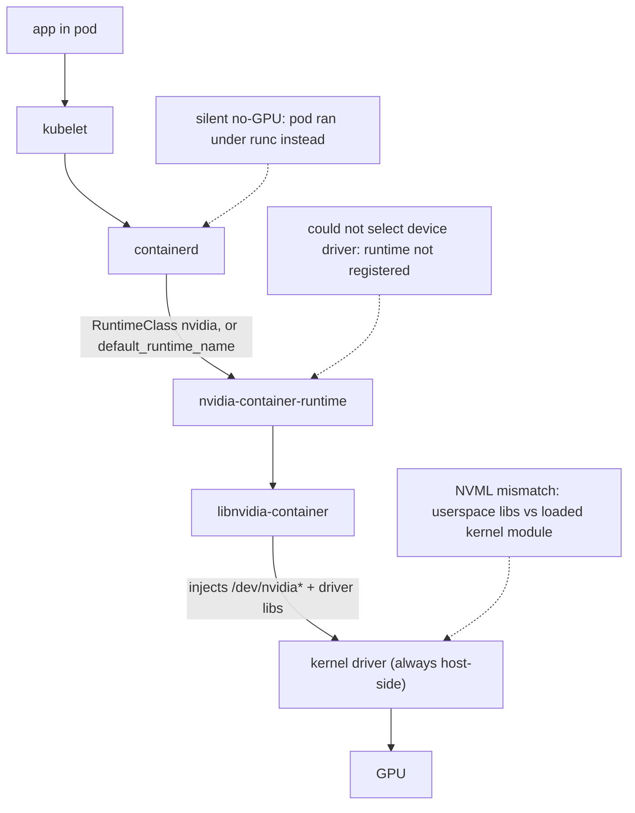
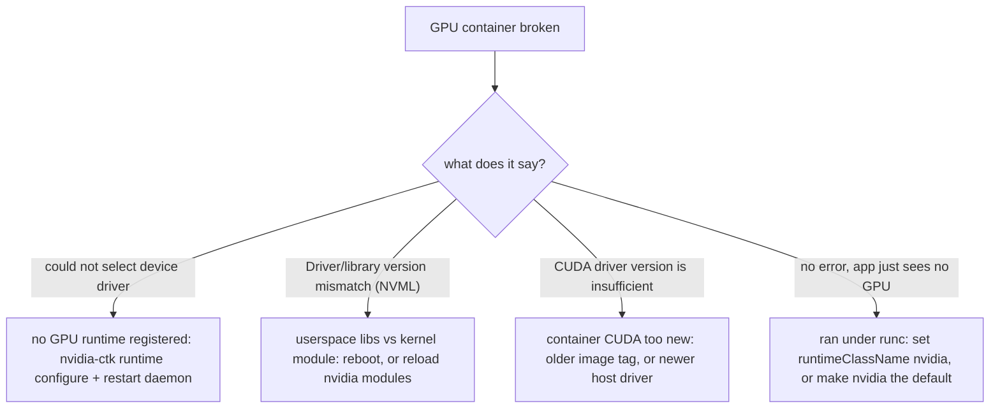

# Week 11 · Day 4 — Troubleshooting the GPU container chain + driver mismatches

[← Master Plan](../../../MASTER-PLAN.md) · [Week 11 overview](plan.md) · [← previous day](day-3.md) · [next day →](day-5.md)

---

## Study block (2 h)

**Domain switch: Troubleshooting & Optimization (23%) starts today.** This is the domain the
hands-on exam labs live in. Method for everything below: *symptom → one diagnostic → localize
the layer → fix → verify*. Never two fixes in a row without a diagnostic between them.

### 1. The GPU container plumbing chain (0:00–0:45)

Every GPU container failure localizes to one link of this chain — memorize it:

```
app → kubelet → containerd → RuntimeClass "nvidia" → nvidia-container-runtime
    → libnvidia-container (injects devices + driver libs) → kernel driver → GPU
```

**The plumbing chain, annotated — every GPU container failure localizes to one link; the dotted notes mark where the classic errors live.**



The wiring commands and files:

```bash
sudo nvidia-ctk runtime configure --runtime=containerd   # writes containerd config.toml
sudo nvidia-ctk runtime configure --runtime=docker       # writes /etc/docker/daemon.json
sudo systemctl restart containerd   # (or docker) — forgetting this IS the classic miss
cat /etc/nvidia-container-runtime/config.toml            # toolkit's own config
# containerd: [plugins."io.containerd.grpc.v1.cri".containerd] default_runtime_name = "nvidia"
# k3s keeps its own: /var/lib/rancher/k3s/agent/etc/containerd/config.toml
```

Two ways a pod gets the nvidia runtime: it's containerd's **default runtime**, or the pod sets
`runtimeClassName: nvidia`. GPU Operator installs the RuntimeClass; a pod without it on a
non-default cluster **runs fine but sees no GPU** — sneakier than an error.

**The four-step diagnostic sequence** (exit criterion — recite it):

1. **Runtime wiring** — `runtimeClassName: nvidia` set? nvidia the default in containerd config?
2. **Toolkit** — `nvidia-ctk --version`; was `runtime configure` run *and* the daemon restarted?
3. **Device plugin** — DaemonSet running? `kubectl describe node | grep nvidia.com/gpu` shows capacity?
4. **Operator validators** — `kubectl get pods -n gpu-operator`: a CrashLooping validator pod *names* the broken layer for you.

### 2. Driver / toolkit mismatches (0:45–1:25)

Three distinct failures that all smell like "GPU broken" — the exam tests whether you can tell
them apart from the error string alone:

| Error string | Actual problem | Fix direction |
|---|---|---|
| `could not select device driver "" with capabilities: [[gpu]]` | Docker/containerd has no GPU runtime registered | toolkit install / `nvidia-ctk runtime configure` / restart daemon |
| `Failed to initialize NVML: Driver/library version mismatch` | userspace driver libs ≠ loaded kernel module (upgrade without reload) | **reboot** (or `rmmod nvidia_uvm nvidia_drm nvidia_modeset nvidia && modprobe nvidia`) |
| `CUDA driver version is insufficient for CUDA runtime version` | container's CUDA newer than host driver supports | older image tag **or** newer host driver |

Diagnostics that disambiguate:

```bash
nvidia-smi --query-gpu=driver_version --format=csv,noheader  # what userspace sees
cat /proc/driver/nvidia/version                              # loaded KERNEL module
dpkg -l | grep nvidia-driver                                 # installed userspace packages
docker info | grep -iA3 runtime                              # is 'nvidia' registered at all?
```

Kernel module ≠ installed package → NVML mismatch (reboot). Container CUDA tag > driver's max
CUDA → insufficient-driver error (image/driver choice). No nvidia runtime in `docker info` →
the could-not-select error (wiring). One glance each.

**Four smells, four layers — the error string alone localizes the fix direction.**



"Works on host, not in container" corollary: the driver is *always* host-side; the container
only receives injected libraries. So host `nvidia-smi` healthy + container blind = chain problem
(steps 1–2 above), never a driver problem.

### 3. Do — break it on purpose (1:25–2:00)

Run [lab-troubleshoot](../labs/lab-troubleshoot.md) **drills (a) and (b)** on the lab node:
(a) de-register the nvidia runtime from daemon.json, observe the exact error, fix with
`nvidia-ctk runtime configure`; (b) provoke the CUDA-too-new error with a deliberately newer
CUDA image. Walk away 10 minutes mid-drill and come back to it cold, like a ticket. These two
drills re-run *timed* in week 12 — today is for making the symptoms feel familiar.

**Read next:** GPU Operator troubleshooting page; nvidia-container-toolkit install/configure docs
(the `nvidia-ctk` sections).

### Quick check

**1. Pod runs, no error, but the app sees no GPU. Host nvidia-smi is fine. First two checks?**
<details><summary>Answer</summary>(1) Does the pod set <code>runtimeClassName: nvidia</code> (or is nvidia containerd's default runtime)? (2) Is the toolkit configured — <code>nvidia-ctk runtime configure</code> run and containerd restarted? Silent no-GPU almost always = pod ran under runc.</details>

**2. `Failed to initialize NVML: Driver/library version mismatch` — cause and the reliable fix?**
<details><summary>Answer</summary>Driver userspace was upgraded while the old kernel module stayed loaded. Reboot (or unload/reload the nvidia modules). Verify with <code>/proc/driver/nvidia/version</code> vs <code>dpkg -l | grep nvidia-driver</code>.</details>

**3. Which layer does a CrashLooping `nvidia-operator-validator` pod point to, and why check it first?**
<details><summary>Answer</summary>The Operator's validator runs staged checks (driver, toolkit, device plugin, CUDA); whichever init container fails names the broken layer — it executes your 4-step sequence for you. <code>kubectl logs</code> on the failing init container.</details>

**4. `docker run --gpus all ...` → "could not select device driver". Is the driver broken?**
<details><summary>Answer</summary>No — Docker simply has no GPU runtime registered. Toolkit missing, daemon.json unconfigured, or docker not restarted after configuring. The kernel driver is a different layer entirely.</details>

---

## Build block (4 h) — KAI + GPU sharing, and the demo dress-run

Objective (Day 4 of the [week-11 build brief](../../../gpu-engineering-lab/03-scale-and-serve/week-11-k8s-gpu-serving/README.md)):
serve-and-train on one GPU, with honest interference numbers.

- Install KAI Scheduler; create `default`/`train`/`serve` queues (`k8s/kai/queue.yaml`); apply `k8s/timeslicing-config.yaml` so the L4 advertises multiple `nvidia.com/gpu` replicas.
- Fill `k8s/kai/batch-job.yaml` TODOs (schedulerName, queue label, gang annotations); run the week-06 LoRA job next to the serving Deployment.
- **DoD:** interference table filled — TTFT p50/p95 + GPU util, serving alone vs serving + LoRA job. Time-slicing gives no isolation; *show it honestly*.
- **DoD:** three written sentences on when you'd reach for MIG or MPS instead (cross-link the demo repo).
- **SHOW touchpoint (master plan):** with the full stack alive, run **all 7 scenes** of [`demo.sh`](../../../k8s-ai-stack-demo/scripts/demo.sh) against this week's k3s stack, and **extend scene 6** so ferrum-serve serves next to vLLM — the same OpenAI-compatible curl against both.
- Hint: measure TTFT with the same load-test invocation both times or the comparison is fiction — one variable, the training job.

---

## Close the day (15 min)

- [ ] Anki: the plumbing chain, 4-step sequence, the three error strings + fix directions (one card each — these are exam-lab currency).
- [ ] One line in [notes.md](notes.md): your measured TTFT p95 degradation under time-slicing.
- [ ] Blockers noted; anything that broke in drills (a)/(b) goes on a flashcard tonight.
- [ ] **Cloud day: instance stopped/terminated?** Log spend.
