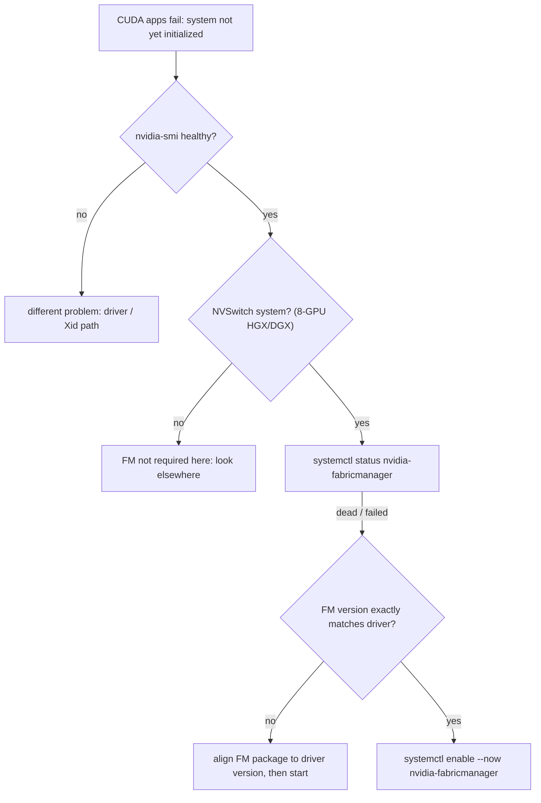

# Week 11 · Day 5 — Fabric Manager, BCM triage, and the week-11 self-check

[← Master Plan](../../../MASTER-PLAN.md) · [Week 11 overview](plan.md) · [← previous day](day-4.md) · [next day →](../week-12/day-1.md)

---

## Study block (2 h)

**Domain: Troubleshooting & Optimization (23%).** One high-value failure signature (Fabric
Manager), a BCM triage kit, then close the week the honest way: closed-book self-check, exit
criteria, PROGRESS row.

### 1. Fabric Manager (0:00–0:40)

What it is: a **userspace systemd service** (`nvidia-fabricmanager`) that programs NVSwitch
routing on HGX/DGX baseboards. Without it, NVLink-over-NVSwitch has no routes, and CUDA refuses
to initialize. Two iron rules:

1. FM is required **only on NVSwitch systems** (8-GPU HGX/DGX). Not on PCIe-only boxes,
   single-GPU nodes, or direct-NVLink pairs.
2. The FM package version must **exactly match the driver version** — a mismatched FM refuses
   to start, and the log says so.

**The failure signature — memorize it verbatim:** on an 8-GPU NVSwitch box, `nvidia-smi` shows
all GPUs perfectly healthy, but *every* CUDA app fails at init with **"system not yet
initialized"**. nvidia-smi talks to the driver (works); CUDA needs the programmed fabric (doesn't).

```bash
systemctl status nvidia-fabricmanager      # dead/failed? there's your answer
journalctl -u nvidia-fabricmanager --no-pager | tail -20
grep -i version /var/log/fabricmanager.log # FM vs driver version mismatch shows here
dpkg -l | grep -E 'nvidia-fabricmanager|nvidia-driver'   # compare versions yourself
sudo systemctl enable --now nvidia-fabricmanager         # fix (after versions match)
```

Symptom→diagnosis→fix in one line: *healthy nvidia-smi + CUDA "system not yet initialized" on an
NVSwitch box → `systemctl status nvidia-fabricmanager` → start it, or align FM version to driver.*

**The Fabric Manager signature as a decision tree — healthy nvidia-smi plus CUDA init failure on an NVSwitch box points here first.**



### 2. BCM troubleshooting basics (0:40–1:10)

The Base Command Manager triage kit — four scenarios the exam samples from:

- **Node stuck in node-installer:** provisioning path first — DHCP/PXE/TFTP from the head node
  reaching the node? Then node identity (MAC → right category, valid disk layout, image
  assigned), then the node-installer console via BMC for image-sync errors.
- **CMDaemon misbehaving:** logs live in `/var/log/cmdaemon` on head and node.
- **Node marked DOWN by healthchecks:** `cmsh -c "device; latesthealthdata <node>"` — find
  *which* check fails before touching anything.
- **Before syncing images:** `cmsh -c "device; imageupdate -n node001 --dry-run"` previews the
  rsync — what would be added/changed/deleted — so a sync can't clobber node-local state you
  forgot to exclude. Dry-run first is the exam-blessed habit.

And the cmsh reflex you drilled in week 10: `set ...` does nothing until **`commit`**.

### 3. Self-check + exit criteria + PROGRESS (1:10–2:00)

- Sit [self-check.md](self-check.md) **closed book** (~30 min). Target ≥ 15/18. Every miss
  becomes a flashcard *tonight*, phrased as symptom → cause.
- Walk the [plan.md](plan.md) exit criteria literally: write the sbatch script and the K8s Job
  from memory against a 5-minute timer; recite the 4-step container sequence and the FM
  signature out loud; fill the allocation table blind.
- Add the week-11 row to [PROGRESS.md](../../PROGRESS.md): self-check score, labs done, build
  shipped, cost.
- **Booking check:** exam is next Friday (Oct 2). Confirm the appointment, ID name match, and
  put the proctoring system test on the week-12 day-4 calendar
  ([booking checklist](../../tools/booking-checklist.md)).

**Read next (only if time remains):** skim the Fabric Manager user guide intro — just the
architecture diagram and the "when required" matrix.

### Quick check

**1. nvidia-smi healthy, every CUDA app on the HGX box fails with "system not yet initialized". First command, and the two most common root causes?**
<details><summary>Answer</summary><code>systemctl status nvidia-fabricmanager</code>. Causes: the service isn't running, or the FM package version doesn't exactly match the driver version (it then refuses to start — see /var/log/fabricmanager.log).</details>

**2. When is Fabric Manager NOT required?**
<details><summary>Answer</summary>Anywhere without NVSwitch: single-GPU nodes, PCIe-only multi-GPU servers, direct-NVLink (non-switched) topologies. FM is specifically the NVSwitch fabric supervisor.</details>

**3. Why run `imageupdate --dry-run` before a real image sync in BCM?**
<details><summary>Answer</summary>It previews the rsync between software image and live node — files that would be added/changed/deleted — catching node-local changes the sync would clobber and missing exclude rules, before anything is applied.</details>

**4. A BCM compute node hangs in the installer forever — name three checks.**
<details><summary>Answer</summary>(1) Provisioning network: DHCP/PXE/TFTP reachability from head to node. (2) Node identity: MAC/category assignment, disk layout, image assignment in cmsh. (3) Head side: /var/log/cmdaemon plus the node-installer console via BMC for sync errors.</details>

---

## Build block (4 h) — the real acceptance test

Objective (Day 5 of the [week-11 build brief](../../../gpu-engineering-lab/03-scale-and-serve/week-11-k8s-gpu-serving/README.md)):
prove the whole stack recreates from git.

- **Teardown & recreate:** `make teardown` (or delete the node), then from clean: `make everything`. **Stopwatch it — ≤ 30 min** or find and fix what's still manual.
- **DoD:** timed number logged; serving + monitoring + KAI job all healthy on the recreated stack (re-run demo scenes 1–2 as the smoke test).
- **DoD:** README writeup — mermaid architecture diagram, dashboard screenshot committed, interference table, "what broke and how I debugged it" (interview gold).
- **DoD:** push; kill the node; log the week's cost.
- Hint: whatever you did by hand during the recreate is the bug — script it before calling the number final.

---

## Close the day (15 min)

- [ ] Anki: FM signature, FM-not-needed cases, BCM triage trio, plus every self-check miss.
- [ ] One line in [notes.md](notes.md): self-check score + recreate-from-git time.
- [ ] Weekend rule: no new material — week 12 is drills, mock, exam. Rest is preparation.
- [ ] **Cloud day: node DELETED (not just stopped)?** Log final week-11 spend.
