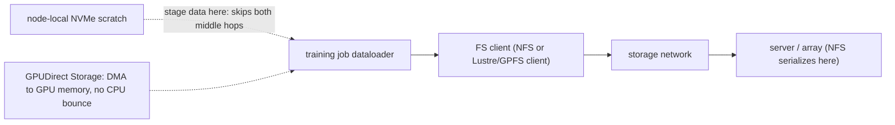
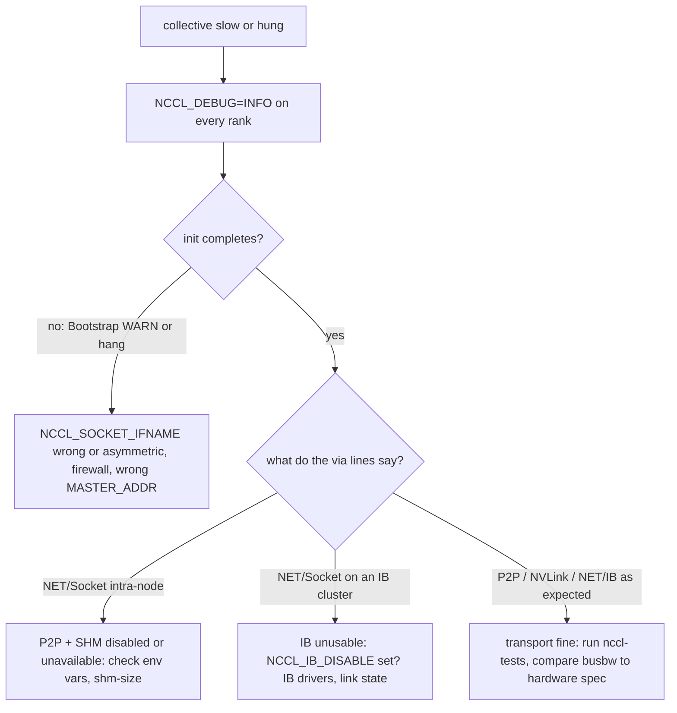

# Week 12 · Day 1 — Storage performance, NCCL debugging + first timed drills

[← Master Plan](../../../MASTER-PLAN.md) · [Week 12 overview](plan.md) · [← previous day](../week-11/day-5.md) · [next day →](day-2.md)

---

## Study block (2 h)

**Domain: Troubleshooting & Optimization (23%) — exam Friday.** From today, everything runs
against a clock: the last two troubleshooting topics, then the drill protocol that carries
through Thursday.

### 1. Storage performance (0:00–0:35)

**The signature of storage-bound training:** GPU utilization sawtooths 0→100→0 in bursts,
step time varies, dataloader wait dominates the profiler. The GPUs are starving, not slow.

Benchmark the data path with `fio`, from the same mount the job reads:

```bash
fio --name=seqread --rw=read --bs=1M --size=10G --numjobs=4 \
    --iodepth=32 --ioengine=libaio --direct=1 --group_reporting
fio --name=randread --rw=randread --bs=4k --size=2G --numjobs=4 \
    --iodepth=32 --ioengine=libaio --direct=1 --group_reporting
```

`--direct=1` (O_DIRECT) bypasses the page cache — without it a warm cache makes any disk look
heroic. Compare the two runs: training datasets read as many small random files behave like the
4k number, not the 1M number — that gap *is* the diagnosis on shared NFS.

Why NFS collapses under many-node training: one server serializes all metadata and bandwidth.
The fixes ladder, cheapest first: **stage to node-local NVMe scratch → more dataloader workers +
prefetch → larger sequential reads via sharded formats (WebDataset/TFRecord) → parallel FS
(Lustre/GPFS) → GPUDirect Storage** (DMA straight from NVMe/NIC to GPU memory, bypassing the CPU
bounce buffer — know the concept).

**Where the bytes actually travel — every hop is a suspect; staging to local NVMe removes the two middle ones.**



### 2. NCCL and network debugging (0:35–1:10)

First move on any collective problem — turn on the flight recorder:

```bash
export NCCL_DEBUG=INFO            # WARN in prod, INFO when diagnosing
export NCCL_DEBUG_SUBSYS=INIT,NET # focus the firehose
```

Read the INFO output for **which transport got picked** — the `via` lines:

| Line says | Meaning |
|---|---|
| `via P2P/CUMEM` (or NVLink) | direct GPU↔GPU — the intra-node fast path |
| `via SHM` | through host shared memory — P2P unavailable or disabled |
| `NET/IB` | RDMA between nodes — the inter-node fast path |
| `NET/Socket` | plain TCP — on an IB cluster this means something is broken |

The env vars that cause (and diagnose) trouble: `NCCL_SOCKET_IFNAME` — wrong value (`ib0` where
none exists, or matching `docker0`) → `NCCL WARN Bootstrap : no socket interface found`, or a
job that **hangs at startup on some nodes**; set by exclusion: `NCCL_SOCKET_IFNAME=^docker,lo`.
`NCCL_IB_DISABLE=1` → silent fall to NET/Socket ("why is allreduce 10× slower?").
`NCCL_P2P_DISABLE=1` → intra-node falls to SHM. Hang triage: asymmetric env across ranks,
firewalled dynamic ports, wrong `MASTER_ADDR` — `NCCL_DEBUG=INFO` on *every* rank, diff the outputs.

**The NCCL triage tree — flight recorder first, then read the via lines against what the topology should give.**



The canonical fabric benchmark:

```bash
./build/all_reduce_perf -b 8 -e 1G -f 2 -g <ngpus>   # nccl-tests
```

Read the **busbw** column at large sizes: NVLink-class intra-node ≈ hundreds of GB/s; tens =
you're on SHM/PCIe; single digits = TCP. Numbers → topology claim → check against what the
hardware should give.

### 3. TIMED DRILLS — the protocol (1:10–2:00)

Exam labs are ~25 min each. All five [cert labs](../labs/lab-troubleshoot.md) get re-run cold
under that budget between today and Thursday. **Protocol per drill:** fresh terminal, no notes,
25-minute hard timer; if stuck > 3 min on one step, write down what you'd look up and move on;
5-minute debrief after — every lookup becomes a flashcard tonight.

- **Drill 1 (25 min):** [lab-gpu-operator](../labs/lab-gpu-operator.md) — bare k3s → GPU
  Operator → CUDA test pod Running. You did this in ≤30 min for the week-11 acceptance test;
  now beat 25 without the repo's scripts open.
- **Drill 2 (25 min):** [lab-troubleshoot](../labs/lab-troubleshoot.md) drill **(c)** — NCCL
  sabotage: baseline 2-rank allreduce with `NCCL_DEBUG=INFO`, break it with `NCCL_SOCKET_IFNAME=ib0`,
  read the WARN, then force the slow path with `NCCL_P2P_DISABLE=1 NCCL_SHM_DISABLE=1` and
  identify the `via NET/Socket` evidence. Today's study section is your answer key.

(If the two drills overflow the block, let them eat the first half-hour of the build block —
this week, drills outrank everything but the exam.)

**Read next:** NCCL env-var reference (troubleshooting section); skim a GPUDirect Storage overview.

### Quick check

**1. GPU util oscillating 0–100% in bursts during training — bottleneck and first diagnostic?**
<details><summary>Answer</summary>Input pipeline/storage-bound (GPUs starving). First: profiler dataloader-wait vs step time, then <code>fio --direct=1</code> against the same mount to get honest storage numbers.</details>

**2. Why does `--direct=1` matter in fio?**
<details><summary>Answer</summary>O_DIRECT bypasses the page cache; without it, cached rereads measure RAM, not storage, and the benchmark lies optimistically.</details>

**3. NCCL_DEBUG shows `via NET/Socket` between GPUs on the same node. What happened and what do you check?**
<details><summary>Answer</summary>Both P2P and SHM paths were unavailable or disabled — check for <code>NCCL_P2P_DISABLE</code>/<code>NCCL_SHM_DISABLE</code> in the env, container <code>--shm-size</code>, and whether the topology permits P2P. Intra-node should be P2P/NVLink or at worst SHM.</details>

**4. 2-node job hangs at NCCL init. Three classic causes?**
<details><summary>Answer</summary>(1) Wrong/asymmetric <code>NCCL_SOCKET_IFNAME</code> (nodes advertise unreachable interfaces like docker0); (2) firewall blocking NCCL's dynamic TCP ports or unreachable IB; (3) wrong MASTER_ADDR / mismatched env or NCCL versions so ranks never rendezvous. First move: <code>NCCL_DEBUG=INFO</code> everywhere.</details>

---

## Build block (4 h) — capstone Day 1: the pipeline

Objective (Day 1 of the [capstone brief](../../../gpu-engineering-lab/03-scale-and-serve/week-12-capstone/README.md)),
local, on the 5090:

- Build `pipeline/Makefile`: `finetune → merge → quantize → package`, per-stage contracts in `pipeline/steps.md`.
- Each stage idempotent + resumable (skips when artifact exists and inputs unchanged) and writes `manifest.json` (git SHA, config, IO hashes, metrics).
- **DoD:** `make -C pipeline pipeline` from clean produces `artifacts/model-v1/` with weights + tokenizer + manifest.
- **DoD:** run it twice — second run must be a fast no-op (that's the idempotency test).
- Hint: keep the model small on purpose (fine-tunes in under an hour); the pipeline is the deliverable, not the model.

---

## Close the day (15 min)

- [ ] Anki: fio flags, the NCCL `via` table, env-var sabotage effects, busbw interpretation — plus every drill lookup from today.
- [ ] One line in [notes.md](notes.md): Drill 1 and Drill 2 times + what you had to look up.
- [ ] Blockers noted (pipeline stage contracts unclear? resolve before Day 2's cloud money burns).
- [ ] Local day — no instance check; but verify no week-11 cloud stragglers are still billing.
