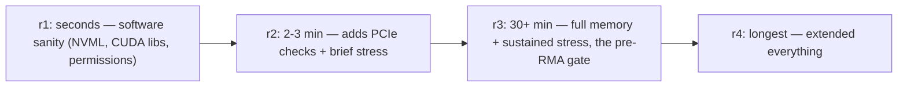
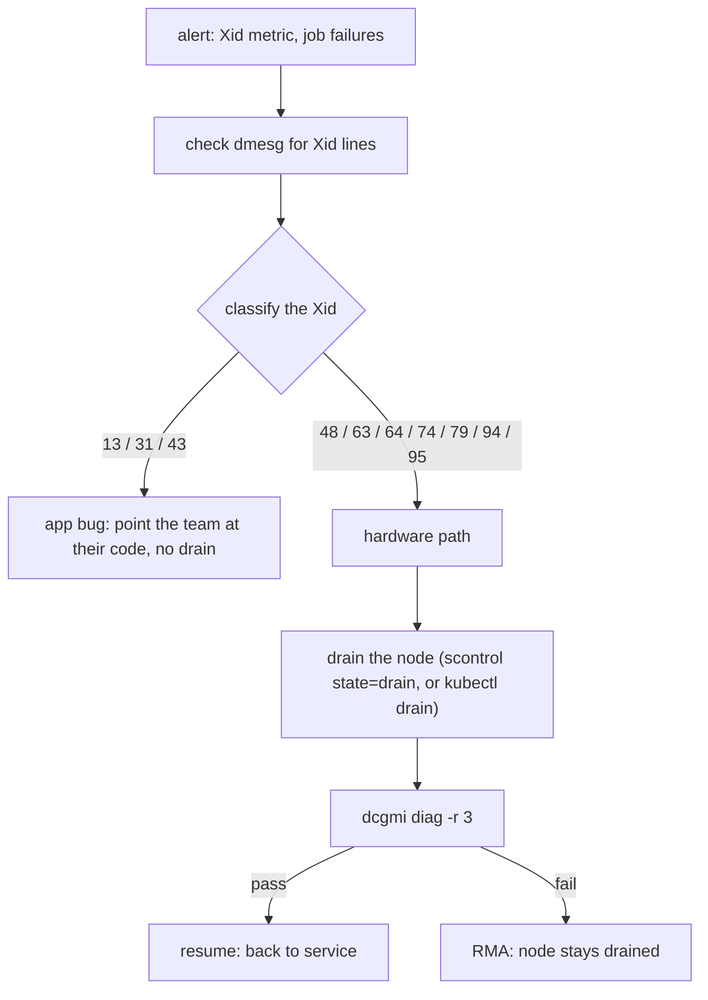

# Week 12 · Day 2 — DCGM diagnostics, Xid errors + the remaining timed drills

[← Master Plan](../../../MASTER-PLAN.md) · [Week 12 overview](plan.md) · [← previous day](day-1.md) · [next day →](day-3.md)

---

## Study block (2 h)

**Domain: Troubleshooting & Optimization (23%).** Last new material of the campaign: the two
tools that decide whether a GPU node stays in service. Then the remaining three labs go under
the 25-minute clock.

### 1. DCGM — the diagnostics ladder (0:00–0:40)

```bash
dcgmi discovery -l          # inventory: GPUs as DCGM sees them
dcgmi diag -r 1             # seconds — software/deployment sanity (NVML, CUDA libs, permissions)
dcgmi diag -r 2             # ~2–3 min — adds PCIe + brief stress; catches degraded links
dcgmi diag -r 3             # 30+ min — full memory + sustained stress; the pre-RMA gate
dcgmi diag -r 4             # extended — longest, most thorough
dcgmi health --set a && dcgmi health --check    # background (passive) health watch
dcgmi dmon -e 155,150 -d 1000                   # live field monitoring (power, temp)
```

What each level *adds* is the exam question: **r1** = is the software stack sane; **r2** = are
the links and basic stress OK; **r3** = is the silicon trustworthy (full framebuffer test).
Active diagnostics (`diag`) load the GPU — never on a node running jobs; passive health
(`health`/`dmon`, or the DCGM exporter you ran in week 11) watches without interfering.

**The escalation ladder — each level buys deeper certainty for more GPU-minutes; r3 is the gate that decides RMA vs return-to-service.**



**The operational playbook, verbatim recall:** alert (Xid metric / job failures) →
`dmesg | grep -i xid` → classify app vs hardware → HW-suspect: **drain** the node
(`kubectl drain` / `scontrol update nodename=X state=drain reason="xid79"`) →
`dcgmi diag -r 3` → pass = return to service; fail = RMA, stays drained.

### 2. Xid errors — the triage table (0:40–1:15)

Xids surface in `dmesg` (`NVRM: Xid (PCI:0000:xx:xx): NN, ...`), `nvidia-smi -q`, and DCGM
(`DCGM_FI_DEV_XID_ERRORS`). The ones worth memory:

| Xid | Meaning | Class |
|---|---|---|
| 13 | graphics engine exception | app |
| 31 | GPU memory page fault | app (bad pointer) — not a broken GPU |
| 43 | app-triggered abort/reset | app |
| 48 | double-bit ECC error | **hardware** |
| 63 / 64 | row remap recorded / **failed** | hardware — 64 = remap table full → RMA path |
| 74 | NVLink error | hardware/fabric |
| 79 | GPU fell off the bus | **hardware** — PCIe/power/thermal; node out NOW |
| 94 / 95 | contained / **uncontained** ECC | hardware — 95 = don't trust the node until reboot |

Triage rule: **13/31/43 → blame the application first** (one user's job, reproducible by them
alone); **48/63/64/74/79/94/95 → hardware path** → drain, `dcgmi diag -r 3`, decide. ECC
context: A100/H100-class parts remap bad rows transparently (Xid 63 = logged, keep watching);
remap *failure* (64) or repeated 48s = the RMA conversation. Check remap state:
`nvidia-smi --query-remapped-rows=gpu_bus_id,remapped_rows.pending,remapped_rows.failure --format=csv`.

**Alert to RMA — classify first; only the hardware class earns a drain and a level-3 diag.**



### 3. TIMED DRILLS 3–5 (1:15–2:00 — will overflow; let it)

Same protocol as yesterday: cold, 25-minute cap, no notes, debrief → flashcards.

- **Drill 3 (25 min):** [lab-mig-config](../labs/lab-mig-config.md) — no A100 rented today, so
  the exam-honest variant: **hand-write every command and its expected output** (enable MIG,
  create 1g.5gb ×7 / mixed profiles, `nvidia-smi mig -lgi`, CUDA_VISIBLE_DEVICES with MIG
  UUIDs), then check against the lab file. Writing it uncued is the drill.
- **Drill 4 (25 min):** [lab-slurm-basics](../labs/lab-slurm-basics.md) — container cluster up,
  QOS added, GPU job sbatched, accounting shown (`sacct`/`sacctmgr`).
- **Drill 5 (25 min):** [lab-runai-kai](../labs/lab-runai-kai.md) — queues, two gang jobs,
  demonstrate preemption.

Also fold [lab-troubleshoot](../labs/lab-troubleshoot.md) **drill (d)** into today's cloud
session (build block): `dcgmi diag -r 1` and `-r 2` on the rented node, `dmesg | grep -i xid`
(empty = healthy = also an answer), and the remapped-rows query above. Five minutes, real outputs.

**Read next:** DCGM user guide "dcgmi diag" section; NVIDIA Xid catalog — skim the full list
once so the eight above feel like old friends.

### Quick check

**1. What does `dcgmi diag -r 2` add over `-r 1`, and when is `-r 3` the answer?**
<details><summary>Answer</summary>r1 = seconds, software sanity (libraries, permissions). r2 = a few minutes, adds PCIe link checks + brief stress. r3 = 30+ min full memory/stress — the gate before RMA or before returning a drained node to service.</details>

**2. dmesg shows `Xid 31` during one team's job; the node otherwise behaves. Action?**
<details><summary>Answer</summary>Xid 31 = GPU memory page fault = application bug (bad pointer/OOB access). Point the team at their code; no drain, no RMA. Reflex: 13/31/43 app-class, hardware class starts at 48.</details>

**3. Which two Xids mean "get this node out of service immediately," and why?**
<details><summary>Answer</summary>79 (GPU fallen off the bus — PCIe/power/thermal failure; the device literally vanished) and 95 (uncontained ECC — state can't be trusted). Both: drain, then diag/RMA path.</details>

**4. Recite the alert-to-RMA playbook.**
<details><summary>Answer</summary>Alert → <code>dmesg | grep -i xid</code> → classify app vs HW → if HW: drain (kubectl drain / scontrol state=drain) → <code>dcgmi diag -r 3</code> → pass: resume; fail: RMA, node stays drained.</details>

---

## Build block (4 h, ~3 h cloud) — capstone Day 2: deploy + measure

Objective (Day 2 of the [capstone brief](../../../gpu-engineering-lab/03-scale-and-serve/week-12-capstone/README.md)):
the Day-1 artifact through the whole serving stack, measured.

- Spin up the week-11 stack (`make everything` — you timed it ≤30 min on Friday).
- Deploy the pipeline artifact; run the week-08 load-test harness against it.
- **DoD:** final end-to-end table committed — TTFT p50/p95, tok/s/user, peak GPU mem, req/s at saturation — for (a) fp16 merged and (b) quantized. The quantization delta *through the full stack* is the headline number.
- **DoD:** Grafana screenshot during the load test; lab-troubleshoot drill (d) outputs captured while the node is up.
- **DoD:** teardown; cost logged.
- Hint: run the fp16 and quantized tests back-to-back in one session — same node, same stack version, one variable.

---

## Close the day (15 min)

- [ ] Anki: diag levels, the 8-row Xid table (one card per row), the drain-diag-RMA playbook, remapped-rows query — plus drill 3–5 lookups.
- [ ] One line in [notes.md](notes.md): drill times + the headline quantization delta.
- [ ] Blockers: anything unscored from drills 1–5 gets 10 min tomorrow morning, not more — tomorrow is mock day.
- [ ] **Cloud day: instance TERMINATED?** Log spend. All new material is now DONE — from here to Friday it's rehearsal.
