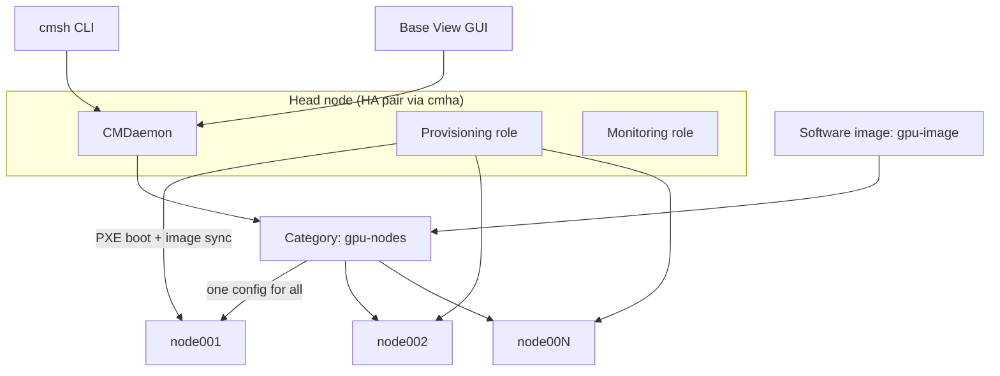

# Week 9 · Day 1 — BCM architecture & node provisioning

[← Master Plan](../../../MASTER-PLAN.md) · [Week 9 overview](plan.md) · [← previous day](../../month-2-ncp-genl/week-8/day-5.md) · [next day →](day-2.md)

Month 3 starts here: **NCP-AIO**, the operations cert — 30 MCQs plus 3 hands-on labs, and
today's material sits squarely in **Installation & Deployment (31%)**, the single heaviest
exam domain. BCM has no free tier, so this is a docs-driven day: you learn the architecture
and the `cmsh` grammar cold from the Administrator Manual, because the exam *will* ask you
to read/write cmsh and reason about provisioning even if you never touch a real head node.

## Study block (2 h)

### 1. What BCM is and what the head node does (0:00–0:45)

NVIDIA **Base Command Manager** (BCM, the productized Bright Cluster Manager) is the
cluster-lifecycle layer: it installs the OS on every node, keeps node software identical via
**images**, and layers workload managers (Slurm, K8s) on top through setup wizards.

The **head node** wears several hats — know each one as a separable *role*, because HA and
scale-out questions hinge on that separation:

- **Management**: runs `cmd` (the Cluster Management Daemon). `cmsh` and **Base View** (the
  browser GUI) are just two clients of the same CMDaemon API — anything you can click in
  Base View has a cmsh equivalent, and the exam prefers the cmsh spelling.
- **Provisioning**: serves software images to booting nodes. On big clusters you offload
  this to dedicated **provisioning nodes** so one head node isn't rsyncing 500 nodes.
- **Monitoring**: collects metrics/healthchecks from every node (more on Day 4).
- **HA**: two head nodes in active/passive pairs, set up and failed over with **`cmha`**
  (`cmha status`, `cmha makeactive`). Shared state lives on a shared filesystem/DRBD.

Below the head node: **regular (compute) nodes**, grouped into **node categories**. A
category binds a set of nodes to *one software image* plus common settings (disk layout,
network interfaces, kernel params). This is the central BCM idea: **you never configure a
compute node directly — you configure its category/image and push.**

**BCM in one picture — clients talk to CMDaemon; categories bind images to nodes; provisioning pushes images out.**



### 2. The provisioning chain (0:45–1:30)

Memorize this sequence; it is exam gold and the root-cause map for "node won't come up":

```
power on → PXE/DHCP (node gets IP + boot image from head)
         → node-installer (tiny in-memory environment)
         → identifies node (MAC ↔ device entry in CMDaemon)
         → partitions disk per category's disk setup
         → syncs the category's software image (rsync from provisioning node)
         → pivots into the installed OS → node state UP
```

Two sync modes: **full provisioning** (wipe + full image copy — slow, guaranteed clean) vs
**grab-and-sync / sync-only** (rsync the delta — fast, default for reboots). You can also go
the *other* direction: `grabimage` pulls a live node's disk back into an image.

Image lifecycle you must be able to narrate:

```bash
cmsh -c "softwareimage; clone default-image gpu-image; commit"
cm-chroot-sw-img /cm/images/gpu-image     # chroot into the image on the head node
  (inside) apt install <pkg> && exit      # patch the IMAGE, never live nodes
cmsh -c "category; use gpu-nodes; set softwareimage gpu-image; commit"
cmsh -c "device; imageupdate -c gpu-nodes -w"   # push delta to running nodes (or reboot)
```

**What breaks and how you notice:** node hangs at PXE → DHCP/MAC not registered (check the
device entry); node loops in `installing` → disk setup or image sync failure (read
`/var/log/node-installer` via the console); you patched a live node over SSH and a reboot
"lost" the change → expected, the image is the source of truth. Changes made in cmsh but
never `commit`-ted silently vanish — the #1 rookie failure.

### 3. cmsh grammar (1:30–2:00)

cmsh is modal: top level → mode → object → property. The universal verbs are
`list`, `show`, `use`, `get`, `set`, `clone`, `remove`, `commit`, `refresh` (discard).

```
[head]% device                      # modes: device, category, softwareimage,
[head->device]% list                #        network, user, partition, monitoring
[head->device]% use node001
[head->device[node001]]% get category
[head->device[node001]]% set category gpu-nodes
[head->device*[node001*]]% commit   # '*' marks uncommitted changes
[head->device[node001]]% power off  # also: power on / power reset / power status
```

One-liners with `-c` (semicolons chain mode + commands) — write 10 of these into
`notes.md` from memory at the end of the block:

```bash
cmsh -c "device; list"
cmsh -c "device; power on -n node00[1-3]"
cmsh -c "softwareimage; list"
cmsh -c "category; use gpu-nodes; get softwareimage"
cmsh -c "device; use node001; set category gpu-nodes; commit"
```

**Read next:** BCM Administrator Manual, intro + architecture + node provisioning chapters —
https://docs.nvidia.com/base-command-manager/

### Quick check

1. A node PXE-boots but the node-installer says it cannot identify itself. What mapping is missing, and where does it live?
2. You `set` a property in cmsh, close your terminal, and the change is gone. Why?
3. What is the difference between `imageupdate` and a full-provisioning reboot?
4. Which daemon do both cmsh and Base View talk to, and what tool manages head-node HA?

<details><summary>Answers</summary>

1. The MAC-address-to-device mapping in CMDaemon — the node's `device` entry (or it must be added/identified as a new node). Without it the installer can't map hardware to a configured identity/category.
2. cmsh changes are staged until `commit`. No commit → discarded (the `*` in the prompt was the warning).
3. `imageupdate` rsyncs the current image delta onto a *running* node (no reboot, sync-only); full provisioning wipes and re-lays the image at boot — guaranteed clean but slower.
4. CMDaemon (`cmd`); HA is managed with `cmha` (status/failover) between two head nodes.

</details>

## Build block (4 h)

**Distributed training week begins — Day 1 is local and free** (RTX 5090 / CPU only).
Brief: [week-09-distributed-training/README.md](../../../gpu-engineering-lab/03-scale-and-serve/week-09-distributed-training/README.md)

Objective: bootstrap `torch.distributed` by hand — no launcher magic — then write the
dumbest data parallel that works.

- [ ] Init with `gloo` + `env://`: set `MASTER_ADDR/MASTER_PORT/RANK/WORLD_SIZE` yourself, then confirm `torchrun` just sets the same env vars.
- [ ] 2 CPU processes on one machine talk to each other (`dist.send`/`dist.recv` smoke test).
- [ ] Manual parameter-averaging DP in `src/train_dist.py`: each rank grads on its shard, average with explicit send/recv.
- [ ] Both ranks converge identically at world_size=2 (fixed seed).

Hint: if ranks diverge, it's almost always seeding or data-shard order — print the first
batch's checksum on each rank before debugging anything else. No cloud spend today; get
`make test` green locally so tomorrow's rented GPUs are for measuring, not debugging.

## Close the day (15 min)

- Anki: 10 new cards (cmsh one-liners, provisioning chain, head-node roles, `cmha`).
- `notes.md`: one line — what did the provisioning chain click on today?
- Blockers: anything unclear in the BCM manual → flag it for Day 5 review.
- Cloud: nothing rented today — confirm tomorrow's 2×GPU instance choice and price so Day 2 starts fast.
