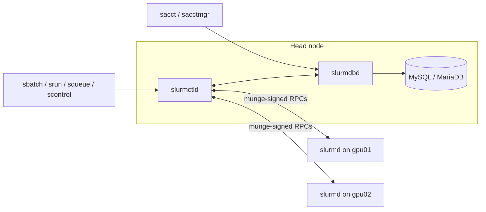
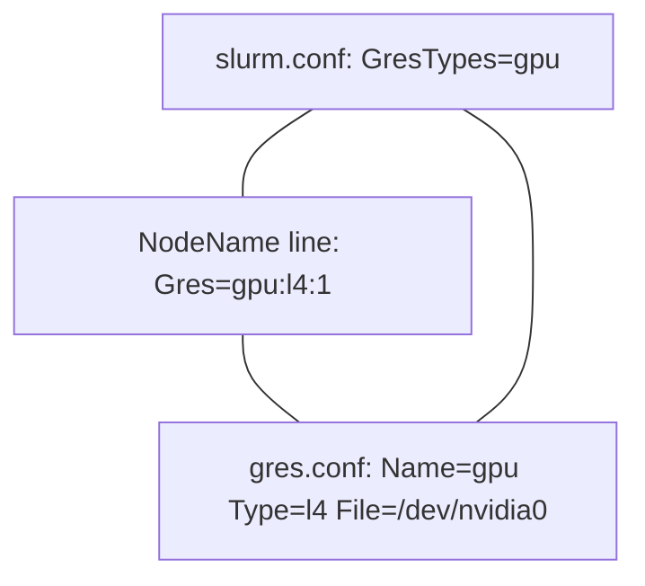

# Week 9 · Day 2 — Slurm cluster setup (as an installer)

[← Master Plan](../../../MASTER-PLAN.md) · [Week 9 overview](plan.md) · [← previous day](day-1.md) · [next day →](day-3.md)

Today you learn Slurm from the **installer's** chair, not the user's — Installation &
Deployment (31%) again. The exam's hands-on labs love broken `slurm.conf`/`gres.conf`
files, so every config line below should feel writable from memory by Friday.

## Study block (2 h)

### 1. Architecture: four daemons and one shared secret (0:00–0:30)

- **`slurmctld`** — the controller, one per cluster (plus optional backup). Owns node/job
  state, scheduling decisions. Lives on the head/management node.
- **`slurmd`** — one per compute node. Launches and supervises job steps. Talks to slurmctld.
- **`slurmdbd`** — the accounting daemon, fronting MySQL/MariaDB. Optional for scheduling,
  **required** for accounts/QOS/fairshare (all of Week 10 Day 1 depends on it).
- **`munge`** — the auth layer. Every daemon-to-daemon message carries a MUNGE credential.
  Two hard requirements: the **identical `/etc/munge/munge.key` on every node** and
  **synchronized clocks**. Break either and you get `Invalid credential` errors everywhere.

**The daemon topology — every arrow carries a MUNGE credential, so identical keys and synced clocks are non-negotiable.**



BCM tie-in (exam vocabulary): BCM deploys/configures all of this via the **`cm-wlm-setup`**
wizard — know that name, and that it writes the configs into the image/categories for you.

### 2. `slurm.conf` — the lines that matter (0:30–1:15)

One file, **identical on every node** (or served via `configless` from slurmctld). A minimal
GPU cluster config you should be able to reproduce:

```ini
ClusterName=lab
SlurmctldHost=head01
AuthType=auth/munge
ProctrackType=proctrack/cgroup

# make Slurm schedule GPUs as trackable resources
GresTypes=gpu
SelectType=select/cons_tres
SelectTypeParameters=CR_Core_Memory

# accounting (Week 10 builds on this)
AccountingStorageType=accounting_storage/slurmdbd
AccountingStorageHost=head01
JobAcctGatherType=jobacct_gather/cgroup

# the inventory: what each node HAS
NodeName=gpu[01-04] CPUs=16 RealMemory=64000 Gres=gpu:l4:1 State=UNKNOWN
# the market: how nodes are SOLD
PartitionName=gpu Nodes=gpu[01-04] Default=YES MaxTime=24:00:00 State=UP
```

Read `NodeName=` as a *claim* the admin makes; at registration `slurmd -C` reports the real
hardware, and if the claim exceeds reality the node is set **invalid/drained** with a reason
like `Low RealMemory`. `SelectType=select/cons_tres` is what makes CPUs, memory and **TRES**
(trackable resources — GPUs) individually consumable; the old `select/linear` allocates
whole nodes.

### 3. `gres.conf` — telling slurmd where the GPUs are (1:15–1:35)

Lives on (or applies to) each compute node; two styles:

```ini
# style 1: autodetect via NVML — needs slurmd built/linked with NVML
AutoDetect=nvml

# style 2: explicit — what you write when autodetect isn't available
Name=gpu Type=l4 File=/dev/nvidia0
```

Then jobs request them: `sbatch --gres=gpu:l4:1` or `--gpus=1`. Consistency triangle to
remember: **`GresTypes=gpu`** (slurm.conf) + **`Gres=gpu:l4:1` on the NodeName line** +
**a matching `gres.conf` entry**. If any corner is missing:

- gres.conf missing/wrong device file → slurmd fails to register the gres → node drains,
  `scontrol show node` reason mentions gres.
- NodeName `Gres=` missing → jobs asking `--gres=gpu:1` pend forever with
  `Resources`/`ReqNodeNotAvail` — the scheduler doesn't know the GPU exists.
- Type mismatch (`l4` vs `L4`) → same symptom; types are strings, exact match.

**The gres consistency triangle — all three corners must name the same thing, exact string match.**



**What breaks and how you notice (drill these):** `Invalid credential` in slurmd logs →
munge key mismatch or clock skew; node stuck `down*` (the `*` = not responding) → slurmd
dead or network/DNS to slurmctld broken; config edited on head only → `scontrol
reconfigure` propagates *some* things but NodeName/topology changes want a daemon restart —
and every node must see the same file.

### 4. Do (1:35–2:00) — [lab-slurm-basics.md](../labs/lab-slurm-basics.md) Part A

Bring up the containerized cluster, verify with `sinfo` (expect the partition, node count,
`idle` state), and run one `srun hostname` across two nodes. Leave Parts B/C for Week 10.

**Read next:** Slurm Quick Start Admin Guide — https://slurm.schedmd.com/quickstart_admin.html ·
GRES guide — https://slurm.schedmd.com/gres.html

### Quick check

1. Which daemon must be running and reachable for `sacct` to return anything, and what database sits behind it?
2. A node shows `drained` with reason `gres/gpu count reported lower than configured`. Name two possible root causes.
3. Why must `slurm.conf` be identical cluster-wide, and what command pushes non-structural changes without restarts?
4. What two conditions must hold for MUNGE authentication to succeed between nodes?

<details><summary>Answers</summary>

1. `slurmdbd`, fronting MySQL/MariaDB (`AccountingStorageType=accounting_storage/slurmdbd`).
2. `gres.conf` missing/wrong on that node (bad `File=` path, missing `AutoDetect=nvml`), or the driver/device absent so NVML sees fewer GPUs than the NodeName `Gres=` claims.
3. slurmctld and every slurmd parse the same file to agree on cluster shape; `scontrol reconfigure` re-reads it for running daemons (structural changes like NodeName lines still want restarts).
4. Identical `/etc/munge/munge.key` on all nodes and clocks in sync (credentials are time-stamped).

</details>

## Build block (4 h)

**Cloud day — rent the 2×GPU node (L4/A10G class).**
Brief: [week-09-distributed-training/README.md](../../../gpu-engineering-lab/03-scale-and-serve/week-09-distributed-training/README.md)

Objective: **ring all-reduce from scratch** in `src/ring_allreduce.py` with
`dist.isend`/`dist.irecv` — reduce-scatter (N−1 steps) then all-gather (N−1 steps).

- [ ] Passes the provided tests vs `dist.all_reduce` (≤1e-5 fp32), including sizes not divisible by world_size.
- [ ] Benchmarked vs NCCL all_reduce, 1 KB → 256 MB; gap quantified + hypothesis written (launch overhead, no LL/LL128 protocol switching, single channel).
- [ ] Results JSON in `bench/results/`.

Hint: debug the chunk-index arithmetic on **CPU/gloo locally** — the tests run there; every
minute of index debugging on the rented node is money. Cost discipline (from the brief):
push your branch before any break, log the session in `bench/results/cost_log.md`, and
**shut the node down when you stop**.

## Close the day (15 min)

- Anki: slurm.conf/gres.conf line cards, the four daemons, munge failure modes, `cm-wlm-setup`.
- `notes.md`: one line — the gres consistency triangle in your own words.
- Blockers: note any lab Part A friction for the Week 10 accounting session.
- **Instance terminated?** Check the provider console, not your memory. Cost log updated.
