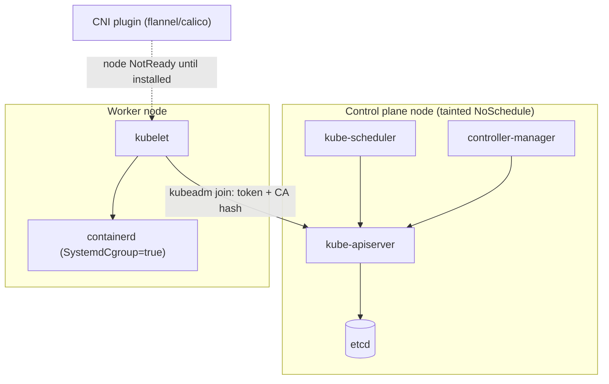
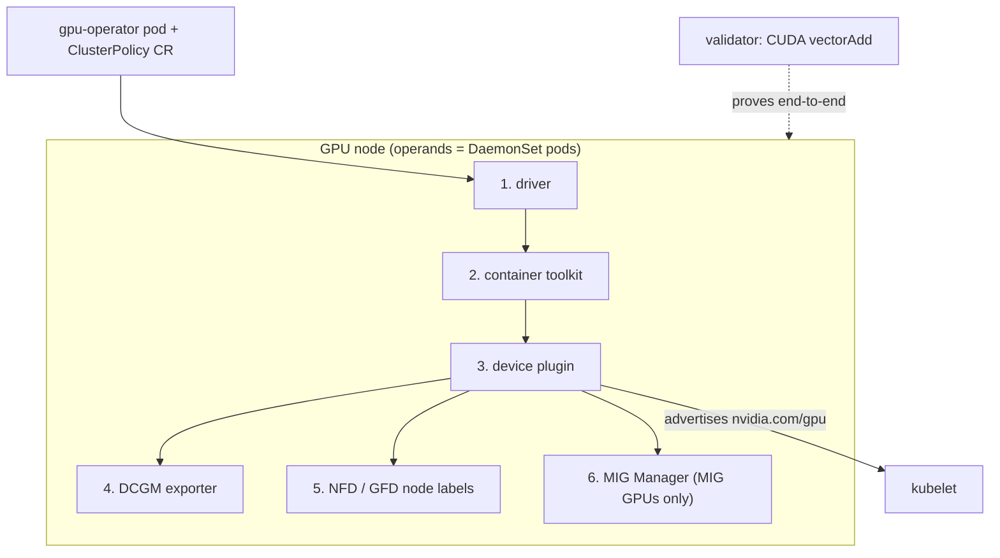

# Week 9 · Day 3 — Kubernetes setup + the GPU Operator stack

[← Master Plan](../../../MASTER-PLAN.md) · [Week 9 overview](plan.md) · [← previous day](day-2.md) · [next day →](day-4.md)

The other half of Installation & Deployment (31%): standing up Kubernetes and making GPUs
schedulable. Today you rent the L4 lab VM (kept for weeks 9–12, **stopped when idle**) and
do it for real — and the same node double-bills as this week's **SHOW touchpoint** for the
demo repo.

## Study block (2 h)

### 1. kubeadm flow — know the sequence (0:00–0:30)

You won't hand-build a cluster in the exam, but you must know the order and where each
failure surfaces:

```bash
# 0) prerequisites on every node: swap off, kernel modules (br_netfilter),
#    container runtime = containerd with SystemdCgroup = true in its config
# 1) control plane
kubeadm init --pod-network-cidr=10.244.0.0/16
# 2) kubeconfig — admin credentials land here:
export KUBECONFIG=/etc/kubernetes/admin.conf   # (or copy to ~/.kube/config)
# 3) CNI — nothing schedules Pods across nodes until a network plugin is installed
kubectl apply -f <flannel/calico manifest>
# 4) workers join with the token kubeadm init printed
kubeadm join <head>:6443 --token ... --discovery-token-ca-cert-hash sha256:...
```

Gotchas the exam likes: the control plane carries a
`node-role.kubernetes.io/control-plane:NoSchedule` **taint** (remove it on a single-node
lab: `kubectl taint nodes --all node-role.kubernetes.io/control-plane-`); nodes stay
`NotReady` until the CNI is up; cgroup-driver mismatch (containerd vs kubelet) makes
kubelet crash-loop. BCM equivalent: the **`cm-kubernetes-setup`** wizard does all of this.

**The pieces kubeadm assembles — workers join the API server; the CNI is what flips nodes to Ready.**



### 2. GPU Operator — the dependency chain (0:30–1:00)

A stock K8s cluster knows nothing about GPUs. The **GPU Operator** installs the whole
enablement stack as operands (mostly DaemonSets), and the **dependency order is the exam
answer** — each layer needs the one before it:

```
driver  →  container toolkit  →  device plugin  →  DCGM exporter  →  GFD/NFD  →  (MIG Manager)
```

- **Driver** DaemonSet: kernel driver in a container. Set **`driver.enabled=false`** when
  the driver is pre-installed (DGX OS, most cloud GPU images) — then the operator validates
  the host driver instead of installing one.
- **Container toolkit** (`nvidia-container-toolkit`): wires the runtime so containers can
  see `/dev/nvidia*`. Modern path: **CDI** (Container Device Interface) — devices described
  as specs instead of runtime hooks.
- **Device plugin**: advertises `nvidia.com/gpu` as an allocatable resource to kubelet.
  Without it, Pods requesting GPUs sit `Pending` with `Insufficient nvidia.com/gpu`.
- **DCGM exporter**: Prometheus metrics (Day 4's topic).
- **NFD/GFD** (Node Feature Discovery / GPU Feature Discovery): node labels like
  `nvidia.com/gpu.product=NVIDIA-L4` — what selectors/affinity match on.
- **MIG Manager**: only acts on MIG-capable GPUs (Week 10 Day 4).
- A **validator** runs a CUDA vectorAdd to prove the stack end-to-end.

**The operand stack as it lands on a GPU node — each DaemonSet pod depends on the one before it; the validator proves the whole chain.**



```bash
helm repo add nvidia https://helm.ngc.nvidia.com/nvidia && helm repo update
helm install gpu-operator nvidia/gpu-operator \
  -n gpu-operator --create-namespace \
  --set driver.enabled=false          # cloud image with pre-installed driver
kubectl get pods -n gpu-operator      # wait for validator: Completed
kubectl describe node | grep -A5 'nvidia.com/gpu'
```

**What breaks and how you notice:** driver pod `CrashLoopBackOff` → kernel headers missing
or a driver already on the host (should have set `driver.enabled=false`); device plugin
running but `nvidia.com/gpu: 0` allocatable → toolkit/runtime misconfig; everything green
but Pods pending → resource *requests* missing `nvidia.com/gpu` limits, or taints.
Configuration is centralized in the **ClusterPolicy** CR — `kubectl edit clusterpolicy` is
how you flip components on/off after install.

### 3. Do (1:00–2:00) — [lab-gpu-operator.md](../labs/lab-gpu-operator.md) end-to-end

Rent the L4 VM today (keep it for weeks 9–12 labs; **stop it whenever idle**). Target from
the week's exit criteria: bare GPU VM → working K8s + GPU Operator in **≤ 30 min**.

**✦ SHOW touchpoint (wk 9):** the cluster you just built is exactly what the
[k8s-ai-stack-demo](../../../k8s-ai-stack-demo/README.md) needs. On this same rented node,
run the demo's [TrainJob](../../../k8s-ai-stack-demo/train/trainjob.yaml) and NCCL scenes
for real — one rental, two repos fed. Note what differs from the kind/k3s dry-run in week 8.

**Read next:** GPU Operator getting started —
https://docs.nvidia.com/datacenter/cloud-native/gpu-operator/latest/getting-started.html

### Quick check

1. Put in dependency order: device plugin, driver, DCGM exporter, container toolkit. What symptom appears if the device plugin is missing?
2. When do you set `driver.enabled=false`, and what does the operator do instead?
3. A fresh kubeadm node stays `NotReady`. Most likely missing component?
4. Which CR centralizes GPU Operator configuration after install?

<details><summary>Answers</summary>

1. driver → container toolkit → device plugin → DCGM exporter. Without the device plugin, `nvidia.com/gpu` is never advertised — GPU Pods stay `Pending` with `Insufficient nvidia.com/gpu`.
2. When the driver is pre-installed on the host (DGX OS, cloud GPU images); the operator skips driver install and validates/uses the host driver.
3. The CNI network plugin — nodes report `NotReady` until pod networking exists.
4. The `ClusterPolicy` custom resource.

</details>

## Build block (4 h)

**Cloud day — same 2×GPU class node as Day 2.**
Brief: [week-09-distributed-training/README.md](../../../gpu-engineering-lab/03-scale-and-serve/week-09-distributed-training/README.md)

Objective: **manual DDP vs real DDP vs FSDP2** — grad hooks calling *your* ring all-reduce,
then a three-way training comparison on the week-05 GPT.

- [ ] `src/manual_ddp.py`: `register_post_accumulate_grad_hook` → your ring all-reduce → average.
- [ ] Same config/seed/data order trained 3 ways: manual DDP, `DistributedDataParallel`, FSDP2 (`fully_shard`).
- [ ] Loss curves overlay within noise (divergence = usually averaging-vs-summing or hook timing — find it).
- [ ] Scaling efficiency `eff = T₂/(2·T₁)` measured and *explained* (comm time, no overlap, PCIe).

Hint: sanity-check hook firing order with a 2-layer toy model before the GPT — if grads
are all-reduced before accumulation finishes you get silent wrongness, not errors.
Push before breaks; **shut the training node down** at session end and log cost; the cert
lab VM is separate — **stop** it too if you're done with the lab.

## Close the day (15 min)

- Anki: GPU Operator dependency chain, `driver.enabled=false`, kubeadm sequence, ClusterPolicy.
- `notes.md`: one line — what broke first in the lab and how you noticed.
- Blockers: any GPU Operator step that took > 5 min to diagnose → candidate for week 11 troubleshooting drills.
- **Instances terminated/stopped?** Two rentals today (build node, lab VM) — check both in the console. Cost log updated.
