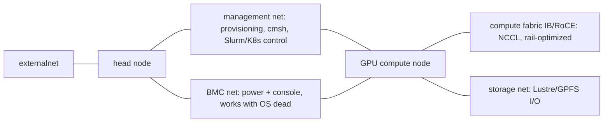
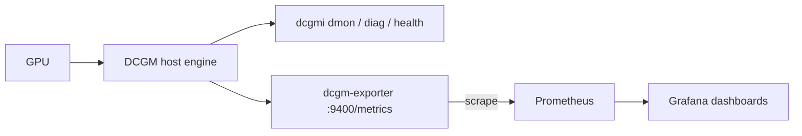

# Week 9 · Day 4 — Cluster networking + monitoring

[← Master Plan](../../../MASTER-PLAN.md) · [Week 9 overview](plan.md) · [← previous day](day-3.md) · [next day →](day-5.md)

Two Installation & Deployment (31%) topics that pay double: the network planes of an AI
cluster (which you'll re-meet in Week 10's datacenter-architecture day) and the DCGM
monitoring stack (which feeds Week 11's troubleshooting drills). Your build block today is
the NCCL deep-dive — the *application's* view of the same fabric you study this morning.

## Study block (2 h)

### 1. Network planes: one cluster, four networks (0:00–0:45)

A DGX-style pod separates traffic by purpose. Draw this once and label it:

- **Management network** (BCM `internalnet`): provisioning, cmsh/CMDaemon, Slurm/K8s
  control traffic, SSH. Ethernet, unglamorous, everything depends on it.
- **Out-of-band/BMC network** (`ipminet`): the BMCs (iDRAC/iLO/Redfish). How BCM powers
  nodes on/off and reaches consoles *even when the OS is dead*. Never share it with tenant
  traffic.
- **Compute fabric**: InfiniBand (NDR/HDR) or **RoCE** (RDMA over Converged Ethernet).
  This is where NCCL lives. Modern GPU nodes are **rail-optimized**: each of the 8 NICs on
  a node connects to its own leaf switch ("rail"), so GPU *i* on every node shares a rail —
  collectives avoid crossing rails.
- **Storage network**: parallel filesystem traffic (Lustre/GPFS); sometimes converged with
  compute, ideally not.
- **externalnet**: the head node's face to the outside world.

**One node, four planes (plus externalnet on the head) — most "slow or broken" scenarios are traffic on the wrong plane.**



In BCM these are first-class **network objects**; node interfaces are assigned per
category/device:

```
cmsh -c "network; list"
cmsh -c "device; use node001; interfaces; list"
cmsh -c "device; use node001; interfaces; use eth0; set network internalnet; commit"
```

**What breaks and how you notice:** provisioning works but jobs crawl → compute traffic
leaked onto the management net (wrong interface/network mapping); node reachable by SSH but
`power status` fails → BMC net/credentials; NCCL throughput far below line rate on RoCE →
PFC/ECN (lossless Ethernet) misconfigured on the switches. Where NCCL fits: it *discovers*
whatever fabric you give it (Day 4 build block shows you the `NCCL_DEBUG=INFO` evidence);
the demo repo's NCCL-transports scene is the K8s-level view of this same layering.

### 2. Monitoring: BCM native + the DCGM stack (0:45–1:30)

**BCM side** — cmsh `monitoring` mode has three nouns: **metrics** (sampled values),
**healthchecks** (pass/fail probes, e.g. `ssh2node`, GPU health), and **actions** (what to
do on failure — email, drain, power cycle). `latestmetricdata`/`dumpmetricdata` pull
values; healthcheck failures flip a node's status flag so you see it in `device list`.

**DCGM side** — the NVIDIA path, and what K8s uses:

- `nvidia-smi` = human snapshot. **DCGM** = fleet telemetry + active health.
- `dcgmi discovery -l` (inventory), `dcgmi dmon` (watch), and **`dcgmi diag -r 1|2|3`**
  (active diagnostics: r1 seconds, r2 minutes, r3 extended — know the levels).
- On K8s, **dcgm-exporter** (installed by the GPU Operator) exposes Prometheus metrics;
  Grafana dashboards sit on top. The three metric names to recognize on sight:

```
DCGM_FI_DEV_GPU_UTIL      # utilization %
DCGM_FI_DEV_FB_USED       # framebuffer (VRAM) used, MiB
DCGM_FI_DEV_XID_ERRORS    # last XID error code — the GPU "check engine" light
```

**The GPU telemetry pipeline — same DCGM data, two consumers: dcgmi for humans, the exporter for Prometheus and Grafana.**



**XID errors** are how GPU faults surface in logs (`dmesg`, DCGM). Worth recognizing:
**XID 79** (GPU fell off the bus — hardware/power), **XID 48 / uncorrectable ECC** (often →
drain node, run `dcgmi diag`), **XID 13/31** (app-level illegal access — usually the job's
bug, not the node's). Ops reflex: XID storm → drain via Slurm (`scontrol update
nodename=... state=drain reason="xid79"`) or cordon in K8s, then diagnose.

### 3. Do (1:30–2:00) — lab-gpu-operator step 7

On yesterday's lab cluster ([lab-gpu-operator.md](../labs/lab-gpu-operator.md)): port-forward
or `curl` the dcgm-exporter `/metrics` endpoint and find all three metrics above. Generate
some GPU load and watch `DCGM_FI_DEV_GPU_UTIL` move.

```bash
kubectl -n gpu-operator port-forward svc/nvidia-dcgm-exporter 9400:9400 &
curl -s localhost:9400/metrics | grep -E 'DCGM_FI_DEV_(GPU_UTIL|FB_USED|XID_ERRORS)'
```

**Read next:** skim the BCM Admin Manual monitoring chapter + DCGM user guide overview
(https://docs.nvidia.com/datacenter/dcgm/latest/).

### Quick check

1. Name the four-plus-one networks of a DGX-style pod and one traffic type per network.
2. Why does the BMC network stay reachable when a node's OS is down, and which BCM feature depends on that?
3. What's the difference between `dcgmi dmon` and `dcgmi diag -r 3`?
4. A node logs XID 79. What is it, and what's the correct ops reflex?

<details><summary>Answers</summary>

1. Management (provisioning/control), BMC/out-of-band (IPMI/Redfish), compute fabric (NCCL/RDMA), storage (parallel FS), externalnet (outside access).
2. The BMC is an independent controller with its own NIC/power domain; BCM power control (`power on/off/reset`, console) works through it regardless of OS state.
3. `dmon` passively samples metrics while workloads run; `diag -r 3` is an active, extended diagnostic that exercises the GPU (run on drained/idle nodes).
4. "GPU has fallen off the bus" — hardware/power-level failure. Drain the node (Slurm) or cordon it (K8s), run `dcgmi diag`, open a hardware ticket; don't let jobs land on it.

</details>

## Build block (4 h)

**Cloud day — last rented session this week.**
Brief: [week-09-distributed-training/README.md](../../../gpu-engineering-lab/03-scale-and-serve/week-09-distributed-training/README.md)

Objective: **NCCL deep-dive** — measure the fabric you studied this morning.

- [ ] Build & run nccl-tests: `all_reduce_perf -b 8 -e 256M -f 2 -g 2`; record the table.
- [ ] Explain **busbw vs algbw** in the README in your own words (all-reduce: busbw = algbw × 2(n−1)/n).
- [ ] Run training with `NCCL_DEBUG=INFO`; grep transport lines; fill the README's transport table (expect P2P-over-PCIe or SHM on a no-NVLink node).
- [ ] Experiments, one-line takeaway each: `NCCL_P2P_DISABLE=1`, `NCCL_ALGO=Ring` vs `Tree`, `NCCL_PROTO=Simple`.

Hint: grep the INFO output for `via` — every channel line names its transport; save the
raw log, it's your evidence. **Then shut the node down** — this is the brief's explicit
"terminate now" day — and log actual cost in `bench/results/cost_log.md`. Push everything
before you stop the instance.

## Close the day (15 min)

- Anki: network planes, XID 79/48/13, three DCGM metric names, `dcgmi diag` levels.
- `notes.md`: one line — which NCCL transport your node used and why.
- Blockers: anything you couldn't explain about the busbw numbers → tomorrow's review.
- **Instance terminated?** Training node MUST be down (cost log proves it ≤ $20). Lab VM stopped.
