# Week 9 · Day 5 — Patching, upgrades, user management + review

[← Master Plan](../../../MASTER-PLAN.md) · [Week 9 overview](plan.md) · [← previous day](day-4.md) · [next day →](../week-10/day-1.md)

Friday: the last Installation & Deployment (31%) topics — how you *change* a running
cluster without breaking it — then the closed-book self-check that decides whether the
week's exit criteria are met.

## Study block (2 h)

### 1. Patch management: three stacks, three patterns (0:00–0:45)

**BCM pattern — patch the image, never the node.** Live-node hand-patching is the
anti-pattern (Day 1: the image is the source of truth; a reprovision reverts you).

```bash
cm-chroot-sw-img /cm/images/gpu-image      # chroot into the image
  (inside) apt update && apt upgrade -y && exit
cmsh -c "device; imageupdate -c gpu-nodes -w"   # rsync delta to live nodes
# kernel/driver changes → reboot the category instead:
cmsh -c "device; reboot -c gpu-nodes"
```

**K8s / GPU Operator pattern** — driver upgrades are declarative: bump the driver version
in the **ClusterPolicy** (or upgrade the operator Helm chart) and the operator rolls it
**node by node**: cordon/drain GPU pods → swap driver pod → validate → uncordon. You watch,
you don't orchestrate.

**Slurm pattern** — upgrade **order matters** because RPC protocols are
backward-compatible only within a window (slurmdbd must be newest first):

```
slurmdbd  →  slurmctld  →  slurmd        (DB first, controller, then compute daemons)
```

Exam phrasing to expect: "which component do you upgrade first?" → **slurmdbd**. Also: back
up the accounting DB and `StateSaveLocation` before touching anything.

**Three stacks, three patch patterns — image-based (BCM), rolling declarative (GPU Operator), strict daemon order (Slurm).**

```mermaid
flowchart TB
    subgraph BCM["BCM: patch the image"]
        I1["cm-chroot-sw-img into image"] --> I2["apt upgrade inside image"]
        I2 --> I3["imageupdate to live nodes"]
        I3 --> I4["kernel/driver change: reboot category"]
    end
    subgraph K8S["GPU Operator: declarative rolling"]
        K1["bump driver in ClusterPolicy"] --> K2["cordon + drain GPU pods"]
        K2 --> K3["swap driver pod, validate"]
        K3 --> K4["uncordon, next node"]
    end
    subgraph SL["Slurm: order matters"]
        S1["slurmdbd first"] --> S2["slurmctld"]
        S2 --> S3["slurmd last"]
    end
```



**What breaks and how you notice:** upgraded slurmd before slurmctld → nodes flap to
`down*` with protocol-version errors in the logs; patched a live node but not the image →
change evaporates on reprovision; driver bumped while pods hold the GPU → operator waits on
drain, upgrade appears "stuck" (check for pods without owners that drain can't evict).

### 2. User management across the three stacks (0:45–1:30)

**BCM**: users/groups live in cmsh `user` mode, backed by an LDAP server BCM runs on the
head node — one identity across all nodes, home dirs on shared storage:

```
cmsh -c "user; add jdoe; set password; commit"
cmsh -c "user; use jdoe; get uid"
```

External identity (corporate AD/LDAP/FreeIPA) is integrated instead of BCM's own LDAP in
real deployments — concept, not commands, for the exam.

**Slurm**: authentication is the OS's problem (munge just proves identity); Slurm manages
**authorization** via the accounting **associations tree**: cluster → account → user. No
association (when `AccountingStorageEnforce=associations`) → jobs rejected at submit.

```bash
sacctmgr add account research Description="research group"
sacctmgr add user jdoe account=research
sacctmgr show assoc format=cluster,account,user,qos%20
```

**K8s**: there are no user objects — users are **certificates or OIDC claims**; groups come
from the identity provider; what they can *do* is RBAC (Week 10 Day 3 deep-dive).
ServiceAccounts are for workloads, not humans. One-sentence summary you should be able to
say cold: *BCM manages identity (LDAP), Slurm manages usage rights (associations), K8s
manages API permissions (RBAC bound to externally-proven identities).*

### 3. Closed-book review (1:30–2:00)

- [self-check.md](self-check.md) **closed-book** — no docs, no notes. Log misses in
  `notes.md` with a one-line "why I missed it".
- Walk the **exit criteria in [plan.md](plan.md)** and check honestly: provisioning chain +
  5 cmsh one-liners from memory; ≤30-min GPU Operator bring-up (did it Day 3); minimal
  slurm.conf/gres.conf pair from memory; GPU Operator components in order with
  what-breaks-if-missing; Slurm upgrade order + image-based patching.
- Add this week's row to [PROGRESS.md](../../PROGRESS.md) (self-check score, exit criteria
  met y/n, lab status).

### Quick check

1. Recite the Slurm upgrade order and the reason for it.
2. A colleague SSHes into gpu03 and installs a library; a month later it's gone. What happened and what was the right procedure?
3. In one sentence each: where does "who is this user" live in BCM, Slurm, and K8s?
4. How does a GPU driver upgrade roll out on a GPU Operator cluster without a global outage?

<details><summary>Answers</summary>

1. slurmdbd → slurmctld → slurmd. RPC/protocol compatibility is guaranteed only when the DB daemon is newest; older daemons can talk *up* to newer ones within the version window, not the reverse.
2. The node was reprovisioned (or image-synced) and reverted to the software image. Right way: `cm-chroot-sw-img` into the category's image, install there, `imageupdate`/reboot the category.
3. BCM: LDAP entries managed via cmsh `user` mode. Slurm: identity from the OS/munge, *rights* in slurmdbd's associations (cluster→account→user). K8s: no user objects — certs/OIDC identities, permissions via RBAC.
4. The operator upgrades node-by-node: cordon + drain GPU workloads, replace the driver DaemonSet pod, validate, uncordon, move on — a rolling upgrade driven from ClusterPolicy.

</details>

## Build block (4 h)

**Local, free — analysis + publish (Friday rule).**
Brief: [week-09-distributed-training/README.md](../../../gpu-engineering-lab/03-scale-and-serve/week-09-distributed-training/README.md)

- [ ] `bench/scaling.py --plot`: bandwidth vs message size (yours vs NCCL), scaling-efficiency bar chart, loss-overlay plot.
- [ ] README results section written **with real numbers**: busbw table, transport table, efficiency + the written explanation of the gap.
- [ ] Cost log finalized (target ≤ $20 actual).
- [ ] All acceptance boxes checked; `make reproduce` documented; **push/publish**.

Hint: if a plot looks wrong, suspect the JSON merge before the measurement — you have the
raw logs from Day 4 to re-derive any number. No instance today; the week's cloud bill is
already fixed.

## Close the day (15 min)

- Anki: upgrade-order card, patch-pattern cards, identity-in-three-stacks card + review the whole week's deck.
- `notes.md`: self-check score + the one concept that cost you the most points.
- Blockers → carry into Week 10 Day 1 warm-up.
- Cloud: nothing rented today. Verify last night's termination actually stuck (console check) before the weekend.
