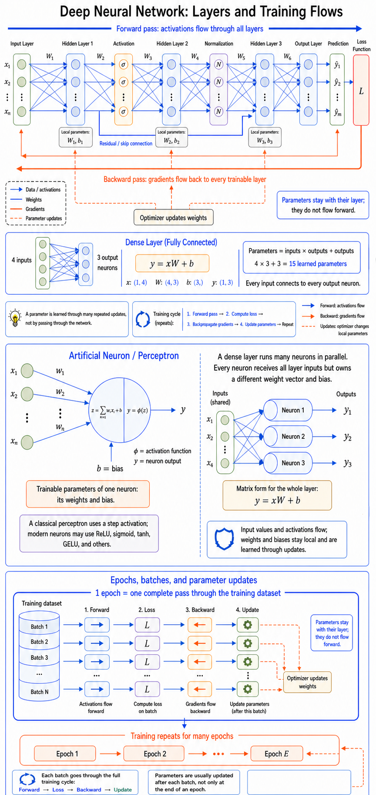
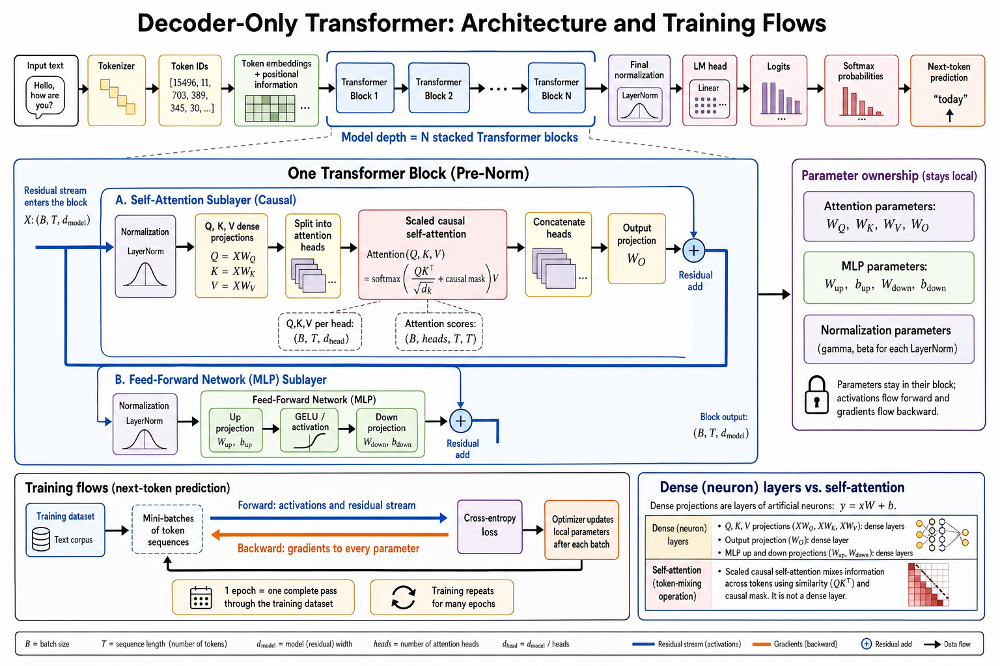
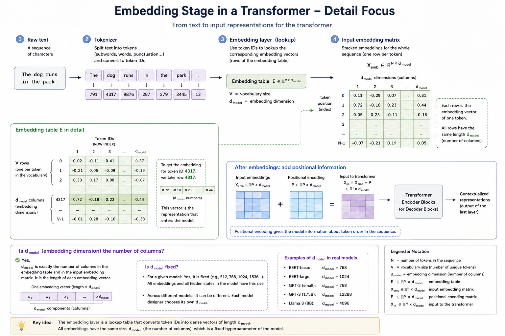
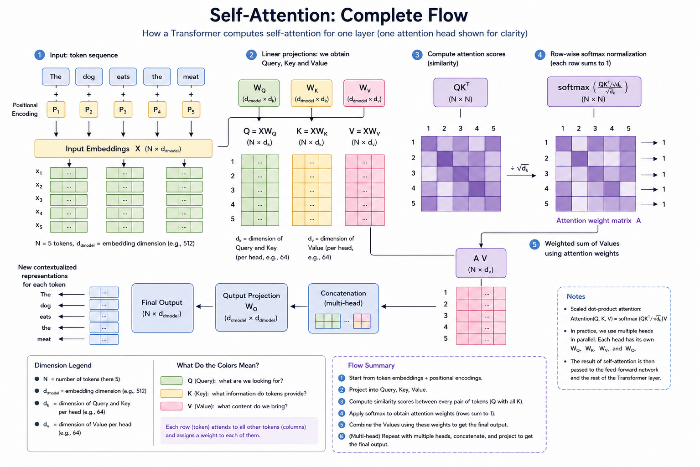

# Demystifying AI Visual Primer

[<- Reference shelf](../README.md) · [Master Plan](../../MASTER-PLAN.md) · [Companion lessons](../../companion-lessons/README.md)

Imported source: `Z:\AI\demystifying_ai_export.zip` on 2026-08-04.

This is the visual, beginner-friendly bridge for Transformer internals: FLOPS,
precision, token IDs, embeddings, parameters versus activations, self-attention,
FlashAttention, and structured sparsity. Use it when a weekly plan says the shape
math is load-bearing and you want the concept drawn before you implement it.

## Core Mental Model

```text
Raw text
  ↓
Tokenizer
  ↓
Token IDs
  ↓
Embedding table lookup
  ↓
Input embedding vectors
  ↓
Positional information
  ↓
Transformer blocks
  ├─ Self-attention
  └─ Feed-forward network
  ↓
Contextualized token representations
  ↓
Output prediction
```

## Weekly Integration

| When | Read | Pull into the week | Gate |
|------|------|--------------------|------|
| Onboarding / Week 1 | [conversation transcript](TRANSCRIPT.md) and [parameters vs activations](docs/03-parameters-and-activations.md) | Vocabulary for learned parameters, temporary activations, and real-number matrix notation. | Explain why `theta` is a bag of learned scalars, while `Q`, `K`, `V`, and layer outputs are computed activations. |
| Week 2 | [compute and precision](docs/01-compute-and-precision.md) plus the sparsity section in [efficiency techniques](docs/05-efficiency-techniques.md#structured-sparsity) | FLOPS vs FLOP, exaFLOPS, FP8/FP4, 2:4 sparsity, and why precision claims must name the format. | State why "10 exaFLOPS" is incomplete without precision and sparsity assumptions. |
| Week 5 | [tokens and embeddings](docs/02-tokens-and-embeddings.md), [parameters and activations](docs/03-parameters-and-activations.md), and [self-attention](docs/04-self-attention.md) | Tokenizer-to-embedding flow, `d_model`, Q/K/V projections, `QK^T`, and attention-score shapes before GPT implementation. | For `Q, K in R^(N x d_k)`, derive why `QK^T` is `N x N`, then say what each cell means. |
| Week 7 | [compute and precision](docs/01-compute-and-precision.md) and [FlashAttention, sparsity, and efficiency](docs/05-efficiency-techniques.md) | Low precision as bandwidth relief, FlashAttention as IO-aware exact attention, and 2:4 sparsity as hardware-executable compression. | Explain why FlashAttention changes memory traffic without changing the attention formula. |
| Week 8 carryover | [self-attention](docs/04-self-attention.md) | The K/V vocabulary used later for KV-cache and paged-attention serving discussions. | Distinguish training activations from serving KV cache in one paragraph. |

## Source Files

| File | Use it for |
|------|------------|
| [01 - Compute and precision](docs/01-compute-and-precision.md) | FLOP/FLOPS, exaFLOPS, FP8, FP4, storage vs multiply vs accumulation precision. |
| [02 - Tokens and embeddings](docs/02-tokens-and-embeddings.md) | Token IDs, embedding table shape, `d_model`, initial vs contextualized representation. |
| [03 - Parameters and activations](docs/03-parameters-and-activations.md) | Learned parameter counts, temporary activations, projection and feed-forward matrix sizes. |
| [04 - Self-attention](docs/04-self-attention.md) | Q/K/V, transpose, scaled dot-product attention, multi-head attention. |
| [05 - Efficiency techniques](docs/05-efficiency-techniques.md) | Naive attention memory, FlashAttention, structured sparsity, combined low-bit savings. |
| [06 - From artificial neurons to decoder-only Transformers](docs/06-neural-network-and-transformer-architecture.md) | Coordinated architecture deep dive: dense layers, training mechanics, causal attention, GPT-style blocks, tensor shapes, and mastery exercises. |
| [Transcript](TRANSCRIPT.md) | Condensed Q&A progression, useful for turning confusions into flashcards. |
| [Handoff prompt](prompts/continue_project.md) | Original continuation prompt from the exported material. |

## Visual Assets

<div class="zoomable-diagram" tabindex="0" role="region" aria-label="Scrollable deep neural network training-flow diagram">
  <a href="images/deep_neural_network_training_flows.png" title="Open the full-resolution diagram">
    
  </a>
</div>

[Open the full-resolution diagram](images/deep_neural_network_training_flows.png) to zoom in or use the scrollbars above to inspect every detail.

<div class="zoomable-diagram" tabindex="0" role="region" aria-label="Scrollable decoder-only Transformer architecture and training-flow diagram">
  <a href="images/decoder_only_transformer_architecture_training_flows.png" title="Open the full-resolution diagram">
    
  </a>
</div>

[Open the full-resolution Transformer diagram](images/decoder_only_transformer_architecture_training_flows.png) to zoom in or use the scrollbars above to inspect every detail.





| Diagram | Use it when |
|---------|-------------|
| [Deep neural network: layers and training flows](images/deep_neural_network_training_flows.png) | Week 1 neural-network vocabulary: forward activations, loss, backpropagated gradients, residual connections, optimizer updates, batches, and epochs. |
| [Decoder-only Transformer: architecture and training flows](images/decoder_only_transformer_architecture_training_flows.png) | Following the dense-network diagram into tokenization, causal self-attention, MLP sublayers, residual streams, next-token prediction, and block-local parameters. |
| [Embedding stage, `d_model` focus](images/embedding_stage_dmodel_focus.png) | Week 5 token-ID and embedding-table confusion. |
| [Embedding stage, annotated legend](images/embedding_stage_annotated_legend.png) | Teaching the full text-to-vector path. |
| [Embedding stage, real-number legend](images/embedding_stage_real_numbers_legend.png) | Repairing `R^(V x d_model)` notation. |
| [Self-attention flow, English](images/self_attention_complete_flow_en.png) | Explaining Q/K/V and token-to-token mixing. |
| [Self-attention flow, Italian](images/self_attention_complete_flow_it.png) | Same diagram in Italian. |

## Math Cards To Add

```text
1 exaFLOPS = 10^18 floating-point operations per second
```

```text
E in R^(V x d_model): V vocabulary rows, d_model columns
```

```text
embedding_table[4317] selects row 4317; it does not create a 4317-element vector
```

```text
Q in R^(N x d_k), K in R^(N x d_k), K^T in R^(d_k x N), so QK^T in R^(N x N)
```

```text
attention(Q,K,V) = softmax(QK^T / sqrt(d_k)) V
```

```text
attention projection params ~= 4 * d_model^2
feed-forward params ~= 2 * d_model * d_ff
```

```text
FlashAttention = same attention math, fewer HBM reads/writes, no materialized N x N score matrix
```

```text
FP4 + 2:4 sparsity can move raw weight storage toward 1/8 of FP16 dense, before metadata and scales
```

## One-Sentence Summary

A Transformer is a large collection of learned numeric parameters that converts token IDs into vectors, repeatedly mixes those vectors according to context, and uses the resulting representations to predict what comes next.
