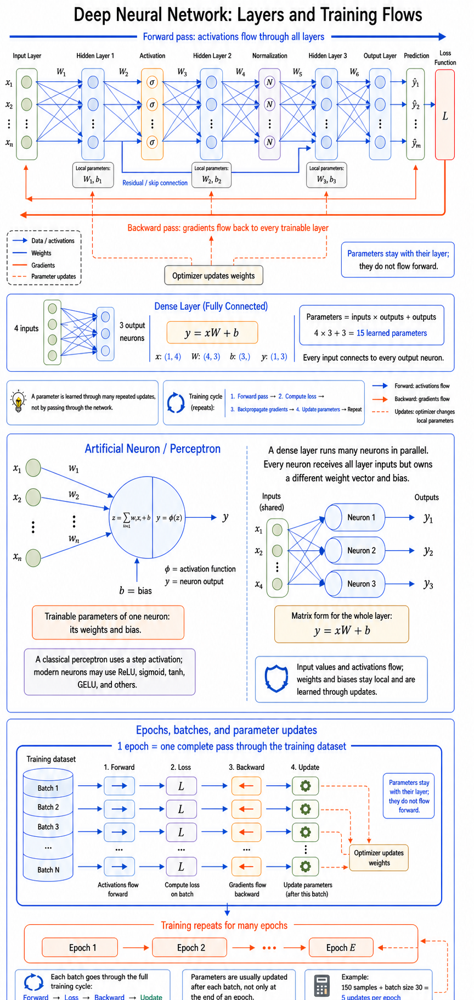

# 3. Parameters and activations

[<- Demystifying AI visual primer](../README.md) · [Reference shelf](../../README.md)

## What is a parameter?

A parameter is a learned scalar value stored in the model.

Examples include entries in:

- the embedding table \(E\)
- Query projection \(W_Q\)
- Key projection \(W_K\)
- Value projection \(W_V\)
- output projection \(W_O\)
- feed-forward matrices
- normalization scale and bias

## Embedding parameters

If:

\[
E\in\mathbb{R}^{50{,}000\times512}
\]

then the embedding table contains:

\[
50{,}000\times512=25{,}600{,}000
\]

trainable parameters.

The token ID is not a parameter. It merely selects a row.

## Parameters versus activations

  

[Open the full-resolution diagram](../images/deep_neural_network_training_flow.png) to zoom in or use the scrollbars above to inspect every detail.

Read the blue path from left to right: each layer uses learned weights to compute
new activations, ending in a prediction and loss. During training, gradients flow
backward along the orange path; the optimizer uses them to update the weights.
Residual or skip connections carry activations around one or more transformations.

### Parameters

Stored in the model and reused for every input:

\[
E,\ W_Q,\ W_K,\ W_V,\ W_O,\ldots
\]

### Activations

Computed temporarily for the current input:

\[
X,\ Q,\ K,\ V,\ \text{attention scores},\ \text{layer outputs}
\]

For example:

\[
Q=XW_Q
\]

- \(X\): current activation
- \(W_Q\): learned parameters
- \(Q\): newly computed activation

## Attention projection parameter count

For a simplified attention block where each projection is:

\[
d_{\text{model}}\times d_{\text{model}}
\]

the four projection matrices contain approximately:

\[
4d_{\text{model}}^2
\]

parameters.

For \(d_{\text{model}}=512\):

\[
4\times512^2=1{,}048{,}576
\]

approximately one million parameters.

## Feed-forward parameter count

A Transformer feed-forward network often expands from \(d_{\text{model}}\) to \(d_{\text{ff}}\), then contracts back.

Its main matrices contain approximately:

\[
2d_{\text{model}}d_{\text{ff}}
\]

parameters.

With:

\[
d_{\text{model}}=512,\qquad d_{\text{ff}}=2048
\]

this is about:

\[
2\times512\times2048=2{,}097{,}152
\]

parameters.

## Meaning of a “100 billion parameter model”

It means the model stores roughly 100 billion learned scalar values across all of its trainable matrices and vectors.

It does not mean:

- 100 billion tokens
- 100 billion neurons
- 100 billion operations per token
